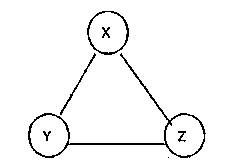
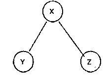
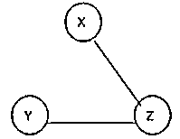
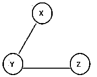
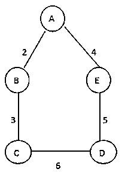
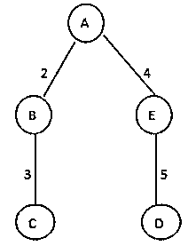
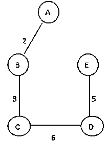
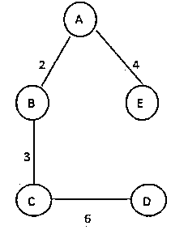
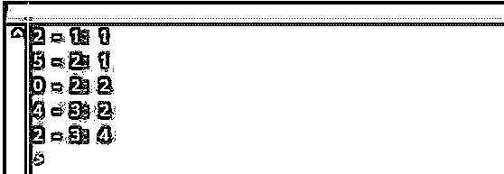

# 数据结构中的生成树

> 原文：<https://www.educba.com/spanning-tree-in-data-structure/>

## 数据结构中的生成树简介

下面的文章提供了数据结构中生成树的概要。在数据结构中，我们有不同类型的树。生成树是树的类型之一。基本上，生成树意味着它是图 G 的子集；它覆盖了生成树中边值最小的所有顶点。此外，生成树不包含任何圈，这意味着我们可以说生成树是一个图，它使用了图的一些术语。

生成树包括图中出现的所有边，这意味着边的数量应该相同。不允许在生成树中断开意味着我们不能从生成树中移除任何单个边，并且当我们将边添加到生成树中时，会创建循环，而循环树不允许在生成树中。

<small>Hadoop、数据科学、统计学&其他</small>

### 算法

基本上，有两种类型的算法，我们用来寻找最小生成树。

#### 1.普里姆算法

下面给出的是提到的算法:

函数 prims(版本，边缘)

Edg _ t = { edge 中权重最小的边}

重复 n-2 次

E =在 Edg_t 中找到邻边，它不包含圈，且有最小权。

Edg_t = Edg_t + {E}

返回(版本，Edg_t)

**说明:**

*   在 Prim 的算法中，我们总是从生成树的最小边开始。之后，我们需要从生成树的当前边中找到相邻的最小边，重复这个过程直到第 n-1 条边。

#### 2.克鲁斯卡尔算法

下面给出的是提到的算法:

kruskal 函数(版本，edg)

Edg_t = { }

重复 n-1 次

E =从生成树中找出相邻的最小权重边。

Edg_t = Edg_t + {E}

返回(版本，Edg_t)

**说明:**

*   Kruskal 算法的工作原理与 Prim 算法相同。唯一的区别是我们没有搜索限制。

### 生成树在数据结构中是如何工作的？

现在让我们看看生成树在数据结构中是如何工作的，如下所示:

假设我们有一个包含顶点和边的图 G (V，E)。

考虑下面的例子如下。

这是一个给定的图 G，我们需要找到这个图的生成，看这里我们可以生成三个不同的生成树如下。

ST 1

ST 2

ST 3

看这里，我们从图 G 中找到了三个不同的跨度；我们知道，完全无向图有最大数量为 Vv-2 的生成树，其中 V 是图中顶点的数量，所以在这个图中 V = 3，所以 3 个生成树是可能的。

**生成树的属性:**

*   该图包含多个生成树。
*   图的所有生成树包含相同数量的边和顶点。
*   生成树不包含意味着循环的环路。
*   当我们从生成树中去掉边时，我们称之为最小连通生成树。
*   当我们从生成树中去掉边时，我们称之为极大连通生成树。

现在考虑下图中的生成树。

上图中可能的不同生成树如下。

SP 1_14

SP 2_16

SP 3_15

在上图中，我们从图中画出了可能的生成树，这里我们还指定了边的权重，第一棵树我们称之为最小生成树，权重为 14，如 SP 1_14 所示。

### 数据结构中生成树的例子

下面给出了生成树的不同例子。

通常，我们可以使用两种不同的算法来实现生成树:Prim 算法和 Kruskal 算法。

#### 示例#1

Prim 使用 python 的程序如下。

**代码:**

`INF = 999999
Ver = 5
Graph = [[0, 10, 65, 0, 0],
[4, 0, 5, 20, 47],
[55, 85, 0, 55, 63],
[0, 21, 41, 0, 71],
[0, 22, 36, 25, 0]] Choose = [0, 0, 0, 0, 0] num_edge = 0
Choose[0] = True
print("Edge of graph : with Weight\n")
while (num_edge < Ver - 1):
min = INF
A = 0
B = 0
for i in range(Ver):
if Choose[i]:
for j in range(Ver):
if ((not Choose[j]) and Graph[i][j]):
if min > Graph[i][j]:
min = Graph[i][j] A = i
B = j
print(str(A) + "-" + str(B) + ":" + str(Graph[A][B]))
Choose[B] = True
num_edge += 1`

**说明:**

*   使用上述 Prim 的程序，我们试图实现一个最小生成树。这里我们首先定义顶点的数量。然后，我们还指定了图的邻接矩阵，如上面的程序所示。
*   我们使用下面的快照来说明上述语句的最终输出。

**输出:**

#### 实施例 2

现在让我们看一个 Kruskal 算法的例子，如下所示。

**代码:**

`class K_Graph:
def __init__(self, ver):
self.V = ver
self.graph = [] def add_edg(self, u, v, w):
self.graph.append([u, v, w])
# Search function
def find(self, par, i):
if par[i] == i:
return i
return self.find(par, par[i])
def apply_union(self, par, R, A, B):
Aroot = self.find(par, A)
Broot = self.find(par, B)
if R[Aroot] < R[Broot]:
par[Aroot] = Broot
elif R[Aroot] > R[Broot]:
par[Aroot] = Aroot
else:
par[Broot] = Aroot
R[Aroot] += 1
# Applying Kruskal algorithm
def kru_algo(self):
res = [] i, e = 0, 0
self.graph = sorted(self.graph, key=lambda value: value[2])
par = [] R = [] for ver in range(self.V):
par.append(ver)
R.append(0)
while e < self.V - 1:
u, v, w = self.graph[i] i = i + 1
A = self.find(par, u)
B = self.find(par, v)
if A != B:
e = e + 1
res.append([u, v, w])
self.apply_union(par, R, A, B)
for u, v, weight in res:
print("%d - %d: %d" % (u, v, weight))
gr = K_Graph(6)
gr.add_edg(0, 1, 5)
gr.add_edg(0, 2, 2)
gr.add_edg(1, 2, 6)
gr.add_edg(1, 0, 8)
gr.add_edg(2, 0, 3)
gr.add_edg(2, 1, 1)
gr.add_edg(2, 3, 4)
gr.add_edg(2, 5, 3)
gr.add_edg(2, 4, 5)
gr.add_edg(3, 2, 4)
gr.add_edg(3, 4, 4)
gr.add_edg(4, 2, 5)
gr.add_edg(4, 3, 2)
gr.add_edg(5, 2, 1)
gr.add_edg(5, 4, 4)
gr.kru_algo()`

**说明:**

*   我们使用下面的快照来说明上述语句的最终输出。

**输出:**

### 结论

从上面的文章中，我们已经看到了生成树的基本语法，我们还看到了生成树的不同例子。我们已经看到了如何以及何时在本文的数据结构中使用生成树。

### 推荐文章

这是一个数据结构中生成树的指南。在这里我们讨论的介绍，算法，如何生成树在数据结构中的工作？&示例。您也可以看看以下文章，了解更多信息–

1.  [堆数据结构](https://www.educba.com/heap-data-structure/)
2.  [数据结构中的线性搜索](https://www.educba.com/linear-search-in-data-structure/)
3.  [数据结构中的链表](https://www.educba.com/linked-list-in-data-structure/)
4.  [数据结构中的双向链表](https://www.educba.com/doubly-linked-list-in-data-structure/)

