# 数据结构中的外壳排序

> 原文：<https://www.educba.com/shell-sort-in-data-structure/>

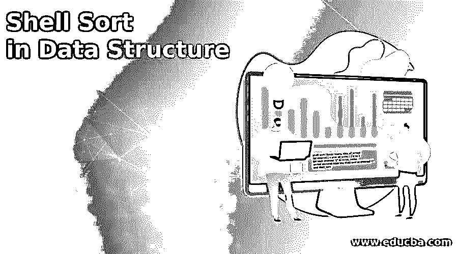

## 数据结构中的外壳排序介绍

数据结构提供了不同种类的排序技术；外壳排序是排序技术之一。shell 排序基本上是基于插入排序算法的，它是数据结构中非常高效的排序技术。在插入排序中，我们一次只移动元素一个位置。有时我们将元素移动到很远的前方；那时，我们需要多次移动。在 shell 排序中，首先，将元素相互排序，并减小排序后的元素之间的间隔。卖出排序以特定的时间间隔执行排序。因此元素之间的间隔减小了，shell 排序性能取决于我们给 sort shell 什么类型的输入。

**语法:**

<small>Hadoop、数据科学、统计学&其他</small>

`shell_sort (Array_name, size_of_array)
for interval j < size_of_array / 2 n to 1
for each interval “j” in Array_name
sorted element from the shell sort at interval “j”
end shell_sort`

**说明:**

*   在上面的语法中，我们首先用两个参数定义用户定义的函数:函数内部的数组名和数组大小。之后，我们需要将间隔与数组的大小进行比较，并打印每个间隔的值，如上面的语法所示。

### 如何在数据结构中进行 Shell 排序？

现在让我们看看 shell sort 在如下数据结构中是如何工作的。

外壳排序类似于插入排序，它通过查看由几个位置的孔隔离的组件来克服插入排序的缺点。总而言之，Shell sort 发挥了其伴随的优势。

**阶段 1:** 在表结构中排列组件，并利用插入排序对列进行排序。

**阶段 2:** 每次重复阶段 1，使用更少数量的较长列，这样到最后，只有一列信息需要排序。

**举例:**

现在考虑一个简单的例子来更好地理解 shell sort，这意味着它是如何工作的。

现在取数组{45，35，52，19，24，29，37，54}。现在把给定的数组分成 4 个区间，每个区间有 4 个位置，这意味着数组的虚拟子表如下。{45, 24}, {35, 29}, {52, 37}, {19, 54}

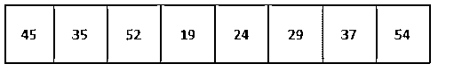

现在比较子列表中的每个值，如果需要，在原始数组中进行交换。

数组列表的结构如下图所示。

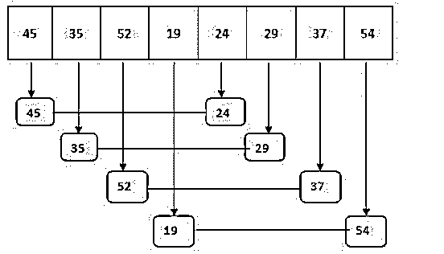

交换值后的最终数组如下图所示。

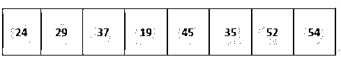

现在我们取 1 位置的间隔，它创建了如下图所示的{24，52，45，52}和{29，19，35，54}两个子列表，并遵循相同的交换过程。

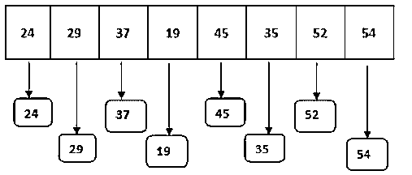

现在我们得到一个新的数组，如下图所示。

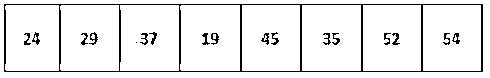

最后，我们得到了一个包含新值的新数组；现在，shell 排序应用插入排序技术对数组进行排序。

**步骤 1:** 比较数组中的前两个元素，如果需要的话可以互换。看到这里第一个元素小于第二个元素即 24 小于 29，所以没有必要交换如下图所示的值和最终数组列表。

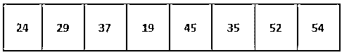

**步骤 2:** 重复同样的过程，比较数组列表中的第二个和第三个元素。在这一步中，第二个元素小于第三个元素，即 29，小于 37。因此不需要执行交换操作。

最终的数组列表如下图所示。

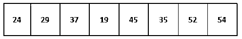

**第三步:**现在比较数组列表中的第三和第四个元素。看到这里第四个元素小于第三个元素，即 19 小于 34，所以我们需要执行交换操作然后最终数组如下图所示。

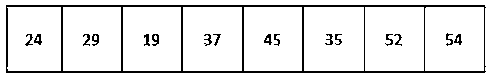

**步骤 4:** 现在，看到这里第三个元素小于第二个元素，所以我们需要执行交换操作，最终数组列表如下图所示。

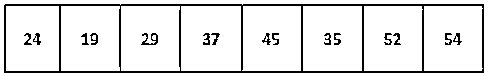

**步骤 5:** 注意第二个元素小于第一个元素的地方，即 19 小于 24。所以我们需要执行如下图所示的交换操作和最终数组列表。

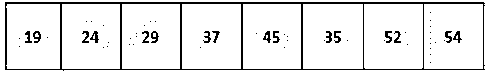

**第六步:**现在比较第四和第五元素；看到这里 37 小于 45，所以没有必要执行交换操作，最终数组列表如下图所示。

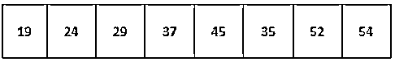

**第七步:**现在比较 45 和 35；看到这里 35 小于 45。所以我们需要执行如下图所示的交换操作和最终数组列表。

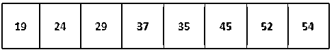

**步骤 8:** 注意这里 35 小于 37，所以我们需要执行如下图所示的交换操作和最终数组列表。

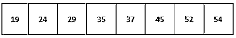

**第 9 步:**现在看到剩余的元素，意思是 value 被排序，也就是说不需要执行任何交换操作，最终数组列表如下图所示。

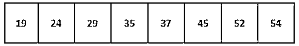

**外壳排序算法如下:**

**第一步:**初始化数组的大小。

**第二步:**之后我们需要将数组列表分割成相同区间的子列表。

**第三步:**使用插入排序对数组列表进行排序。

**第四步:**重复所有步骤，直到列表排序完毕。

### 数据结构中的外壳排序示例

下面给出了使用 python 编程语言进行 shell 排序的示例，如下所示:

**代码:**

`def shell_Sort(arr_list):
diff = len(arr_list) // 2
while diff > 0:
i = 0
j = diff
while j < len(arr_list):
if arr_list[i] > arr_list[j]:
arr_list[i], arr_list[j] = arr_list[j], arr_list[i] i += 1
j += 1
while i - diff != -1:
if arr_list[i - diff] > arr_list[i]:
arr_list[i - diff], arr_list[i] = arr_list[i], arr_list[i - diff] i -= 1
diff //= 2
arr_list1 = [45, 35, 52, 19, 24, 29, 37, 54] print("User input Array List is:", arr_list1)
shell_Sort(arr_list1)
print("sorted Array List is:", arr_list1)`

我们可以使用不同的编程语言来实现它。

**说明:**

*   在上面的例子中，我们试图实现 shell 排序。
*   我们使用下面的快照来说明上述语句的最终输出。

**输出:**

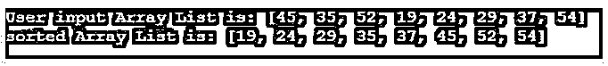

### 结论

从上面的文章中，我们看到了 Shell 排序的基本语法，也看到了 Shell 排序的例子。我们已经看到了如何以及何时在本文的数据结构中使用 Shell 排序。

### 推荐文章

这是一个数据结构中外壳排序的指南。这里我们讨论一下入门，如何在数据结构中进行 shell 排序？还有例子。您也可以看看以下文章，了解更多信息–

1.  [在数据结构中合并排序](https://www.educba.com/merge-sort-in-data-structure/)
2.  [数据结构中的堆栈](https://www.educba.com/stack-in-data-structure/)
3.  [堆数据结构](https://www.educba.com/heap-data-structure/)
4.  [数据结构中的快速排序](https://www.educba.com/quick-sort-in-data-structure/)

