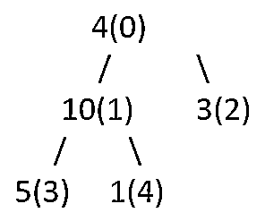
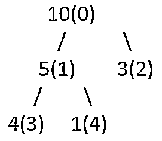

# 数据结构中的堆排序

> 原文：<https://www.educba.com/heap-sort-in-data-structure/>

## 数据结构中的堆排序介绍

Heapsort 是所有可用排序算法中最有效的算法之一，它使用完全平衡的二叉树来可视化源数组，也称为堆。为了学习和理解堆的工作原理，你需要对两种数据结构有一个清晰的概念，即树和数组。此外，您应该了解像堆和完整二叉树这样的数据结构，它们用于存储数据。本文将学习堆排序在数据结构中的工作，以及它在 C++语言中的实现。

### 堆排序工作

堆排序技术包括在节点之间进行比较，它使用称为二进制堆的数据结构技术。堆排序的工作方式类似于选择排序，我们找到最小的元素，然后将最小的元素放在开头。之后，对所提供的数组的剩余节点或元素执行相同的过程。

<small>Hadoop、数据科学、统计学&其他</small>

最常用的数据结构是二进制堆。为了理解这一点，我们首先需要知道什么是一个完全的二叉树，除了最后一层允许的例外，所有的层都被完全占据。此外，完整二叉树中的所有元素或节点都尽可能靠左放置。二进制堆也是完全二叉树的一种特殊情况，其中父节点的值大于其两个子节点的值，或者小于其两个子节点的值。在第一种情况下，它被称为最大堆，而在后一种情况下，它被称为最小堆。堆的表示是使用二叉树或数组来完成的。

### 听力排序的步骤

堆排序算法包括以下步骤

1.  无论所提供的数据输入数组完成了什么，都要从该数据创建一个最大堆。
2.  现在考虑最大值存储在堆的根节点。之后，继续用最后一个节点替换根节点，并将堆的大小减少 1。最后一步是为树根准备堆(heapify)。
3.  除非堆大小大于 1，否则请遵循步骤 2。

请注意，只有当某个特定节点的所有子节点都被堆积时，我们才能对该节点执行 heapify 过程。因此，在进行这个过程时，遵循自底向上的方法。

考虑图表中显示的以下堆–

每个节点的索引在节点值后的括号中表示。当我们在索引为 1 的节点上执行堆积过程时，树将如下所示

我们必须不断重复上面的过程，以自顶向下的方式递归地创建堆，以从中创建一个排序的堆。

### 数据结构中的堆排序示例

让我们考虑一个使用 C++编程语言的堆排序实际工作的例子。

`// C++ Program which demonstrates the use of the heap sort and its implementation
#include <iostream>
using namespace std;
/* When a subtree having the root as node i then we have
to prepare the heap of the array with index i of the
node where the size of the array is n*/
void prepareHeap(int arr[], int n, int i)
{
int largest = i; // Create a variable for storing the largest value as root
int l = 2 * i + 1; // left side node
int r = 2 * i + 2; // right side node
// In case if left child has the value which is greater than that of root node
if (l < n && arr[l] > arr[largest])
largest = l;
/* In case if right child has the value which is greater
than that of largest node detected uptil now*/
if (r < n && arr[r] > arr[largest])
largest = r;
// In case if the largest value identified is not the root node
if (largest != i) {
swap(arr[i], arr[largest]);
// Prepare the heap recursively for the sub tree which has got affected.
prepareHeap(arr, n, largest);
}
}
// The function which will carry out the heap sort
void heapSortAlgo(int arr[], int n)
{
// Do the rearragement of the array to create heap
for (int i = n / 2 - 1; i >= 0; i--)
prepareHeap(arr, n, i);
// Retrieve an element one by one from the heap
for (int i = n - 1; i > 0; i--) {
// Shift the current root node at the end
swap(arr[0], arr[i]);
// Prepare the heap for maximum value on the reduced heap
prepareHeap(arr, i, 0);
}
}
/* The function which will print all the contents of the array on the console */
void display(int arr[], int n)
{
for (int i = 0; i < n; ++i)
cout << arr[i]  << " ";
cout << "\n";
}
// Controller for calling the functions and deciding the flow
int main()
{
int arr[] = { 12, 11, 13, 5, 6, 7 };
int n = sizeof(arr) / sizeof(arr[0]);
heapSortAlgo(arr, n);
cout << "Using heap sort the generated sorted array is \n";
display(arr, n);
}`

用 C++语言执行上述程序的输出如下所示

### 时间复杂度

堆排序的时间复杂度是 O(nlogn)。另一方面，当考虑使用特定节点创建新堆的单独堆化过程时，其时间复杂度为 O(logn)。

### 结论——数据结构中的堆排序

堆排序在二进制堆内部工作，二进制堆是一个完全平衡的二叉树，在其节点上有最大值或最小值。因此，递归地执行 heapify 过程来获得排序后的数组，如上面的例子所示。

### 推荐文章

这是一个数据结构中堆排序的指南。这里我们讨论堆排序的工作原理及其在 C++语言中的实现。您也可以阅读以下文章，了解更多信息——

1.  [c++中的堆排序](https://www.educba.com/heap-sort-in-c-plus-plus/)
2.  [堆数据结构](https://www.educba.com/heap-data-structure/)
3.  [Java 中的堆排序](https://www.educba.com/heap-sort-in-java/)
4.  [C 中的堆排序](https://www.educba.com/heap-sort-in-c/)

