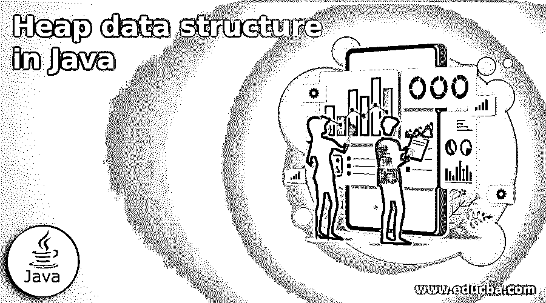
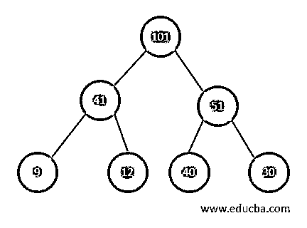
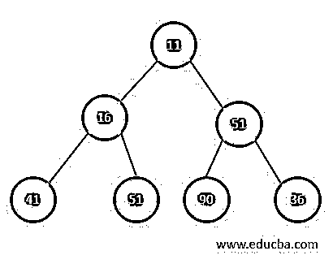
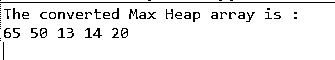

# Java 中的堆数据结构

> 原文：<https://www.educba.com/heap-data-structure-in-java/>




## Java 堆数据结构介绍

下面的文章提供了 Java 堆数据结构的概要。堆是一种特殊类型的基于树的数据结构，其中树是一个完整的二叉树。另一方面，二叉树是这样一种树，其中每个节点最多可以有两个孩子。因此，我们必须先了解完整的二叉树，然后才能进一步了解堆数据结构。

堆数据结构的根节点与其子节点进行比较，并根据顺序进行排序。如果 x 是一个根节点，y 是它的一个子节点，那么属性 key (x)>= key (y)将产生一个最大堆。“堆属性”指的是根节点和子节点之间的关系，所提到的属性 key (x)>= key (y)。

<small>Hadoop、数据科学、统计学&其他</small>

根据父子节点的顺序，堆可以是两种类型之一:

**1。最大堆–**

最大堆中的根节点键是堆中所有键中最大的。因此，应该确保堆中的所有子树递归地具有相同的属性。

下图是一个最小堆树。如我们所见，根节点大于其子节点。




**2。最小堆—**

最小堆中的根节点键是堆中所有其他键中最小或最不重要的。该属性应该在堆中的所有其他子树中递归有效，就像它在 max 堆中一样。

下图是一个最小堆树。正如我们所看到的，根键是堆中最小的键。




最大堆的时间复杂度是 *O(* logn *)* ，因为树的高度决定了最大堆中可用的最大比较次数。因此，完整二叉树的高度总是 *logn* 。

用 Java 实现堆数据结构的一种简单方法——

堆化是将二叉树转换成堆数据结构的方法。可以用它来创建最小堆或最大堆。

1.  接受一个输入数组。
2.  从数组中，创建一个完整的二叉树。
3.  从非叶节点的第一个索引开始，其索引是 n/2–1。
4.  使当前元素 I 最大。
5.  左子的索引是 2i + 1，2i+2 是右子的索引。

如果 leftChild 大于 currentElement(即第 I 个索引处的元素)，则将 leftChildIndex 设置为最大。

如果 rightChild 大于 maximum 中的元素，则将 rightChildIndex 设置为 maximum。

1.  用 currentElement 替换最大的元素。
2.  在对子树进行堆化之前，应该重复步骤 3 到 7。

堆数据结构的算法

`Heapify ( arr, size, i)`

**第一步:**使 I 最大

第二步: lChild = 2i + 1

第三步: rChild = 2i + 2

**第四步:** if lChild > arr【最大】

将 lChildIndex 设置为最大

第五步: if rChild > arr【最大】

将 rChildIndex 设置为最大

**第六步:**交换 arr[i]和 arr[最大]

要创建最大堆:

MaxHeap(数组，大小)

从非叶节点的第一个索引循环到零

打电话给医生

**返回值—**这个算法的返回值是最大堆。

### java 中堆数据结构的例子

在最大堆中插入元素的 java 最大堆数据结构示例

**程序示例 1—**

```
package jex;
import java.util.ArrayList;
class Heap {
void heapify(ArrayList <Integer> mh, int i) {
int size = mh.size();
int largest = i;
int lc = 2 * i + 1;
int rc = 2 * i + 2;
if (lc < size && mh.get(lc) > mh.get(largest))
largest = lc;
if (rc < size && mh.get(rc) > mh.get(largest))
largest = rc;
if (largest != i) {
int temp = mh.get( largest );
mh.set( largest, mh.get(i) );
mh.set( i, temp );
heapify(mh, largest);
}
}
void insert(ArrayList <Integer> mh, int n) {
int size = mh.size();
if (size == 0) {
mh.add( n );
} else {
mh.add( n );
for (int i = size / 2 - 1; i >= 0; i--) {
heapify( mh, i);
}
}
}
void printHeap(ArrayList<Integer> a, int size) {
for (Integer i : a) {
System.out.print(i + " ");
}
System.out.println();
}
public static void main(String args[]) {
ArrayList <Integer> a = new ArrayList <Integer>();
int size = a.size();
Heap h = new Heap();
h.insert(a, 13);
h.insert(a, 14);
h.insert(a, 65);
h.insert(a, 50);
h.insert(a, 20);
System.out.println("The converted Max Heap array is : ");
h.printHeap(a, size);
}
}
```

上述代码的输出是–




与上面的程序一样，创建了包含 heapify()、insert()和 printHeap()函数的 Heap 类。heapify()函数用于通过根据条件设置 leftchild 或 right child maximum，从传递的 ArrayList 创建最大堆。insert()函数用于将数字插入到 max 堆中，printHeap()函数用于打印 max 堆。然后，在 main 函数中，创建一个整数的 ArrayList，还创建 Heap 类对象。接下来，通过调用堆对象上的 insert()函数，将元素插入到堆对象中。插入所有元素后，调用 printHeap()函数打印最大堆，正如我们在上面的输出中看到的。

### 结论

堆基于完整的二叉树数据结构。二叉树是这样一种树，其中每个节点最多可以有两个子节点。因此，有两种堆，最大堆和最小堆。最大堆的时间复杂度为 O(logn)。

### 推荐文章

这是一个 Java 堆数据结构的指南。在了解堆数据结构之前，我们先讨论完整的二叉树。您也可以阅读以下文章，了解更多信息——

1.  [跳过列表 Java](https://www.educba.com/skip-list-java/)
2.  [Maven 跳过测试](https://www.educba.com/maven-skip-test/)
3.  [堆数据结构](https://www.educba.com/heap-data-structure/)
4.  [Java 中的堆排序](https://www.educba.com/heap-sort-in-java/)


