# 二叉树类型

> 原文：<https://www.educba.com/binary-tree-types/>

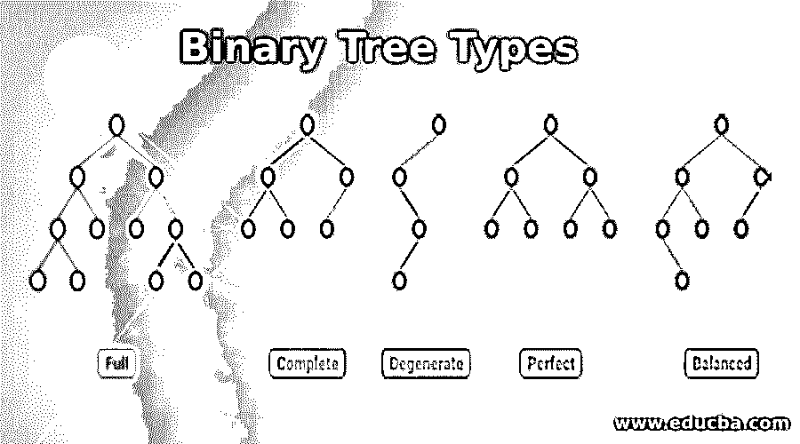

## 二叉树类型介绍

下面的文章提供了二叉树类型的概要。二叉树是一种数据结构，其中每个节点最多有两个子节点，或者每个节点最多连接两个子树。那些子树也是二叉树。在二叉树中，有三个组成部分。

1.  **值**:存储在节点上的值
2.  ***左侧:**左侧子节点的地址
3.  ***右:**左右节点的地址

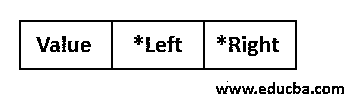

<small>Hadoop、数据科学、统计学&其他</small>

二叉树有许多特征，根据它们的特征，二叉树有 5 种类型。我们来详细了解一下:—

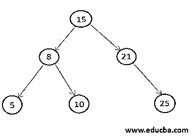

### 二叉树的类型

下面是不同类型的二叉树:

#### 1.完全二叉树

完全二叉树是具有附加属性的二叉树，该属性是二叉树中的每个节点应该有两个孩子或者没有孩子。其地址存储在根节点中的节点称为根节点的子节点。那些没有孩子的节点被称为叶节点。

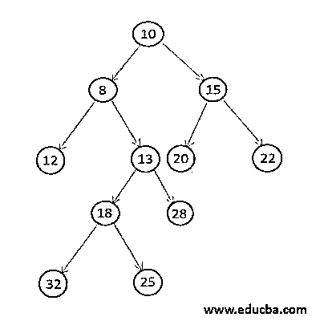

让我们看看一棵二叉树是否是完全二叉树。在下面的代码中，我们采用和上面一样的二叉树。为了检查完整的二叉树，我们必须遍历所有的节点；如果任何节点只有一个子节点，那么我们只需返回 False。另一方面，如果所有节点只有两个孩子或没有孩子，那么唯一的二叉树称为完全二叉树。

**代码:**

`struct BTNode
{
int value; // element value
struct BTNode * left; //To store address of left child
struct BTNode * right; //To store address of right child
};
struct BTNode *GenerateBTNode(int data) {
struct BTNode *node = new BTNode;
node->value = data;
node->right = NULL;
node->left = NULL;
return node;
}
bool isFullTree(struct BTNode *root) {
if(root==NULL){
return true;
}
if (root->left==NULL && root->right==NULL) {
return true;
}
if(root->left!=NULL && root->right!=NULL) {
return(isFullTree(root->left) && (isFullTree(root->right)));
}
return false;
}
void displayTreeInorder (struct BTNode *root) {
if(root != NULL){
displayTreeInorder(root->left);
cout<<root->value<<endl;
displayTreeInorder(root->right);
}
}
int main(){
BTNode *root=NULL;
root = GenerateBTNode(10);
root->left = GenerateBTNode(8);
root->right = GenerateBTNode(15);
root->left->left = GenerateBTNode(12);
root->left->right = GenerateBTNode(13);
root->left->right->left = GenerateBTNode(18);
root->left->right->left->left = GenerateBTNode(32);
root->left->right->left->right = GenerateBTNode(25);
root->left->right->right = GenerateBTNode(28);
root->right->left = GenerateBTNode(20);
root->right->right = GenerateBTNode(22);
bool flag = isFullTree(root);
cout<< flag <<endl;
displayTreeInorder(root);
}`

**输出:**

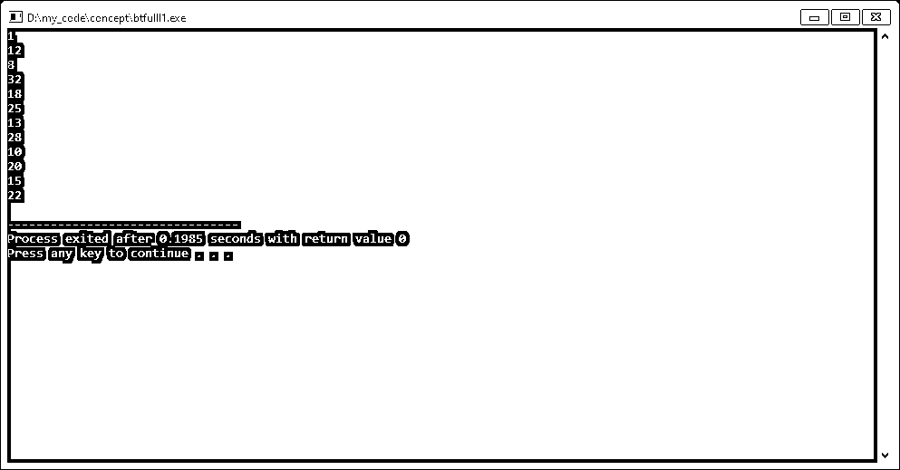

#### 2.完全二叉树

完全二叉树是那些树的所有级别都被完全填充的二叉树，二叉树的最后一级可能被完全填充，也可能不被完全填充，但是在节点的最后一级，每个节点应该在最左边的位置。

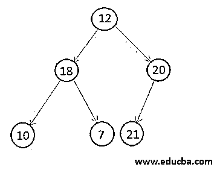

现在，让我们检查一下上面的二叉树是否完成了二叉树。在下面检查完整二叉树的代码中，首先，获取节点总数。因此，完整二叉树中的任何节点的索引都不应该大于节点总数。所以，如果我们发现任何一个节点的索引大于节点总数，那么这个二叉树就不是一个完整的二叉树，我们简单地返回 False。

**代码:**

`struct BTNode
{
int value; // element value
struct BTNode * left; //To store address of left child
struct BTNode * right; //To store address of right child
};
struct BTNode *GenerateBTNode(int data) {
struct BTNode *node = new BTNode;
node->value = data;
node->right = NULL;
node->left = NULL;
return node;
}
int TotalBTNodes(BTNode* root) {
if (root == NULL) {
return (0);
}
return (1 + TotalBTNodes(root->left) + TotalBTNodes(root->right));
}
bool isCompleteTree( BTNode* root, int totalnode, int ind) {
if (root == NULL) {
return true;
}
if (ind >= totalnode) {
return false;
}
return (isCompleteTree(root->left, totalnode, 2*ind+ 1 ) && isCompleteTree(root->right, totalnode, 2*ind + 2));
}
void displayTreeInorder (struct BTNode *root) {
if(root != NULL){
displayTreeInorder(root->left);
cout<<root->value<<endl;
displayTreeInorder(root->right);
}
}
int main(){
BTNode *root=NULL;
root = GenerateBTNode(12);
root->left = GenerateBTNode(18);
root->right = GenerateBTNode(20);
root->left->left = GenerateBTNode(10);
root->left->right = GenerateBTNode(7);
root->right->left = GenerateBTNode(21);
int totalnode = TotalBTNodes(root);
bool flag = isCompleteTree(root, totalnode, 0);
cout<< flag <<endl;
displayTreeInorder(root);
}`

**输出:**

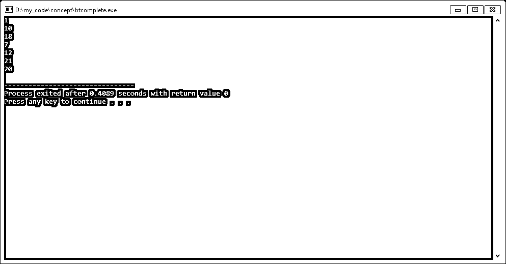

#### 3.完美二叉树

完美二叉树是那些每个节点应该有两个孩子或者没有孩子，每个叶节点的层次应该相同的二叉树。节点的级别是距根节点的高度或距离。完美二叉树是完全二叉树，其中它们的最后一层也是完全填充的。

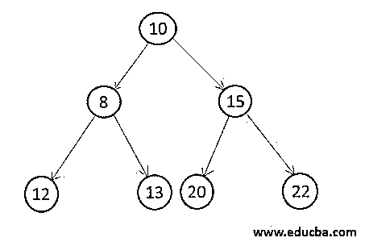

#### 4.平衡二叉树

平衡二叉树是这样的二叉树，其中二进制的高度是该二叉树中节点总数的 log2。设 h 是树的高度，n 是树的节点数。那么 **h = log(n)** 。

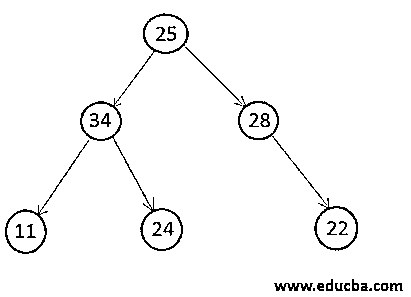

#### 5.退化二叉树

退化二叉树是这样一种二叉树，其中每个二叉树只有一个子树。它可以是左子节点，也可以是右子节点，但是任何节点都不应该同时有两个子节点。

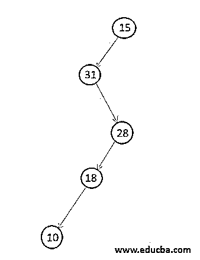

**代码:**

`struct BTNode
{
int value; // element value
struct BTNode * left; //To store address of left child
struct BTNode * right; //To store address of right child
};
struct BTNode *GenerateBTNode(int data) {
struct BTNode *node = new BTNode;
node->value = data;
node->right = NULL;
node->left = NULL;
return node;
}
bool isDegenerateTree(struct BTNode *root) {
if(root == NULL){
return true;
}
if(root->left == NULL && root->right == NULL){
return true;
}
// If root have two children
if(root->left!=NULL && root->right!=NULL){
return false;
}
if(root->left != NULL){
return(isDegenerateTree(root->left));
}
else{
return(isDegenerateTree(root->right));
}
}
void displayTreeInorder (struct BTNode *root) {
if(root != NULL){
displayTreeInorder(root->left);
cout<<root->value<<endl;
displayTreeInorder(root->right);
}
}
int main(){
BTNode *root=NULL;
root = GenerateBTNode(15);
root->left = GenerateBTNode(31);
root->left->right = GenerateBTNode(28);
root->left->right->left = GenerateBTNode(18);
root->left->right->left->left = GenerateBTNode(10);
bool flag = isDegenerateTree(root);
cout<< flag <<endl;
displayTreeInorder(root);
}`

**输出:**

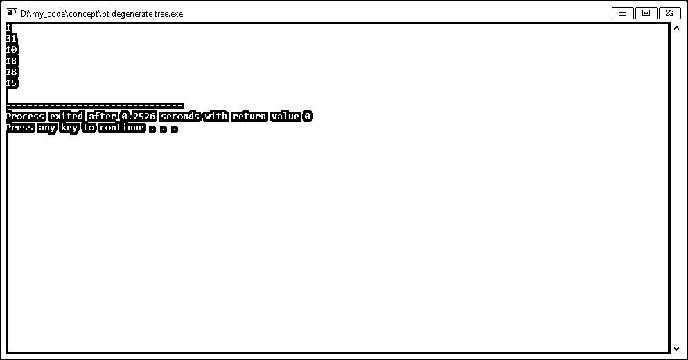

### 结论

这些都是二叉树的类型。因此，研究不同类型的二叉树将有助于我们在更好的时间复杂度下执行更好的操作。

### 推荐文章

这是一个二叉树类型的指南。这里我们讨论不同类型的数据结构，如完全、完整、完美、平衡和退化二叉树。您也可以阅读以下文章，了解更多信息——

1.  [二分搜索法 C++](https://www.educba.com/binary-search-c-plus-plus/)
2.  [Oracle B 树索引](https://www.educba.com/oracle-b-tree-index/)
3.  数据结构中的 B 树
4.  [Java 中的二叉树是什么？](https://www.educba.com/what-is-a-binary-tree-in-java/)

