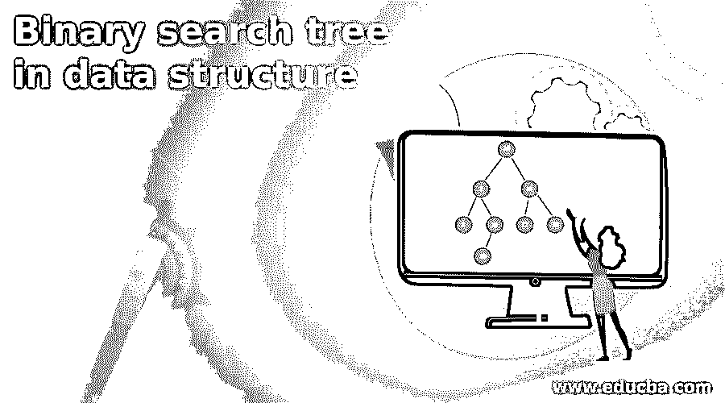
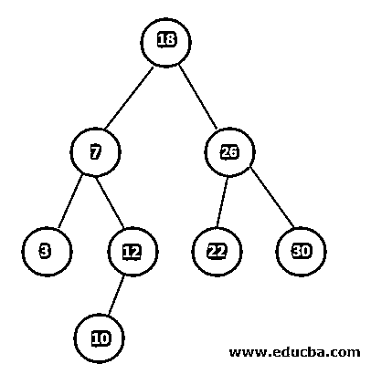
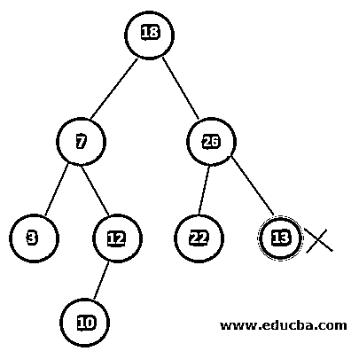
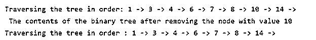

# 数据结构中的二叉查找树

> 原文：<https://www.educba.com/binary-search-tree-in-data-structure/>

## 什么是数据结构中的二叉查找树

二叉查找树是用于维护有序元素列表的数据结构。在这个树中，每个节点最多只能有两个子节点。存储值时遵循的格式是，主节点的左侧节点的值应该小于主节点的值，而右侧节点的值应该大于主节点的值。主节点左侧和右侧的所有子节点都遵循这种模式。树的每个单个节点的子树也拥有上述两个属性，因此它们也充当 BST，即二叉查找树。

存储在二叉树节点内的特定值或数字可以容易地在 O (log (n))时间复杂度内被搜索。本文将使用 C 语言研究二分搜索法树的工作、实现和应用。

<small>Hadoop、数据科学、统计学&其他</small>

### 二叉查找树的例子

主节点应始终拥有大于左节点或左节点所有后代的值，并且应小于右节点及其所有子节点的值。相同的规则适用于所有其他节点。下面的树是正确的二叉查找树示例——

下面的树不是二叉查找树的正确示例，因为包含值 13 的节点应该拥有一个大于 26 的值，这是它的父节点或主节点。因此，遵循规则的单个节点构成了下面的树，而不是二叉查找树。树的每个节点都必须遵循规则。

### 二叉查找树的执行情况

现在，让我们看看如何通过使用 C 编程语言实现二叉查找树数据结构概念来利用它。以下是 C 程序，其中包含解释所有执行操作的所有正确注释，函数名称不言自明

`// C program for implementing the Binary search tree data structure
#include <stdio.h>
#include <stdlib.h>
struct node {
int key;
struct node *leftNode, *rightNode;
};
// Creation of the new node in the tree
struct node *newlyCreatedNode(int element) {
struct node *temporaryNode = (struct node *)malloc(sizeof(struct node));
temporaryNode->key = element;
temporaryNode->leftNode = temporaryNode->rightNode = NULL;
return temporaryNode;
}
// Traversing all the nodes in order
void traversalInOrder(struct node *mainRootNode) {
if (mainRootNode != NULL) {
// Left node traversal
traversalInOrder(mainRootNode->leftNode);
// Main Root node traversal
printf("%d -> ", mainRootNode->key);
// Right node traversal
traversalInOrder(mainRootNode->rightNode);
}
}
// Insert a new item in the binary search tree
struct node *addElement(struct node *node, int key) {
// In case if the tree seems to be empty then return a newly created node
if (node == NULL) return newlyCreatedNode(key);
// Insert a new element that is node after traversing the right side
if (key < node->key)
node->leftNode = addElement(node->leftNode, key);
else
node->rightNode = addElement(node->rightNode, key);
return node;
}
// Search for the succesor that is found by traversing inorder format
struct node *minimumValueNode(struct node *node) {
struct node *presentNode = node;
// Search the node which is present at the most left side of the tree that is left most leaf
while (presentNode && presentNode->leftNode != NULL)
presentNode = presentNode->leftNode;
return presentNode;
}
// Remove the node from the tree
struct node *removeOrDeque(struct node *mainRootNode, int key) {
// In case if the tree is completely empty then return the same main root node that is supplied
if (mainRootNode == NULL) return mainRootNode;
// Search for the node which is to be deleted
if (key < mainRootNode->key)
mainRootNode->leftNode = removeOrDeque(mainRootNode->leftNode, key);
else if (key > mainRootNode->key)
mainRootNode->rightNode = removeOrDeque(mainRootNode->rightNode, key);
else {
// In case if the current node has only one of the offspring or none of the child
if (mainRootNode->leftNode == NULL) {
struct node *temporaryNode = mainRootNode->rightNode;
free(mainRootNode);
return temporaryNode;
} else if (mainRootNode->rightNode == NULL) {
struct node *temporaryNode = mainRootNode->leftNode;
free(mainRootNode);
return temporaryNode;
}
// In case if the current node has two child nodes
struct node *temporaryNode = minimumValueNode(mainRootNode->rightNode);
// Replace the the node which is being removed or deleted in the place of successor in order
mainRootNode->key = temporaryNode->key;
// Remove the identified successor node detected in order traversal
mainRootNode->rightNode = removeOrDeque(mainRootNode->rightNode, temporaryNode->key);
}
return mainRootNode;
}
// Controller for carrying out all the operations and manipulating all the data
int main() {
struct node *mainRootNode = NULL;
mainRootNode = addElement(mainRootNode, 8);
mainRootNode = addElement(mainRootNode, 3);
mainRootNode = addElement(mainRootNode, 1);
mainRootNode = addElement(mainRootNode, 6);
mainRootNode = addElement(mainRootNode, 7);
mainRootNode = addElement(mainRootNode, 10);
mainRootNode = addElement(mainRootNode, 14);
mainRootNode = addElement(mainRootNode, 4);
printf("Traversing the tree in order: ");
traversalInOrder(mainRootNode);
printf("\n The contents of the binary tree after removing the node with value 10 \n");
mainRootNode = removeOrDeque(mainRootNode, 10);
printf("Traversing the tree in order : ");
traversalInOrder(mainRootNode);
}`

上述代码执行后的输出如下所示

### 复杂性

让我们讨论使用二叉查找树的时间和空间复杂性。在执行诸如搜索、插入或删除之类的操作来操纵节点和内容时，二叉查找树的空间复杂度是 O(n)。每种情况下每个操作的时间复杂度如下表所示

| 执行的操作 | 搜查 | 插入 | 删除 |
| 最佳情况下的复杂性 | o(登录号) | o(登录号) | o(登录号) |
| 最坏情况下的复杂性 | O (n) | O (n) | O (n) |
| 一般情况下的复杂性 | o(登录号) | o(登录号) | o(登录号) |

### 二叉查找树的应用

二叉查找树用于许多算法和计算机应用中。其中一些列举如下

*   动态排序在内部利用了二叉查找树。
*   在数据库中，通过使用二叉查找树来实现多级索引。
*   在 UNIX 内核中，通过使用二叉查找树来管理虚拟内存区域。

### 结论

二叉查找树是一种数据结构，其中每个节点最多应该有两个子节点，左侧所有节点的值应该小于当前节点的值，而右侧的值应该大于当前节点的值。

### 推荐文章

这是数据结构中二叉查找树的指南。这里我们讨论使用 C 语言编程的二叉查找树的工作、实现和应用。您也可以阅读以下文章，了解更多信息——

1.  [Oracle B 树索引](https://www.educba.com/oracle-b-tree-index/)
2.  数据结构中的 B 树
3.  [什么是决策树？](https://www.educba.com/what-is-decision-tree/)
4.  [数据结构中树的类型](https://www.educba.com/types-of-trees-in-data-structure/)

