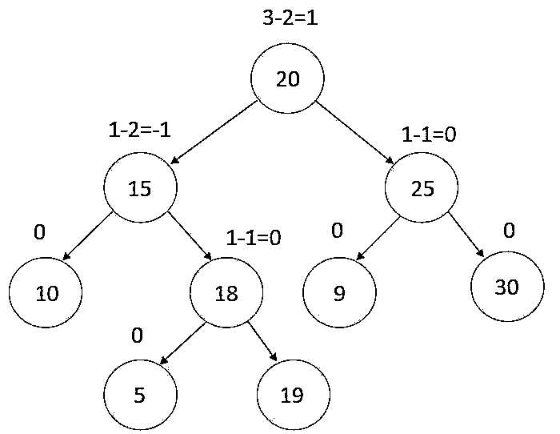
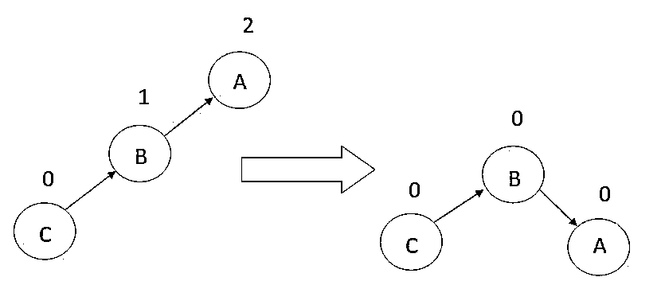
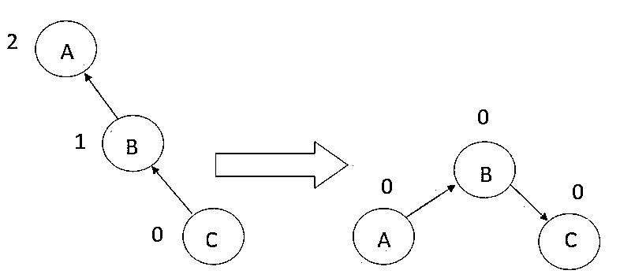
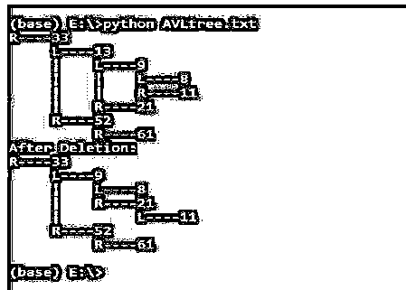

# AVL 树旋转

> 原文：<https://www.educba.com/avl-tree-rotation/>

## AVL 树旋转简介

以下文章提供了 AVL 树轮换的概述。AVL 树是一种二叉查找树，也称为自平衡树，其中每个节点都连接到一个平衡因子，该平衡因子是通过从特定节点的左子树的高度中减去右子树的高度来计算的。当每个节点的平衡因子在-1 和 1 之间时，该树被定义为平衡的 AVL 树。另一方面，当平衡因子小于-1 或大于 1 时，则该树被称为不平衡树，需要平衡才能得到完美的 AVL 树。

*   如果对于一个特定的节点，获得的平衡因子是-1，则它定义该节点的左子树比右子树高一级。
*   如果对于特定的节点，所获得的平衡因子是 0，则它定义了该节点的左子树和右子树处于相同的级别。
*   如果对于一个特定的节点，获得的平衡因子是 1，那么它定义了左子树比该节点的右子树低一级。

**平衡 AVL 树示例:**

<small>Hadoop、数据科学、统计学&其他</small>

### AVL 树中的旋转操作

在 AVL 树中执行旋转，以通过执行各种旋转操作将非平衡树变成平衡树。

通常，AVL 树中有四种类型的旋转:

*   向左旋转
*   向右旋转
*   左右旋转
*   左右旋转

前两次旋转称为单次旋转，接下来的两次旋转称为两次旋转。

#### 1.向左旋转(LL)

当一个节点被插入左子树或者从左子树中删除时，AVL 树变得不平衡，我们需要使用 LL 旋转来平衡它。这种 LL 旋转也称为应用于边缘的顺时针旋转，它具有最高的平衡系数。

#### 2.右旋转(右后)

当一个节点被插入到右边的子树中或者从右边的子树中删除时，AVL 树变得不平衡，我们需要通过逆时针方向旋转节点来平衡它。这种旋转技术应用于具有最高平衡因子的节点的边缘。

#### 3.左右旋转

左右旋转是 RR 旋转和 LL 旋转的组合。首先，在子树上执行 RR 旋转，然后，在从插入节点到第一个节点的整个树的部分上执行 LL 旋转

#### 4.左右旋转(左后)

左右旋转是 LL 旋转和 RR 旋转的组合。在这种情况下，第一次 L1 旋转是在已经做出改变的子树上执行的；然后，从插入的节点到树的顶部，即第一个节点，在整个树的部分上执行 RR 旋转。

### AVL 树旋转示例

以下是 AVL 树旋转的示例:

**Python 中的 AVL 树。**

**代码:**

`import sys
# Create a node
class TreeNode(object):
def __init__(self, key):
self.key = key
self.left = None
self.right = None
self.height = 1
class AVLTree(object):
# Function to insert a node
def insert_node(self, root, key):
# Insert the node at the correct location
if not root:
return TreeNode(key)
elif key < root.key:
root.left = self.insert_node(root.left, key)
else:
root.right = self.insert_node(root.right, key)
root.height = 1 + max(self.getHeight(root.left),
self.getHeight(root.right))
# Balance the tree by updating the balance factor
balanceFactor = self.getBalance(root)
if balanceFactor > 1:
if key < root.left.key:
return self.rightRotate(root)
else:
root.left = self.leftRotate(root.left)
return self.rightRotate(root)
if balanceFactor < -1:
if key > root.right.key:
return self.leftRotate(root)
else:
root.right = self.rightRotate(root.right)
return self.leftRotate(root)
return root
#Function to delete a node
def delete_node(self, root, key):
# Remove the deleted node
if not root:
return root
elif key < root.key:
root.left = self.delete_node(root.left, key)
elif key > root.key:
root.right = self.delete_node(root.right, key)
else:
if root.left is None:
temp = root.right
root = None
return temp
elif root.right is None:
temp=root.left
root = None
return temp
temp = self.getMinValueNode(root.right)
root.key = temp.key
root.right = self.delete_node(root.right,
temp.key)
if root is None:
return root
# Update the nodes balance factor
root.height = 1 + max(self.getHeight(root.left),
self.getHeight(root.right))
balanceFactor = self.getBalance(root)
# Balance the tree
if balanceFactor > 1:
if self.getBalance(root.left) >= 0:
return self.rightRotate(root)
else:
root.left = self.leftRotate(root.left)
return self.rightRotate(root)
if balanceFactor < -1:
if self.getBalance(root.right) <= 0:
return self.leftRotate(root)
else:
root.right = self.rightRotate(root.right)
return self.leftRotate(root)
return root
# Function to perform tree’s left rotation
def leftRotate(self, z):
y = z.right
T2 = y.left
y.left = z
z.right = T2
z.height = 1 + max(self.getHeight(z.left),
self.getHeight(z.right))
y.height = 1 + max(self.getHeight(y.left),
self.getHeight(y.right))
return y
# Function to perform tree’s right rotation
def rightRotate(self, z):
y = z.left
T3 = y.right
y.right = z
z.left = T3
z.height = 1 + max(self.getHeight(z.left),
self.getHeight(z.right))
y.height = 1 + max(self.getHeight(y.left),
self.getHeight(y.right))
return y
# Get the height of the node
def getHeight(self, root):
if not root:
return 0
return root.height
# Get the node balance factor
def getBalance(self, root):
if not root:
return 0
return self.getHeight(root.left) - self.getHeight(root.right)
def getMinValueNode(self, root):
if root is None or root.left is None:
return root
return self.getMinValueNode(root.left)
def preOrder(self, root):
if not root:
return
print("{0} ".format(root.key), end="")
self.preOrder(root.left)
self.preOrder(root.right)
# Print the AVL tree
def printHelper(self, currPtr, indent, last):
if currPtr != None:
sys.stdout.write(indent)
if last:
sys.stdout.write("R----")
indent += " "
else:
sys.stdout.write("L----")
indent += "| "
print(currPtr.key)
self.printHelper(currPtr.left, indent, False)
self.printHelper(currPtr.right, indent, True)
myTree = AVLTree()
root = None
nums = [33, 13, 52, 9, 21, 61, 8, 11] for num in nums:
root = myTree.insert_node(root, num)
myTree.printHelper(root, "", True)
key = 13
root = myTree.delete_node(root, key)
print("After Deletion: ")
myTree.printHelper(root, "", True)`

**输出:**

### 结论

AVL 树是一种自平衡二叉树，其中每个节点都连接到一个平衡因子。这棵树是为了纪念 1962 年的发明家 GM Adelson-Velsky 和 EM Landis 而命名的。平衡因子是通过从特定节点的左子树中减去右子树的高度来计算的。在 AVL 树中有四种类型的旋转:左旋转、右旋转、左右旋转、左右旋转。

### 推荐文章

这是一个 AVL 树旋转的指南。这里我们分别讨论 AVL 树中的介绍、旋转操作和例子。您也可以看看以下文章，了解更多信息–

1.  [在数据结构中展开树](https://www.educba.com/splay-tree-in-data-structure/)
2.  数据结构中的 AVL 树
3.  [二叉查找树类型](https://www.educba.com/binary-search-tree-types/)
4.  [数据结构中的哈希表](https://www.educba.com/hash-table-in-data-structure/)

