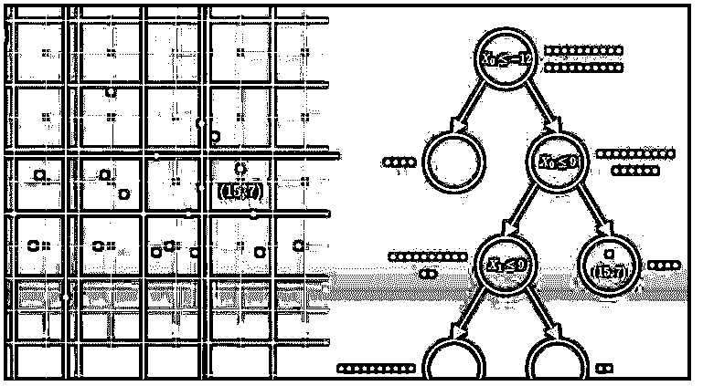
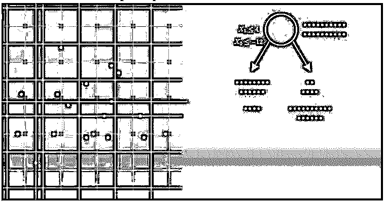
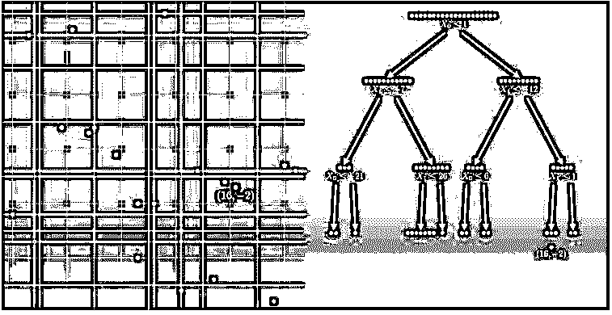
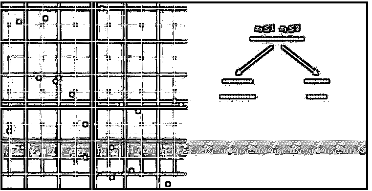

# 决策树类型

> 原文：<https://www.educba.com/decision-tree-types/>

## 决策树类型介绍

决策树类型取决于目标变量或数据挖掘问题。在这里，我们将看到基于数据挖掘问题的决策树类型。如果我们看一下决策树，决策树被定义为给定一个数据库 D = {t1，t2，…。tn}其中 ti 表示一个元组，由属性集 A = {A1，A2，…定义。，Am}。还有，给定一组类 C = {c1，c2，…，ck}。

决策树是一种二叉树，具有以下属性:

<small>Hadoop、数据科学、统计学&其他</small>

*   首先，决策树的每个内部节点都标有属性 Ai。
*   其次，每条边都用一个谓词标记，该谓词可以应用于与其父节点相关联的属性。
*   最后，每个叶节点用 cj 类标记。

### 数据挖掘中的决策树类型

数据挖掘中有两种类型的决策树:

*   分类决策树
*   回归决策树

这里，我们将看到基于数据挖掘问题的两种类型的决策树。

#### 1.分类决策树

一般来说，决策树是一种二叉树，它递归地分割数据集，直到我们只剩下纯叶节点。这意味着数据只是类的一种类型。例如，分类决策树中有两种节点:决策节点和叶节点。

决策节点包含拆分数据的条件。叶节点帮助我们决定新数据点的类别。如果任何子节点是纯节点，这意味着它不包含任何条件；那么我们就不需要进一步拆分这个节点了。因此，当我们得到数据集的所有叶节点时，我们可以很容易地对数据进行分类。

**我们如何在分类决策树中拆分数据集？**

我们的模型如何决定最优分割。

让我们从根源开始。

从根本上说，我们有完整的数据。我们要比较两种分裂。第一个是 x1 <= 4，对应的子节点看起来像第一个黄色和红色的虚线。第二个条件是 x0 <= -12，对应的子节点看起来像接下来的黄色和红色虚线。如果你还记得，我们的目标是得到纯叶节点；我们必须进行第二次分裂。因为在这种情况下，我们已经成功地产生了只有红点的左边的孩子。但是我们的计算机怎么能做同样的事情。答案就在信息论中。更准确地说，我们的模型将选择最大化信息增益的分割。要计算信息增益，我们首先需要了解一个状态所包含的信息。让我们看看根状态；这里，红点和绿点的数量是相同的。这意味着这种状态具有最高的杂质和不确定性。量化的方法是使用熵。

Entropy=∑-p_i log(p_i)

其中 p _ i =类概率。

如果熵很高，那么我们对随机选取的点就很不确定。利用这个公式，我们将计算其余四个状态的熵。具有最小熵的节点称为纯节点。现在，为了找到对应于分裂的信息增益，我们需要从父节点的熵中减去子节点的组合熵。

IG=E(parent)-w_i ∑(〖child〗_i)

给出更大信息增益的分割，我们将选择该分割。

#### 2.回归决策树

我们如何使用决策树解决回归问题。嗯，基本概念和决策树分类器一样。我们使用二叉树递归分割数据，直到只剩下纯叶节点。只有两个区别，我们如何定义杂质，以及我们如何做预测。

我们如何在回归决策树中分割数据集？

如何分割数据集是最重要的部分。

这里，我们有整个数据集，任务将是找到最佳分裂条件。为此，我们将考察两个候选条件；第一个条件是 x0 小于或等于 1；在这种情况下，分割将看起来像第一条虚线。而我们的第二个条件是 x1 小于或等于 2，在这种情况下，划分就像第二条虚线一样。别忘了满足条件的点往左，其余的往右。现在的问题是，哪种分裂更好？为了找到这一点，我们需要计算哪个分裂减少子节点的杂质最多。为此，我们需要计算方差缩减。是的，在回归的上下文中，我们使用方差作为杂质的度量。

关注完整的数据集；我们将使用以下公式计算整个数据集的方差:

V_ar=1/n∑(y_i-Ӯ)〖^2〗

记住，较高的方差意味着较高的杂质。因此，首先计算根节点的方差，然后计算被分割的单个数据集的方差。然后我们将计算方差减少。为此，我们只需从父节点中减去子节点的组合方差。权重只是子对象相对于父对象的相对大小。如果我们计算条件 x0 <= 1 和 x1 <= 2 的方差减少，我们将得到第一次分裂的方差减少比第二次分裂多得多。这告诉我们，第一次分裂比第二次分裂更能减少杂质。所以最后我们得出结论，我们应该选择第一个。

### 结论

我们可以在两个基础上划分决策树，基于目标变量或基于数据挖掘问题。他们的类型，他们如何分割数据，并为给定的条件选择最佳答案。

### 推荐文章

这是决策树类型的指南。这里我们分别讨论数据挖掘中的介绍和决策树类型。您也可以看看以下文章，了解更多信息–

1.  [什么是决策树？](https://www.educba.com/what-is-decision-tree/)
2.  数据挖掘中的决策树
3.  [创建决策树](https://www.educba.com/create-decision-tree/)
4.  [决策树算法](https://www.educba.com/decision-tree-algorithm/)

