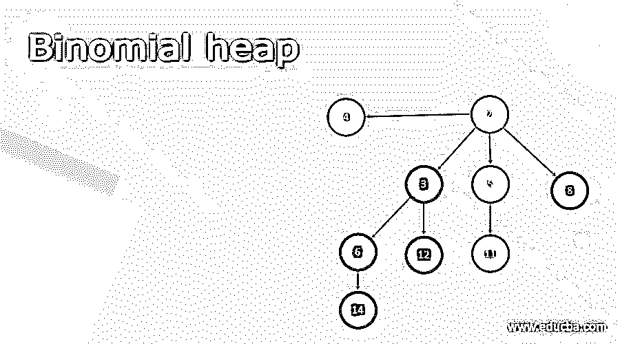

# 二项式堆

> 原文：<https://www.educba.com/binomial-heap/>

## 二项式堆简介

二项式堆是另一种数据结构，如数组、堆栈、队列、链表和树。它是满足以下属性的二叉树的集合:

*   首先，集合中没有两个二叉树具有相同的大小。
*   其次，集合中的每个节点都有一个键。
*   集合中的每个二叉树都满足堆属性。
*   最后，第四，二叉树的根是相连的，并且是递增的。

k 阶二叉树定义如下:

<small>Hadoop、数据科学、统计学&其他</small>

*   在二叉树中，正好有
*   是一对树，其中一个树的根成为另一个树的最左边的子树(对于所有树)。
*   将两个合并为一个，在根处具有最小值的将是的根，另一个将成为子节点。

### 表示内存中的二项式堆

*   堆中的每个节点 x 具有以下字段:
*   键[x]:包含数据
*   p[x]:指向 x 的父节点的指针
*   child[x]:指向 x 最左边的子级的指针
*   sibling[x]:指向紧挨着它右边的 x 的兄弟的指针
*   学位[x]:包含许多孩子的
*   如果 x 没有孩子，则 child[x] = NIL。
*   如果 x 有其父代的最右边的子代，那么 sibling[x] = NIL。
*   如果 x 是根 p[x] = NIL。
*   如果 x 是根，那么 sibling [x]指向列表中的下一个根。
*   如果 x 是根列表中的最后一个根，兄弟[x] = NIL。
*   给定的堆 H 由字段 head[H]访问，它只是指向 H 的第一个根列表的指针。
*   如果二项式堆 H 没有元素，head[H] = NIL。

### 二项式堆的实现

`key[x]: contains data
p[x]: pointer to x’s parent
child[x]: pointer to the leftmost child of x
sibling[x]: pointer to the sibling of x immediately to its right
degree[x]: containing several children
class Node{
int key;
Node p;
Node child;
Node sibling;
int degree;
}`

### 二项式堆上的操作

下面是对二项式堆的不同操作:

#### 创建二项式堆

*   创建一个空的二项式堆:MAKE_BINOMIAL_HEAP 过程简单地分配并返回一个对象 H，其中 head[H] = NIL。
*   因为它需要同样长的时间，所以运行时间将是。

#### 寻找最小键

*   过程 BINOMIAL_HEAP_MINIMUM 返回一个指针，指向 n 节点二项式堆 h 中具有最小键的节点。
*   因为二项式堆是最小堆排序的，所以最小键必须位于根节点中。
*   该过程从根列表中查找最小元素。
*   这个实现假设没有带值的键。
*   二项式堆最小值的运行时间是 O(logn)，因为最多有 floor(logn) +1 个根要检查。
*   当在堆上调用 figure BINOMIAL_HEAP_MINIMUM 时，返回包含 1 的节点地址。

**二项式 _ 堆 _ 最小值(H)的语法**

`yNIL
xhead[H] min
while x NIL
do if key[x] < min
then min key[x] y x
xsibling[x] return y`

#### 二项式链接程序

*   过程 BINOMIAL_LINK(y，z)将以节点 y 为根的树链接到以 z 为根的树。
*   它使 z 成为节点 y 的父节点。
*   节点 z 因此成为 a 的根

**二项式 _LINK(y，z)的语法**

`p[y]z
sibling[y]child[z] child[z]y
degree[z]degree[z]+1`

#### 联合两个二项式堆

*   给定两个二项式堆，H1 和 H2 创建一个二项式堆。
*   首先，我们简单地按照递增的顺序合并两个堆。
*   在这之后，我们需要确保至多有一棵任意度数的二叉树，以便我们组合相同度数的二叉树。
*   遍历列表。
*   在遍历合并根的列表时，我们保留三个指针 prev-x、x 和 next-x。
*   在旅行时，可能会出现以下 4 种情况
    *   案例 1: degree[x]degree[next-x]
        *   简单地走在名单的前面
    *   情况 2:degree[next-x]-degree[sibling[next-x]]
        *   简单地走在名单的前面
        *   下一次迭代执行情况 3 或情况 4
    *   情况 3 或情况 4:degree[x]= degree[next-x]degree[sibling[next-x]]
    *   案例 3: key[x]key[next-x]
        *   从根列表中删除 next-x 并链接到 x。
    *   案例 4: key[x]>key[next-x]
        *   从根列表中删除 x 并链接到下一个-x

**二项式堆联合语法(H1，H2)**

`HMAKE_BINOMIAL_HEAP
head[H]BINOMIAL_HEAP_MERGE(H1, H2)
free the objects H1 and H2 but not the lists they point to
If head[H] = NIL
Then return H
prev-xNIL
xhead[H] next-xsibling[x] while next-xNIL
do if (degree[x]degree[next-x]) or
(sibling[next-x]NIL and degree[sibling[next-x]] = degree[x])
then prev-xx
xnext-x
else if key[x]key[next-x] then sibling[x]sibling[next-x] BINOMIAL_LINK(next-x, x)
else if prev-x = NIL
then head[x]next-x
else sibling[prev-x]next-x
BINOMIAL_LINK(x, next-x)
xnext-x
next-xsibling[x] return H`

#### 联合两个二项式堆–分析

*   设 H1 包含 n1 个节点，H2 包含 n2 个节点，所以 n = n1 +n2
*   那么 H1 包含最多底数(log 1)+1 个根，而 H2 包含最多底数(log 2)+1 个根
*   所以 H 最多包含 floor(log n1)+floor(log N2)+22 floor(log n)+2 = O(logn)
*   因此，执行二项式堆合并的时间是 O(logn)次迭代。
*   因此二项式堆联合(H1，H2)需要 O(logn)

#### 插入节点

*   下面的过程将节点 x 插入到堆 H 中，假设 x 已经被分配并且 key[x]已经被填充。
*   该过程只是在 O(1)时间内创建一个单节点二项式堆 H ’,并在 O(logn)时间内将其与一个节点二项式堆合并。

**二项式 _ 堆 _ 插入(H，x)的语法**

`H’<-MAKE_BINOMIAL_HEAP()
p[x]<-NIL
child[x]<-NIL
sibling[x]<-NIL
degree[x]<-NIL
degree[x]<-0
head[H’]<-x
H<-BINOMIAL_HEAP_UNION(H,H’)`

### 结论

在本文中，我们已经讨论了与二项式堆相关的大部分主题。看完这篇文章，我们得出结论，二项式堆是一种非线性的数据结构，是满足一些特殊条件的二叉树的集合。我们可以使用联合语法连接两个二项式堆。它基于动态内存分配，这意味着它在运行时为数据分配内存。

### 推荐文章

这是二项式堆的指南。这里我们讨论二项式堆是一种非线性的数据结构，是满足一些特殊条件的二叉树的集合。您也可以看看以下文章，了解更多信息–

1.  [堆数据结构](https://www.educba.com/heap-data-structure/)
2.  [C 中的堆排序](https://www.educba.com/heap-sort-in-c/)
3.  [什么是堆内存？](https://www.educba.com/what-is-heap-memory/)
4.  [Seaborn 热图](https://www.educba.com/seaborn-heatmap/)

