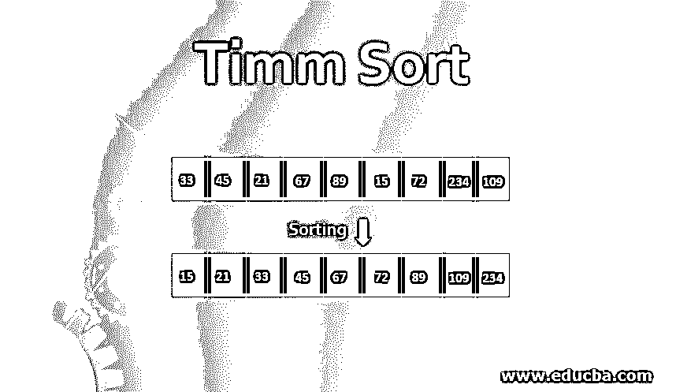
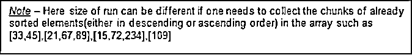
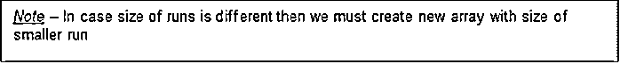
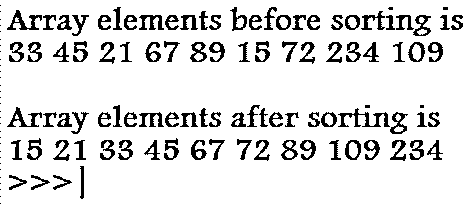

# 黑色小时

> 原文：<https://www.educba.com/timm-sort/>

## Timm 排序简介

Tim Peters 在 2001 年引入了 Tim sort 作为 Python 语言的稳定排序算法，它由插入排序和合并排序组成，通过将元素数组分成大小为 32 或 64(取决于数组大小)的块(称为游程)来提高排序性能，然后使用插入排序对这些游程进行排序，因为插入排序在数组大小较小时表现良好，并使用合并排序进一步合并它们，因为合并排序在数组中的元素数为 2 的幂时表现最佳。在这个主题中，我们将学习 Timm 排序。

### 如何进行 Tim 排序？

Tim Sort 是最快的排序算法，它使用两种算法在最佳情况下工作。

<small>Hadoop、数据科学、统计学&其他</small>

Tim Sort 的工作原理是，在小的排序块上执行合并排序可以提高性能。因此，在这里，我们的工作是将数组分成相同大小的不同游程，并使用插入排序对它们进行排序。

例如–[ 33，45，21，67，89，15，72，234，109]

#### 第一部分

这里我们将把这个数组分成大小为 3 的游程

Three

[33,45,21]  [67,89,15]  [72,234,109]

现在，我们将对每一次运行执行插入排序。

[33,45,21] -> [33,45,21]  ->[33,21,45] [67,89,15]  -> [67,89,15] -> [67,15,89]  ->[15,67,89] [72,234,109] -> [72,234,109] -> [72,109,234]

**结果数组** - > [33，21，45，15，67，89，72，109，234]

**复杂性**–插入排序需要二进制搜索新元素的正确位置+所有元素向右移位。因此，如果数组中元素的数量为 n，

二分搜索法复杂度= log(n ),并且由于对阵列的每个元素执行该复杂度，因此比较的次数= nlog(n)

轮班次数= 1+2+3…n-1 个元素= (n-1)*n/2 = O(n2)

**执行插入排序的成本** = nlog(n)次比较+N2 次移位，其中操作系统更适合执行移位并提高性能。

为了获得最佳性能，我们需要将游程长度保持在 2 的幂，最小长度=32，最大长度为 64 个元素。

#### 第二部分

现在，一旦我们运行了已排序的元素，我们将对它们执行 mergeSort。

执行合并排序需要额外的数组空间来存储用于比较的元素，在许多情况下，这是左右数组的总和，即 6，但这里我们将采用 size = min(left array 的大小，right array 的大小)的数组，这减少了所需的空间。

现在，我们将使用下面的算法对前两次运行执行合并排序

[33,21,45, 15, 67,89, 72,109,234]

**步骤 1-**初始化一个大小为 3 的新数组 Arr2，将第二次游程的元素复制到新数组 2 中，并将 Arr1 中的元素向右移动 3 个位置。

[0,0,0,33,21,45]Arr2 -> [15,67,89]

**步骤 2-**比较两个数组中的元素，开始填充数组 1。

[0,0,0,33,21,45]    [15,67,89]  – > Since 15<33 ->[15,0,0,33,21,45] [15,0,0,33,21,45]   [15,67,89]  -> Since 33<67 ->[15,33,0,33,21,45] [15,33,0,33,21,45]   [15,67,89]   -> 21<67 ->[15,33,21,33,21,45] [15,33,21,33,21,45]   [15,67,89]   ->45<67 -> [15,33,21,45,21,45]

**步骤 3-**复制数组中未被访问过的剩余元素

[15,33,21,45,67,89]

由于使用了较少的额外空间，因此这是一种就地排序算法，并且在比较具有相同值的两个元素的情况下，首先采用具有较低索引的值，从而使算法更加稳定。

对下一次运行重复上述 3 个步骤，Arr1 = [15，33，21，45，67，89，72，109，234] Arr2 = [72，109，234]

**和结果数组=**>【15，33，21，45，67，72，89，109，234】

**合并排序的复杂度** = Cm.nlog(n-x)，x 是合并排序中减少的级别数，因此我们的目标必须是增加 x，Cmis 是我们减少一半所需的空间数。

### 运行时执行合并的最佳解决方案

为了以更有效的方式对这些运行执行合并排序，将它们放入堆栈(运行)中，并将被递归地提取。

[33,21,45] [15,67,89] [72,109,234]

#### 算法

`while(runs.length>=2) :
If(runs[2].length > runs[0].length + runs[1].length{
If(runs[0].length > runs[1].length){
Merge(runs[0],runs[1])
}       else : break;
}
else : merge(runs[1],min(runs[0],runs[2])`

**例子**

`RUNLENGTH = 32
def iSort(myArr, leftIndex, rightIndex):
for x in range(leftIndex + 1, rightIndex+1):
temp1 = myArr[x] y = x - 1
while myArr[y] > temp1 and y >= leftIndex:
myArr[y+1] = myArr[y] y -= 1
myArr[y+1] = temp1
def mergeArray(myarr, lIndex, mid, rIndex):
l1, l2 =  mid - lIndex + 1, rIndex - mid
leftArr, rightArr = [], [] for i in range(0, l1):
leftArr.append(myarr[l + i])
for i in range(0, l2):
rightArr.append(myarr[mid + 1 + i])
i, j, k = 0, 0, l
while i < l1 and j < l2:
if leftArr[i] <= rightArr[j]:
arr[k] = leftArr[i] i += 1
else:
arr[k] = rightArr[j] j += 1
k += 1
while i < l1:
myarr[k] = leftArr[i] k += 1
i += 1
while j < l2:
myarr[k] = rightArr[j] k += 1
j += 1
def timSorting(myArr, num):
for i in range(0, num, RUNLENGTH):
iSort(myArr, i, min((i+31), (num-1)))
size = RUNLENGTH
while size < num:
for left in range(0, num, 2*size):
mid = left + size - 1
right = min((left + 2*size - 1), (num-1))
mergeArray(myArr, left, mid, right)
size = 2*size
if __name__ == "__main__":
myArr = [33,45, 21,67,89,15, 72, 234, 109] num = len(myArr)
print("Array elements before sorting is")
for i in range(0, num):
print(myArr[i], end = " ")
print()
timSorting(myArr, num)
print()
print("Array elements after sorting is")
for i in range(0, num):
print(myArr[i], end = " ")
print()`

**输出:**

### 结论–Timm 排序

Tim sort 是一种对元素数组执行排序的机制，它通过将元素分成最大为 32 或 64 的游程，然后使用插入排序对它们进行排序，插入排序在数组较小时被认为是最佳的，然后使用合并排序按排序顺序合并所有游程，因为它对排序元素块最有效，带来 O(n log n)时间的复杂性。

### 推荐文章

这是一个 Timm 排序指南。在这里，我们讨论如何执行 Tim 排序以及这两种算法，以便在它们的最佳情况下工作。您也可以看看以下文章，了解更多信息–

1.  [冒泡排序算法](https://www.educba.com/bubble-sort-algorithm/)
2.  [JavaScript 中的排序算法](https://www.educba.com/sorting-algorithms-in-javascript/)
3.  [Python 中的堆排序](https://www.educba.com/heap-sort-in-python/)
4.  [c#中的排序](https://www.educba.com/sorting-in-c-sharp/)

