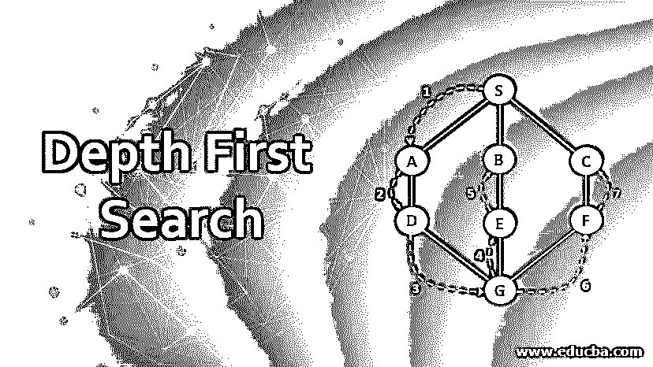
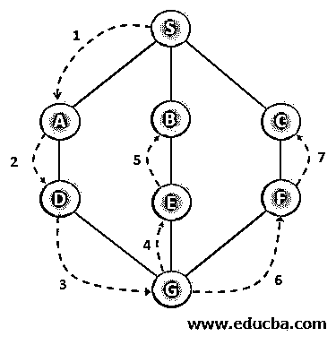
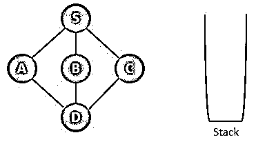
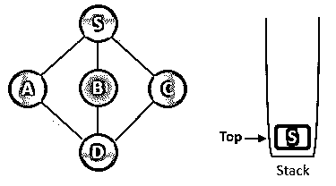
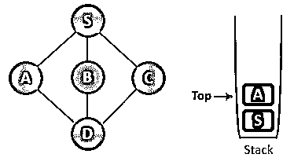
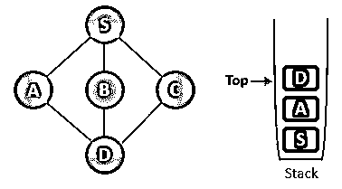
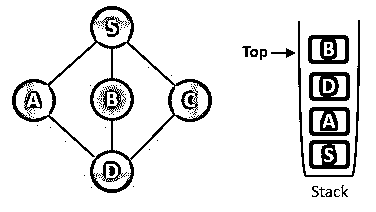
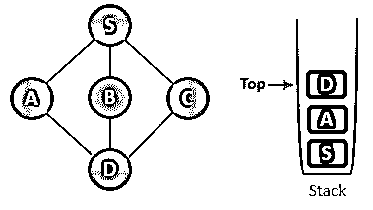
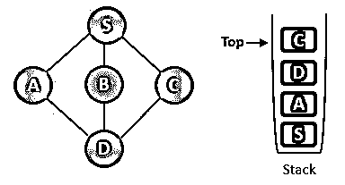
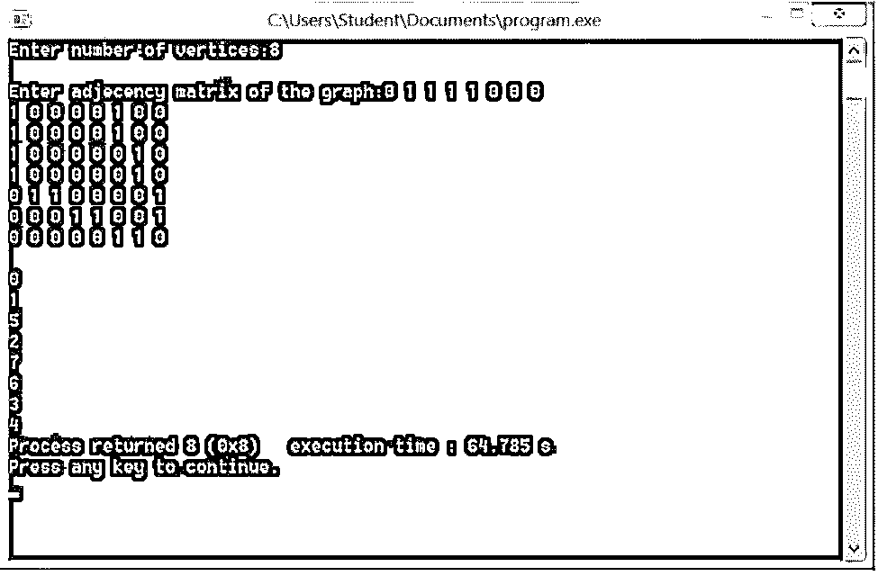

# 深度优先搜索

> 原文：<https://www.educba.com/depth-first-search/>

## 深度优先搜索简介

图的深度优先搜索是无信息搜索策略的重要组成部分。该算法用于在没有任何领域知识的情况下执行搜索活动。该算法以深度方式搜索节点，而不像广度优先搜索那样应用广度搜索策略。它通过搜索根节点开始操作，从而在该深度扩展后继节点。然后，它移动到该深度的另一个节点，直到出现死胡同。该算法需要更少的内存空间和时间来执行，即使当所需的解决方案位于树或图的底部时也是如此，这与 BFS 策略不同，后者需要大量的内存和执行时间。DFS 算法需要使用堆栈数据结构来实现。DFS 算法在没有领域知识的情况下工作，这是它的潜在优势。

### DFS 战略中涉及的步骤

现在，我们将看一下 DFS 战略中涉及的步骤。

<small>Hadoop、数据科学、统计学&其他</small>

*   **第一步:**我们访问根节点，任意起始顶点，以及相邻的未访问顶点。然后，我们将它标记或标注为已访问。
*   **第二步:**我们打印出来或者展示出来。
*   第三步:然后，我们将它放入堆栈中。
*   **步骤 4**–如果没有找到相邻顶点，我们从堆栈中执行顶点的弹出操作。这将逐渐从堆栈中移除没有相邻节点的所有顶点。
*   **第 5 步**–然后，我们重复第 1 步和第 2 步，直到所有节点都被访问并且堆栈为空。

### 带步骤的深度优先搜索示例

我们现在可以举一个例子。首先，应用 DFS 算法从根节点 S-A-D-G-E-B 开始遍历，然后到 F，最后到 c

#### 图形遍历深度图解

步骤如下。

**第一步:**首先，我们初始化堆栈来遍历图。

**第二步:**然后，我们将 S 节点标记为已访问，并将其推入堆栈。然后，我们探索从 s 中保持未访问的任何节点。我们从三个可用选项中选择任何节点。这里我们有 A、B 和 c。假设我们选择了首先要访问的 A 节点，并进一步探索。

步骤 3: 我们现在将一个节点标记为已访问，并将其推回堆栈。然后，再次寻找与节点 a 相邻的新节点。这里我们将 S 和 D 作为相邻节点。节点 S 已经被浏览过了，所以我们选择了 d。

**第四步:**现在，我们访问 D 节点，并将其标记为被访问节点。然后，我们将它推入堆栈，并进一步移动。在这里，我们现在有 B 和 C 节点，这是未经探索的。它们正好在节点 D 之前并且未被访问。所以我们选择了访问下一个 B 节点。

**第五步:**我们已经选好了要访问的 B 节点。然后我们将它标记为已访问，并将其推入堆栈。现在 B 没有任何相邻节点保持不被访问。因此，我们开始 pop 操作。所以我们从堆栈中弹出 B 节点。

**步骤 6:** 现在，我们检查堆栈的顶部元素，回溯到前一个节点，并检查任何相邻的未访问节点。所以我们在栈顶找到了一个 D 节点。

**第七步:**现在，我们只能看到还没有被访问过的节点，即从节点 d 开始的节点 C，这样，我们访问了 C 节点，并将其标记为已访问，并将其推入堆栈。

正如我们现在看到的，C 节点已经没有未被访问的节点了，所以继续执行弹出操作，直到我们找到任何尚未被访问的节点。因此，在本例中，我们找到了所有已经访问过的节点。因此，我们发现在弹出操作结束时堆栈是空的。

现在，我们尝试使用堆栈数据结构中的 push 和 pop 操作来执行 DFS 实现的程序。

### 用 C 语言实现 DFS 的程序

用于 DFS 实现的 C 语言程序如下:

`#include<stdio.h>
void DFS(int);
int G[10][10],visited[10],m;    //n here is number of vertices and the graph is being sorted in the array G[10][10] void main()
{
int x,y;
printf("Enter the number of vertices in the array:");
scanf("%d",&m);
//read the adjecency matrix
printf("\nEnter the matrix of the graph:");
for(x=0;x<m;x++)
for(y=0;y<m;y++)
scanf("%d",&G[x][y]);
//visited nodes are initialized to zero for our convenience
for(x=0;x<m;x++)
visited[x]=0;
DFS(0);
}
void DFS(int x)
{
int y;
printf("\n%d",x);
visited[x]=1;
for(y=0;y<m;y++)
if(!visited[y]&&G[x][y]==1)
DFS(y);
}`

**输出:**

**应用:**DFS 算法在计算机科学中有各种各样的应用。举例来说，DFS 被用于检测图中的循环、拓扑排序、测试图的二分性质、解决只有一个解的难题等。

**复杂度:**

DFS 搜索算法的运行时间类似于 BFS，由下式给出:

**O (V+E)**

*   **其中 V** =顶点数
*   E = 边的数量

### 深度优先搜索的优势

*   深度优先搜索算法需要较少的时间和存储空间。
*   DFS 确保如果解决方案存在，将会找到它。
*   特别是在图论中，DFS 有着巨大的应用。
*   执行时间表示为 T(V，E)=θ(1)+θ(d)+∑IT(VI，E i )，其中 d 可以表示为根节点的度数。v 和 E 是顶点和边的数目。

### 深度优先搜索的缺点

*   运行时间被认为是有限的，但当目标节点未知时，它可能会超过。
*   该算法可能会重复自己，而没有进一步的进展。人们担心 DFS 会出现类似 BFS 的无限循环。

### 结论

深度优先搜索是一种算法，对于它探索的路径来说是幼稚的。它遵循了无信息搜索策略，这一方面使它成为一种强大的策略，另一方面，它以更少的空间和时间赋予了深入探索的力量。类似于 BFS 战略，DFS 有各种各样的应用。

### 推荐文章

这是一个深度优先搜索的指南。在这里，我们讨论 DFS 策略、示例和代码实现中涉及的介绍和步骤。您也可以阅读以下文章，了解更多信息——

1.  [人工智能中的搜索算法](https://www.educba.com/search-algorithms-in-ai/)
2.  [Azure 功能](https://www.educba.com/azure-functions/)
3.  [亚马逊 53 号公路](https://www.educba.com/amazon-route-53/)
4.  [数据结构中的堆栈](https://www.educba.com/stack-in-data-structure/)

