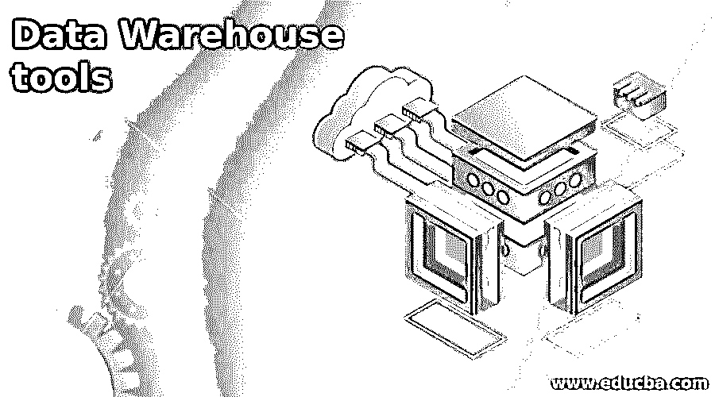
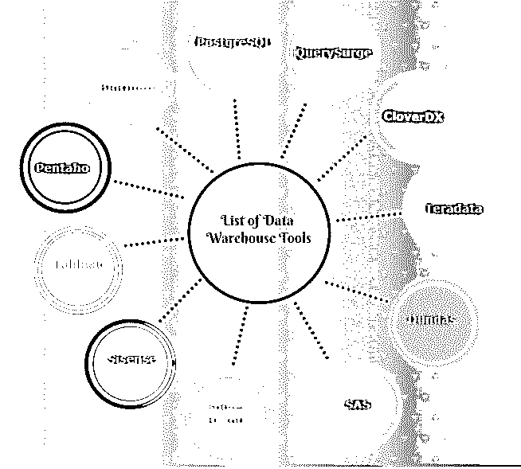

# 数据仓库工具

> 原文：<https://www.educba.com/data-warehouse-tools/>

## 数据仓库工具简介

数据仓库工具基本上用于在数据仓库上执行的各种操作，例如清理数据并将其从垃圾或重复数据中分离出来的过程，将来自各种格式的源的数据 ETL(提取、转换和加载)为目标中的单一通用格式的过程，查询数据以获取、更新、删除或分析各种数据组合的过程，生成用于分析的报告的过程以及重要的业务决策过程。

### 数据仓库工具列表

1.  查询
2.  CloverDX
3.  Teradata
4.  邓达斯
5.  斯堪的纳维亚航空公司
6.  西森斯
7.  活人画
8.  BigQuery
9.  一种数据库系统
10.  Pentaho
11.  求解器 BI360

让我们仔细看看这些工具及其详细特性。

<small>Hadoop、数据科学、统计学&其他</small>

#### 1.查询

QuerySurge 是 RTTS 开发的用于 ETL 测试的解决方案。它专为数据存储和大数据测试的自动化而设计。它保证在目标方案中，从来源获得的信息也保持完整。

**query surge 的特性-**

*   这将改善数据治理和数据质量。
*   QuerySurge 将加快数据交付周期。
*   提高数据和数据治理的质量。
*   有了这个自动化的手动测试变得容易。
*   它在各种平台上提供测试，比如 Oracle、Amazon、IBM、Teradata 和 Cloudera。
*   它提高了测试速度，并提供高达 100%的信息覆盖率。
*   它包括一个现成的 DevOps 解决方案，可用于大多数构建、ETL 和 QA 软件管理。
*   为信息安全提供共享的自动化电子邮件报告和控制面板。

#### 2.CloverDX

CloverDX 是一个数据集成平台，它是为那些需要完全和彻底控制他们正在做的事情的人设计的，他们试图在密集的环境中解决复杂的问题，而不是开发自己的工具，他们更喜欢购买同类产品中的优秀工具。它提供了与其他外部系统的接口。

**clover dx 的特性-**

*   享受来自 CloverDX 的公司级私人援助。
*   云中或现场的主机、节点或群集节点。
*   创建可扩展框架，节省现金并与员工分享。
*   流程和转换的自动化和编排。

#### 3.Teradata

另一个数据仓库工具是 Teradata，它用于显示和处理数据仓库中的大量信息。该组织自夸 Vantage 的解决方案是“普适数据智能平台”和“持续管理所有信息的同类软件”Vantage 提供了与许多仪器和语言以及领先的分析引擎的完全集成。

**Teradata 的特性-**

*   Teradata 支持 SQL 行业标准，以便与表进行交互来存储数据。
*   Teradata 的数据库系统建立在一个坚固的并行(MPP)架构上。
*   为了确保任务及时完成，Teradata 系统将任务分散在其程序之间。
*   Teradata 可以连接到连接到通道的系统，如大型机或网络连接系统。
*   高度可扩展的是 [Teradata 系统](https://www.educba.com/what-is-teradata/)。

#### 4.邓达斯

这是一个仪表板，分析，报告工具。有了 Dundas，无限的数据转换成为可能。它提供了创建有吸引力的数据的功能，如图表、表格样式、图形、文本格式等。

**邓达斯的特点-**

*   轻松的网络浏览器访问。
*   产品功能齐全的服务器应用。
*   集成和访问各种数据源。
*   用于拖放的智能工具。
*   可以分析高级和预测性数据。

#### 5.斯堪的纳维亚航空公司

SAS 是大型数据仓库工具之一，帮助用户从不同的数据源访问信息。使用 SAS 分析大信息使之变得简单。SAS 还提供跨组织的数据。可以在外部数据库中查看原始数据文件，并且可以使用不同的信息工具以及科学图表和报告来管理信息。

**SAS 的特性-**

*   在 SAS 中，你可以很容易地理解 GUI。
*   容易和能够产生复杂的模型。
*   内置知识库和生成定制 qkb 的能力。

#### 6.西森斯

Sisense 是一个商业智能工具，可以实时分析和可视化大型和不同的数据集。这是为具有各种显示器的仪表板准备复杂信息的理想方法。

**si sense 的特性-**

*   使用平滑数据创建单一真实版本。
*   它允许您在没有技术的情况下创建交互式仪表盘。
*   高速搜索大数据。
*   导出数据到 Excel，CSV，PDF 和其他格式的图像。
*   在一台大型商用服务器上处理信息。
*   通过过滤和计算确定关键指标。

#### 7.活人画

许多商业智能行业使用这个工具来可视化数据。它有助于以简单的格式分析复杂的数据。使用这个 tableau 工具创建的数据可视化是仪表板和工作表的形式。tableau 工具创建的数据很容易被业内任何级别的人理解。即使是没有任何技术知识的非技术人员也能理解这些数据。

**画面特征-**

*   导入所有尺寸和范围信息。
*   它管理元数据。
*   Tableau 创建一个“无代码”数据查询。

#### 8.BigQuery

BigQuery 是 Google 提供的一个业务级的、基于云的数据仓库工具。该平台旨在通过存储和查询大数据集来节省时间，提供针对数 TB 数据集的超快速 SQL 查询，为用户提供对数据的实时洞察。Google BigQuery 提供自动信息传输和完整的数据访问控制。

**big query 的特性-**

*   可以非常快速的分析大量的数据。
*   BigQuery API 需要编码技能。
*   对于非 IT 用户，它提供了学习曲线。
*   现收现付。成本低。

#### 9.一种数据库系统

PostgreSQL 是一个开放源代码的强大的对象相关数据库系统，经过 30 多年的积极发展，它在可靠性、健壮性和效率方面赢得了良好的声誉。

**PostgreSQL 的特性-**

*   PostgreSQL 支持后端。
*   供应商未提供 PostgreSQL。
*   PostgreSQL 相对于自由和开源来说是非常可扩展的。
*   它帮助开发人员构建应用程序，帮助管理人员保护数据完整性和创建容错环境，并帮助您管理数据，无论数据集大小如何。

#### 10\. Pentaho

Pentaho 是开源的。该工具不仅用于数据仓库，还用于业务分析过程。它设计有集成的、现代的、可嵌入的、面向未来的分析平台，包括多样化的[大数据需求](https://www.educba.com/what-is-big-data/)，以实现持续创新。该工具支持无需编码的大数据集成、带有个人仪表盘的数据可视化以及用于数据管道加速的平台。

**Pentaho 的特点-**

*   Pentaho 有一个简单的界面。
*   Pentaho 也有多种工具。
*   通过 Pentaho 快速轻松地分析各种来源的信息。

#### 11.求解器 BI360

Solver BI360 提供 360°数据、报告、数据存储和交互式仪表板，作为完整商业智能平台的一部分。在数据浏览器中，用户可以方便地查看数据并添加尺寸和模块。

**解算器 BI360 的特性-**

*   解算器 BI360 非常灵活。
*   他们有强大的客户支持。

### 结论

在本文中，我们已经了解了什么是数据仓库和数据仓库软件。通过比较所有的工具和软件，用户可以根据需求、准确性和效率选择最佳的替代工具。

### 推荐文章

这是数据仓库工具的指南。这里我们讨论仓库工具的介绍和列表，以及它们各自的特性。您也可以浏览我们推荐的其他文章，了解更多信息——

1.  [十大开发运维工具](https://www.educba.com/devops-tools/)
2.  [数据仓库架构](https://www.educba.com/data-warehouse-architecture/)
3.  [10 种流行的数据仓库技术](https://www.educba.com/10-popular-data-warehouse-tools/)
4.  [数据仓库职业](https://www.educba.com/career-in-data-warehousing/)
5.  [甲骨文数据仓库](https://www.educba.com/oracle-data-warehousing/)
6.  [主机测试中要遵循的步骤](https://www.educba.com/mainframe-testing/)
7.  [数据仓库测试指南](https://www.educba.com/data-warehouse-testing/)
8.  [三层数据仓库架构的概念](https://www.educba.com/three-tier-data-warehouse-architecture/)

