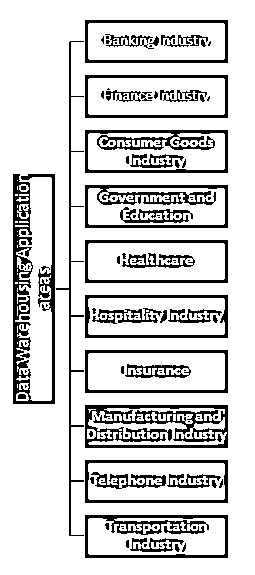

# 数据仓库职业生涯

> 原文：<https://www.educba.com/career-in-data-warehousing/>

## 数据仓库职业介绍

随着过去几年数据的巨大增长，需要组织这些数据以便从中提取有价值的信息，这就需要数据仓库。由于现在大多数公司都在处理数据，因此在数据仓库领域有很多发展机会。

### 数据仓库包括以下内容

数据清理

<small>Hadoop、数据科学、统计学&其他</small>

数据集成

数据整合

数据仓库就像从不同的来源创建一个数据仓库，这些来源可能是结构化的，也可能是非结构化的，通常来自特定的请求，这有助于决策制定，也有助于获得分析见解。

### 建立数据仓库职业生涯所需的教育

*   要在数据仓库领域建立职业生涯，数据仓库工程师应该拥有计算机科学、信息技术、数据科学/统计或任何其他相关领域的学士学位。同等工作经验也是可以接受的。
*   为了在数据仓库领域建立职业生涯，数据仓库工程师应该在 SQL server 编码和 SQL server 管理方面有至少 2 年的经验。他/她还应该对服务器集成和 ETL 工具有很好的了解。
*   为了在数据仓库领域建立职业生涯，数据仓库工程师还应该对维度建模和其他数据仓库技术有很好的理解。具备建立跨职能和关系数据库的良好知识。不仅 ETL 的候选人也应该有 Tableau 或任何其他分析平台(SpagoBI)的知识
*   为了在数据仓库领域建立职业生涯，数据仓库工程师必须具备使用 Ms Word、PowerPoint、Ms Excel、MS Project、MS Visio 和 MS Team Foundation Server 的良好技能，这将有助于他/她创建良好的数据设计，也有助于创建跨各种业务模块的良好文档和报告流程
*   要在数据仓库领域建立职业生涯，数据仓库工程师应该能够诊断复杂的数据仓库流程、业务逻辑故障和数据流问题，为此，他/她应该精通分析和调试 SQL 查询，还应该精通任何脚本语言，如 python、C sharp、Perl、R 等。
*   要在数据仓库领域建立职业生涯，数据仓库工程师必须具备良好的人际交往技能，思想开放，欢迎任何变化，他/她应该自我激励，积极主动，超越职责范围
*   要在数据仓库领域建立职业生涯，数据仓库工程师应该具备良好的人际交往能力，应该能够与公司的其他人建立牢固、有意义和持久的关系。他/她应该平易近人。他/她可以与合作人员或高级管理层分享他们的见解。

### 职业道路

通常有两种数据库，一种是 [OLAP](https://www.educba.com/what-is-olap/) (在线分析处理)数据库，另一种是传统的关系数据库设计，称为 OLTP(在线分析事务处理)。

数据仓库属于[面向数据工程](https://www.educba.com/what-is-data-engineering/)的路径，下面给出了一组简短的课程，帮助人们在数据仓库领域建立成功的职业生涯，并成为数据仓库专家。

对于初学者来说，必须熟悉数据仓库领域的术语，并且可以浏览下面的链接，该链接简要总结了现实世界中使用的术语。

[http://www . SQL boot camp . com/how-to-be-a-data-warehouse-architect/](http://www.sqlbootcamp.com/how-to-become-a-data-warehouse-architect/)

成为一名数据仓库工程师的必经之路是在一所专门从事数据库管理的大学里学习计算机课程。候选人应该擅长计算机，应该有效地处理庞大的数据集。

现在有很多培训项目和兼职课程，人们可以通过这些项目成为一名数据仓库工程师。这些通常是为正在寻找转换(工作/职业道路的改变)的职业人士准备的。对于像这样的候选人，他们应该乐于学习新技术，因为这些技术不时会有机会出现。

数据仓库/数据库管理方面的一些顶尖学校如下

*   伊利诺斯州芝加哥市**德保罗大学**的[计算和数字媒体学院](https://www.educba.com/career-in-digital-media/)
*   纽约皇后区约翰大学
*   **纽约佩斯大学**纽约
*   阿肯色州琼斯伯勒的阿肯色州立大学

### **数据仓库的应用领域**

在行业/公司中使用数据的任何地方，都需要行业数据仓库，[数据仓库](https://www.educba.com/data-warehousing-interview-questions/)的一些应用领域如下:

让我们来看看其中的几个:

*   在银行业，数据仓库被用于[风险管理](https://www.educba.com/risk-management-in-banks/)，以及分析消费者数据、[市场趋势](https://www.educba.com/emerging-market-trends-2019/)，并在决策中发挥重要作用(尤其是在贷款部门)。
*   在金融行业，数据仓库用于分析客户的消费模式，从而使客户的利润最大化。
*   在医疗保健行业，数据仓库用于隔离患者数据，以便在保险公司需要时可以提供给他们。它还有助于安全地跟踪员工记录和财务交易。
*   在保险业中，数据仓库用于分析数据模式和客户趋势，以便为客户准备定制的保单(为每个客户定制保单)。
*   在服务部门，数据仓库用于维护客户档案、资源管理收入模式和财务记录。
*   在运输行业中，数据仓库用于存储和维护船上的船员数据，并存储用于定价策略的财务记录。它还存储客户数据，以便让活动者与一群客户一起试验他们的市场策略。

### 薪资(美国数据，而非印度具体数据)

根据学历和经验，下表显示了数据仓库工程师的工资。

| **教育** | **经历** | **美元工资** |
| 副学士学位 | <1 | **$148，511-$157，815** |
| 副学士学位 | 3-4 | **$149，200-$158，332** |
| 副学士学位 | 5-6 | **$150，062-$158，849** |
| 副学士学位 | 7-9 | **$151，440-$159，883** |
| 学士学位 | <1 | **$150，062-$158，849** |
| 学士学位 | 3-4 | **$150，751-$159，366** |
| 学士学位 | 5-6 | **$151，440-$159，883** |
| 学士学位 | 7-9 | **$152，819-$160，745** |
| 硕士或工商管理硕士 | <1 | **$151，440-$159，883** |
| 硕士或工商管理硕士 | 3-4 | **$152，129-$160，228** |
| 硕士或工商管理硕士 | 5-6 | **$152，819-$160，745** |
| 硕士或工商管理硕士 | 7-9 | **$154，025-$161，778** |
| 法学博士、医学博士、哲学博士或同等学历 | <1 | **$152，819-$160，745** |
| 法学博士、医学博士、哲学博士或同等学历 | 3-4 | **$153，336-$161，261** |
| 法学博士、医学博士、哲学博士或同等学历 | 5-6 | **$154，025-$161，778** |
| 法学博士、医学博士、哲学博士或同等学历 | 7-9 | **$155，231-$162，640** |

### **结论或职业前景**

使数据仓库成为一个需要关注的领域的是，过去只有大公司使用数据来预测公司的增长，但随着计算领域的进步(如 AWS、Hadoop 等)，甚至更小的新兴公司也能够利用这种做法，因此对数据仓库工程师的需求呈指数级增长。如今，如果没有适当的分析，公司就会迷失在市场中，如果分析是公司的心脏，那么数据就是血液。

### 推荐文章

这是数据仓库职业生涯的指南。在这里，我们讨论了数据仓库的简介、所需的教育技能以及应用领域、工资和职业前景。您也可以阅读以下文章，了解更多信息——

1.  [股票研究生涯的惊人指南](https://www.educba.com/equity-research-career/)
2.  [你不知道的 5 种营销职业](https://www.educba.com/marketing-career-path/)
3.  [健康管理职业指南](https://www.educba.com/healthcare-management-careers/)
4.  [在信息安全职业生涯中取得成功的步骤](https://www.educba.com/information-security-career-path/)

