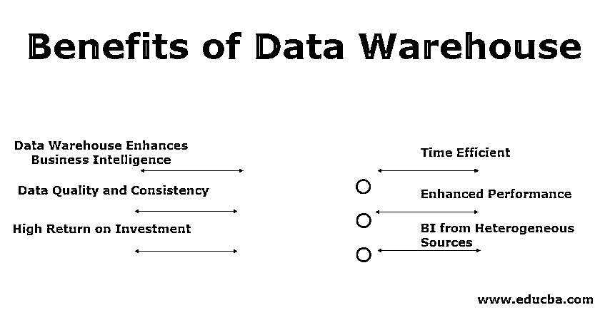

# 数据仓库的好处

> 原文：<https://www.educba.com/benefits-of-data-warehouse/>

## 介绍数据仓库的优势

数据仓库系统在任何组织中的应用都有巨大的优势，因为它是商业智能输入材料的主要来源。组织选择数据仓库的最常见原因是“快速访问数据”、“更高的数据质量和可靠性以及低冗余或零冗余”、“实现卓越的业务决策”、“更低的时间消耗”、“存储或存档历史数据以备后用”、“渐进性能”、“来自多个来源的集成数据的一站式商店”、“由于即时决策而提高的生产率”等。

### 数据仓库给企业界带来的好处

数据仓库给企业界带来的好处如下:

<small>Hadoop、数据科学、统计学&其他</small>

#### 1.数据仓库增强商业智能

为数据仓库使用不同的数据源有助于收集更多相关的数据。它通过不断地将新数据与以前收集的数据进行匹配，有助于降低错误频率。经过一定的格式化和处理后，数据非常一致，可以随时进行分析。数据的质量有助于决策者根据确凿的事实做出决策。现在，当局不再依赖不完整或低质量的数据。根据 Exforsys 的说法，我们通过数据仓库获得的商业智能的增长可以直接应用于市场细分、库存管理和销售。

#### 2.数据质量和一致性

一致、相关和历史数据的集成数据库有助于分析师提高工作效率，并提供更准确的业务洞察。组织的历史数据有助于研究和分析不同的时间段和趋势，以便更好地预测未来。数据仓库还有助于持续积累和集成大量数据，最终减轻生产系统的压力。它有助于从生产服务器卸载数据提取和报告，并且还可以消除对 SSIS 软件包的依赖，因为现在可以通过数据仓库直接访问数据。来自某个组织的各种活动或部门的一致信息有助于理解趋势，也有助于认识到所犯的错误，并在感受到挫折之前纠正它们。

#### 3.高投资回报

就创收而言，数据仓库是昂贵的，但随着时间的推移会产生高质量的结果。数据仓库在早期阶段需要大量资金，但随着时间的推移，它可以帮助组织呈指数级增长。根据国际数据公司的数据，1996 年数据仓库投资的平均三年回报率达到了 401%。

#### 4.时间效率

数据仓库使决策者能够在一个地方快速访问来自不同来源的关键数据。可以在很短的时间间隔内做出高效的决策，这意味着现在当局不需要浪费时间从多个来源收集数据。随着数据仓库的建立，现在业务主管不需要 IT 部门的支持就可以调出数据，而是可以轻松地执行所需数据的查询。

#### 5.增强的性能

随着数据检索和数据分析速度的提高，我们能够存储大量数据，也能够快速查询。数据仓库专门用于收集和分析数据，而不仅仅是操作系统创建和修改数据。实施数据仓库和简化的数据模型简化了报告的创建，也有助于为特定需求创建定制报告。如果与高级 SQL 功能一起使用，它有助于优化数据库性能。

#### 6.来自不同来源的 BI

一个组织有许多物理上不同的、基于不同平台的子系统。在商业智能中，需要合并来自不同来源的数据。在数据仓库中，这些数据的集成是在一个地方完成的，并且是可访问的。将一个组织的所有数据累积到一个容器中减少了数据重复，这使得数据仓库成为一个故事的单一视图，而不是具有多种含义的多个故事。

在了解了数据仓库对组织的好处之后。让我们来看一个真实世界的问题及其在数据仓库中的解决方案的案例研究。

### 美国的一家电力控股公司

*   **业务问题—**各种子市场的能源交易系统没有集成，导致详细和分散的报告特征。该企业需要一个组合的、多层次的交易数据，以及一整套用于风险和市场对市场分析的风险衡量标准。
*   **提供解决方案—**实施了基于网络的风险报告门户。它基于客户需求，包括具有分层安全模型的报告。组织内的不同角色被允许查看不同的数据集合。该系统提供了一组报告，有助于根据用户的工作职能和业务重点提供不同的视图。在最高级别，公司可以看到他们的整个能源投资组合，并可以评估各种能源交易工具的对冲策略。

这个案例研究帮助我们认识到数据仓库如何简化组织的业务模型，并通过更有效地洞察组织的数据来帮助获得更多的业务增长。

### 结论

在本文中，我们了解了数据仓库及其在当前市场环境中的优势，以及数据仓库如何帮助一家电力控股公司简化其业务问题，并帮助决策者获得一些有益的见解。

### 推荐文章

这是一个关于数据仓库好处的指南。在这里，我们讨论企业世界的数据仓库的介绍和好处。您也可以浏览我们推荐的其他文章，了解更多信息——

1.  [什么是数据分析师？](https://www.educba.com/what-is-data-analyst/)
2.  [数据仓库工具](https://www.educba.com/data-warehouse-tools/)
3.  [什么是数据仓库？](https://www.educba.com/what-is-data-warehouse/)
4.  [数据仓库的类型](https://www.educba.com/types-of-data-warehouse/)

