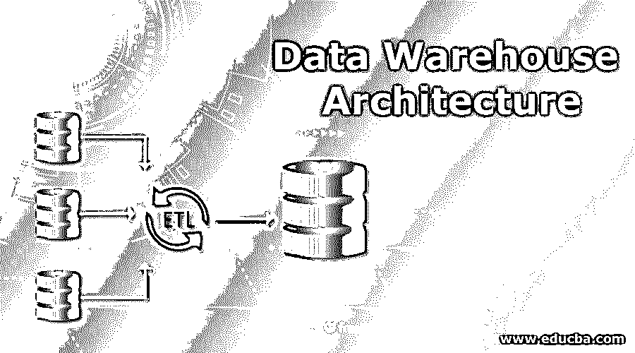
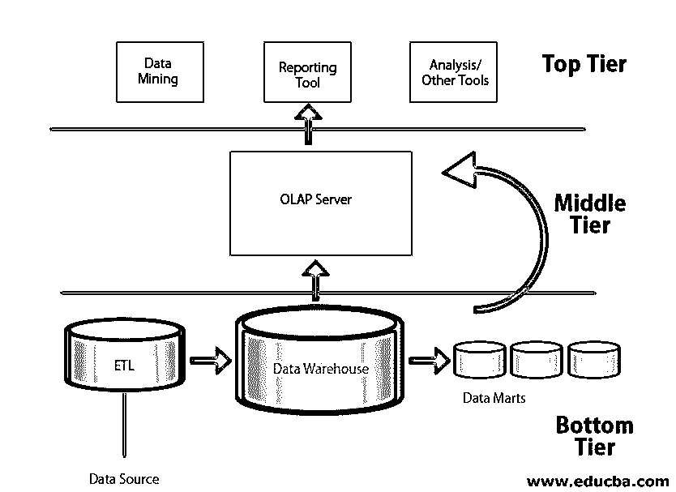
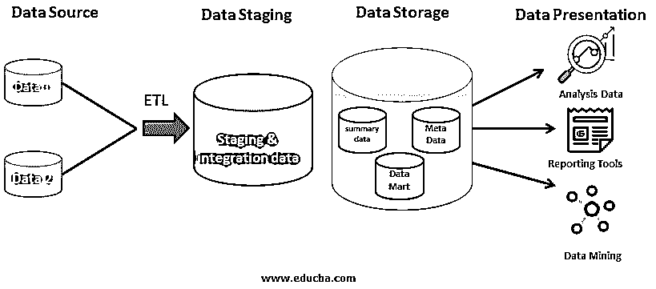

# 数据仓库体系结构

> 原文：<https://www.educba.com/data-warehouse-architecture/>

## 数据仓库体系结构介绍

数据仓库体系结构可以被定义为具体功能安排的结构表示，基于该结构表示来构建数据仓库，该数据仓库应当包括其所有主要的实用组件，该数据仓库通常被四个精细层包围，例如，来自不同源的所有数据位于其中的源层、数据经受 ETL 处理的暂存层、存储经处理的数据以供将来练习的存储层、以及根据用户的便利性使用前端工具的呈现层。

### 数据仓库体系结构

<small>Hadoop、数据科学、统计学&其他</small>

数据仓库体系结构通常由三层组成。

*   顶级
*   中间层
*   底层

#### 顶级

*   顶层由体系结构的客户端前端组成。
*   存储在数据仓库中经过转换和逻辑应用的信息将在该层中用于业务目的。
*   为了生成所需的信息，提供了几种用于报告生成和分析的工具。
*   数据挖掘已经成为一个很大的趋势，在这里完成。
*   确定基于利润的商业交易的所有需求分析文档、成本和特性都是基于这些工具完成的，这些工具使用数据仓库信息。

#### 中间层

*   中间层由 OLAP 服务器组成
*   OLAP 是在线分析处理服务器
*   OLAP 用于向商业分析师和经理提供信息
*   由于它位于中间层，它理所当然地与底层的信息进行交互，并将洞察力传递给顶层的工具，后者处理可用的信息。
*   数据仓库架构中主要使用关系或多维 OLAP。

#### 底层

底层主要由数据源、ETL 工具和数据仓库组成。

**1。数据来源**

数据源由获取的源数据组成，并提供给 Staging 和 ETL 工具以供进一步处理。

**2。ETL 工具**

*   ETL 工具非常重要，因为它们有助于将逻辑、原始数据和模式结合成一体，并将信息加载到数据仓库或数据集市中。
*   有时，ETL 将数据加载到数据集市中，然后将信息存储在数据仓库中。这种方法被称为自底向上的方法。
*   ETL 将信息直接加载到数据仓库的方法称为自顶向下方法。

**自上而下方法和自下而上方法的区别**

| **自上而下的方法** | **自下而上的方法** |
| 当来自数据仓库的信息被用于创建数据集市时，提供了明确和一致的信息视图 | 由于首先创建了数据集市，因此可以很容易地生成报告，并且与数据集市交互相对容易。 |
| 强大的模型，因此受到大公司的青睐 | 没有那么强，但是数据仓库可以扩展，可以创建大量的数据集市。 |
| 时间、成本和维护成本都很高 | 时间、成本和维护成本低。 |

**数据集市**

*   数据集市也是一个存储组件，用于存储由个人授权的与公司相关的特定功能或部分的数据。
*   数据集市从数据仓库中收集信息，因此我们可以说数据集市存储了数据仓库中的信息子集。
*   数据集市灵活且体积小。

**3。数据仓库**

*   数据仓库是整个数据仓库体系结构的中心组成部分。
*   它充当储存信息的仓库。
*   大量数据存储在数据仓库中。
*   这些信息被大数据等多种技术使用，这些技术需要分析大量的信息子集。
*   数据集市也是数据仓库的一种模型。

### 数据仓库体系结构的不同层

下面是不同的层:

在数据仓库体系结构中有四种不同类型的层。

#### 1.数据源层

*   数据源层是遇到来自源的数据并随后将其发送到其他层进行所需操作的层。
*   数据可以是任何类型。
*   源数据可以是数据库、电子表格或任何其他类型的文本文件。
*   源数据可以是任何格式。然而，我们不能期望得到相同格式的数据，因为来源有很大的不同。
*   在现实生活中，源数据的一些例子可以是
*   公司中每个特定应用程序或工作或雇主条目的日志文件。
*   调查数据、股票交易数据等。
*   网络浏览器数据等等。

#### 2.数据暂存层

以下步骤发生在数据暂存层。

**步骤#1:数据提取**

源层收到的数据被输入到暂存层，在暂存层中，对获取的数据进行的第一个处理是提取。

**第二步:登陆数据库**

*   提取的数据临时存储在着陆数据库中。
*   一旦提取了数据，它就检索数据。

**步骤#3:中转区**

*   获取着陆数据库中的数据，并在中转区执行若干质量检查和中转操作。
*   还确定了结构和模式，并对无序的数据进行了调整，从而试图在已获取的数据之间实现通用性。
*   在转换和更改之前为数据准备一个位置或设置是一个额外的优势，这使得准备过程非常重要。
*   它使数据处理更容易。

**第四步:ETL**

*   它是一种提取、转换和加载。
*   ETL 工具用于数据的集成和处理，其中逻辑被应用于相当原始但有点有序的数据。
*   根据所需的分析性质提取这些数据，并将其转换为适合存储在数据仓库中的数据。
*   在转换之后，数据或者说信息最终[被加载到数据仓库](https://www.educba.com/what-is-data-warehouse/)中。
*   ETL 工具的一些例子是 Informatica，SSIS 等。

#### 3.数据存储层

*   处理后的数据存储在数据仓库中。
*   这些数据经过清理、转换，并以明确的结构进行准备，从而为雇主提供了根据业务需要使用数据的机会。
*   根据架构的方法，数据将存储在数据仓库和数据集市中。数据集市将在后面的阶段讨论。
*   有些还包括操作数据存储。

#### 4.数据表示层

*   在这一层，用户可以与存储在数据仓库中的数据进行交互。
*   将使用查询和几个工具来根据数据获取不同类型的信息。
*   信息通过数据的图形表示到达用户。
*   报告工具用于获取业务数据，业务逻辑也用于收集多种信息。
*   元数据信息以及系统操作和性能也在这一层进行维护和查看。

### 结论

数据仓库很重要的一点是它的效率。为了创建一个高效的数据仓库，我们构建了一个称为业务分析框架的框架。

关于数据仓库的设计，有四种类型的视图。

**1。自顶向下视图:**该视图只允许选择数据仓库所需的特定信息。

**2。数据源视图:**这个视图显示了从数据源到数据如何被转换和存储的所有信息。

**3。数据仓库视图:**该视图通过事实表和维度表显示数据仓库中的信息。

**4。业务查询视图:**这是从用户角度展示数据的视图。

### 推荐文章

这是数据仓库架构的指南。在这里，我们讨论了数据仓库架构的不同类型的视图、层和层。您也可以浏览我们推荐的其他文章，了解更多信息——

1.  [数据仓库职业](https://www.educba.com/career-in-data-warehousing/)
2.  【JavaScript 如何工作
3.  [数据仓库面试问题](https://www.educba.com/data-warehouse-interview-questions/)
4.  [什么是熊猫](https://www.educba.com/what-is-pandas/)
5.  [数据仓库测试完整指南](https://www.educba.com/data-warehouse-testing/)
6.  [三层数据仓库架构指南](https://www.educba.com/three-tier-data-warehouse-architecture/)

