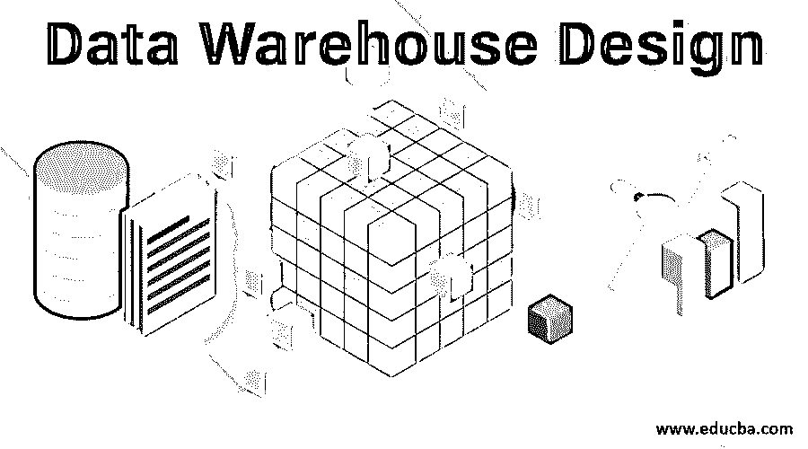
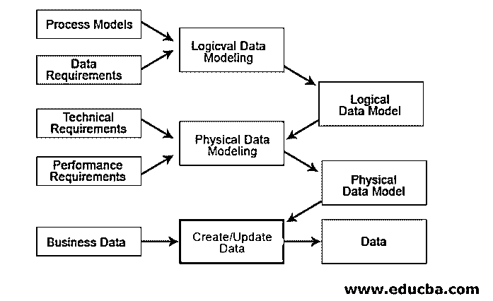
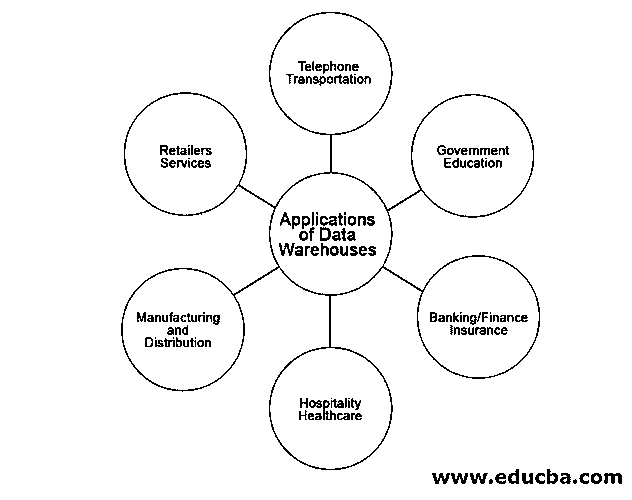

# 数据仓库设计

> 原文：<https://www.educba.com/data-warehouse-design/>

## 数据仓库设计简介

对于设计和实现数据仓库系统，数据仓库实践有其自己的开发生命周期流程。它涉及基本步骤，如需求分析、数据源识别、ETL 处理、基于需求和数据源选择数据模型的数据建模，以及选择实现数据仓库所基于的设计方法的设计方法，即“自顶向下方法”或“自底向上方法”

数据仓库有两个主要概念:

<small>Hadoop、数据科学、统计学&其他</small>

*   **OLAP:** 在线分析处理
*   **OLTP:** 在线事务处理

两者都是在线处理系统，但有一些不同之处。 [OLTP 管理](https://www.educba.com/what-is-oltp/)ATM 等交易应用， [OLAP 使用](https://www.educba.com/what-is-olap/)进行报告、预测等分析处理。

### 需求收集

*   需求收集是数据仓库设计的一个阶段。它需要确定标准并成功地实施这些标准。因此，数据仓库设计将使用两种策略:业务策略和技术策略。
*   业务战略注重长期业务观点，有助于增加增长利润。技术策略需求基于用户报告、分析、硬件选择、开发方法、测试技术、实现环境和用户培训。
*   当我们确定业务和技术战略时，我们还需要设计 BCP(灾难恢复)计划。当发生人为或自然的灾难时，我们需要有一个计划来快速恢复数据并确保没有数据丢失。制定灾难恢复计划是一项挑战，也是对组织的信任。

### 环境设置

*   一旦我们为数据仓库设计收集了数据，我们就需要为开发、测试和生产建立一个合适的环境。最好应该有一个独立的应用程序、数据库和独立的报告/ETL 系统。
*   当我们为每一个构建单独的环境时，它确保所有的改变都可以被开发/测试，然后转移到生产中。
*   如果我们有一个为所有这些活动设计的单一环境，最终可能会出现问题和数据丢失。例如，当系统中发生事故时，我们无法导航并找到修复它的方法，这使它变得更加复杂。

### 数据建模

*   一旦建立了需求收集和环境，接下来就是设计如何在数据仓库中连接数据源、处理和存储。这种技术被称为数据建模。它可以是对对象和其他对象之间关系的分析。
*   在设计数据仓库时，工程师们设计了数据需要如何存储以及存储在哪里。同时，我们还应该定义从数据仓库中检索数据的可能方式。一旦确定了来源，团队就可以构建逻辑并创建结构模式视图。

### 数据模型的类型

有三种类型:

*   概念的
*   逻辑学的
*   身体的

下面提到了三种类型的数据模型:

**1。概念性的:**它描述了系统包含的内容，并且由业务架构师设计来定义业务策略的范围。

**2。逻辑:**这定义了如何在 DBMS 中创建逻辑；它将由业务分析师和数据架构师设计，以创建一组存储/检索数据的规则

**3。物理:**这定义了系统如何实现。

### 数据仓库设计的使用

当检索数据时，成为一个好的数据仓库设计可能是耗时的。每一步都必须有效地遵循，才能使系统成为一个好系统。它将帮助组织处理复杂类型的数据，并根据趋势分析提高生产率。所以 DWH 建筑设计的每一步都很重要，在选择方法上更有意识。组织随后进入每个流程，并成功实现数据仓库。

数据仓库有几个重要的应用用途:

**1。银行业:**大多数银行都在使用数据仓库来存储大量的交易数据，并且能够更快地检索查询数据。它可以像客户数据、市场趋势、报告、分析等一样进行管理。

**2。金融业:**与银行业类似，但唯一的重点是通过分析客户数据来改善财务变化。

**3。政府:**如今，政府在线管理大量数据，并将其存储在关系数据库中。每个数据都像 Aadhaar 一样相互关联；潘与许多消息来源有关联。

**4。医疗保健:**医疗保健管理者和服务者如此多的信息。它维护临床细节、客户记录并帮助他们预测结果、分析反馈并生成报告。

**5。保险:**保险公司主要用于数据模式、客户趋势和维护记录。

**6。制造和分销行业:**在所有行业中最广泛使用，用于存储项目信息，并帮助他们预测制造和销售的需求项目。分析售出的物品，从而提供更好的决策技巧。

**7。零售商服务:**零售商是生产商和顾客之间的中间人。数据仓库帮助他们了解促销和商品购买趋势。

**8。电话行业:**电话行业管理着大量的历史数据，这些数据有助于制定客户数据趋势和目标来推动广告活动。

### 数据仓库的优点和缺点

下面给出了提到的优点和缺点:

#### 优势:

*   提供增强的商业智能。
*   确保数据质量和一致性。
*   节省时间和金钱。
*   跟踪历史智能数据。
*   产生高投资回报率。

#### 缺点:

*   额外的报告工作。
*   数据的不灵活性和同质化。
*   所有权问题。
*   对大量资源的需求。
*   隐藏的问题耗费时间。

### 推荐文章

这是数据仓库设计指南。这里我们讨论数据仓库的设计技术、需求收集、环境设置、类型、用途以及优缺点。您也可以阅读以下文章，了解更多信息——

1.  [数据仓库的好处](https://www.educba.com/benefits-of-data-warehouse/)
2.  [数据仓库实现](https://www.educba.com/data-warehouse-implementation/)
3.  [数据仓库建模](https://www.educba.com/data-warehouse-modeling/)
4.  [数据仓库工具](https://www.educba.com/data-warehouse-tools/)

