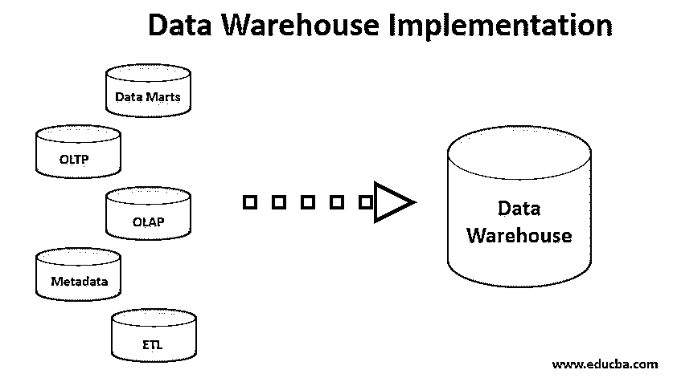
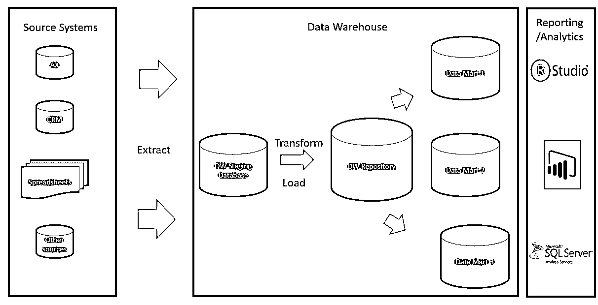
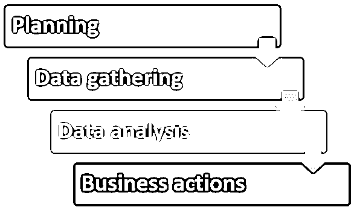
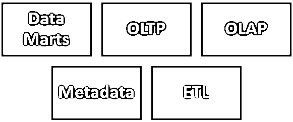
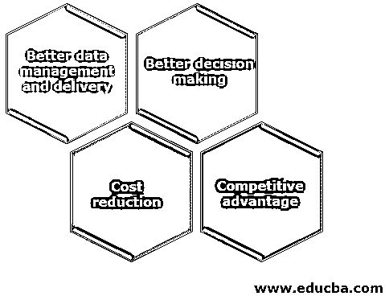

# 数据仓库实现

> 原文：<https://www.educba.com/data-warehouse-implementation/>

## 数据仓库实现简介

数据仓库实现是在根据客户提供的需求对数据仓库进行分类、分析和设计之后，创建一个功能完备的数据仓库所必需的一系列活动。数据仓库实现的各个阶段是“规划”、“数据收集”、“数据分析”和“业务行动”。每个数据仓库都需要一些重要的组件，这些组件需要在设计系统实现时进行定义，比如数据集市、OLTP/ OLAP、ETL、元数据等。

<small>Hadoop、数据科学、统计学&其他</small>

(来源:Stoneridge 软件，2019 年。)

随着数据量的日益增长，用于管理和操作数据的传统方式和方法在本质上已经变得过时，为了克服这个问题，我们需要一个更有效和更先进的数据存储系统来配合数据仓库的使用。

### 什么是数据仓库实现？

以下是对什么是数据仓库实现的解释:

*   为了以有效的方式为组织识别和存储数据，数据仓库的概念应运而生。让我们从什么是数据仓库开始？数据仓库可以说是存储大量数据的存储区域，可以帮助组织基于强大的数据分析和商业智能做出决策。
*   它是一个存储库，存储来自各种来源的各种格式的数据，并在 ETL 工具的帮助下将这些数据转换成可用于组织的报告和仪表板目的的标准格式。这有助于从组织收集的数据中产生有意义的见解。
*   在组织中建立和实现数据仓库系统的过程称为数据仓库实现。[数据仓库是企业商业智能过程中最重要的组成部分之一。数据仓库实现过程需要一系列步骤，需要以非常有效的方式来遵循这些步骤。这些过程如下:](https://www.educba.com/career-in-data-warehousing/)

#### 1.规划

计划是流程中最重要的步骤之一。它有助于我们获得一条路径或路线图，我们必须遵循它来实现我们描述的目标和目的。它是组织中实施的每个成功项目的基石。如果缺乏合理的计划，那么项目很有可能会失败。

#### 2.数据采集

因为数据在任何地方都是可用的，但是所有可用的数据对一个组织都没有帮助。数据收集是一个涉及从各种来源收集可用于数据分析和报告的数据的过程。它涉及广泛的步骤，并且是一个耗时的过程，因为我们需要首先确定对组织有帮助的数据。

#### 3.数据分析

一旦收集了数据，下一步就是数据分析。从一天当中一起产生和获得有意义的见解的过程被称为数据分析。

#### 4.商业行为

从数据分析中获得的见解和信息将进一步用于组织的决策。洞察力水平越高，业务决策的效率就越高，而这些决策将决定组织的未来。

### 数据仓库实现的组件

数据仓库实现的一些主要组件如下:

#### 1.数据集市

数据集市是数据仓库的重要组成部分。可以说它是数据仓库的子集，专注于特定的业务线，如销售、市场营销、人力资源等**。**

#### 2.olap

OLTP 层处理与组织相关的任务中的事务性数据。它代表在线交易处理。它处理本质上经常变化的事务性数据。

#### 3.OLAP

OLAP 层帮助处理和分析存储在数据库中的数据。它代表在线分析过程。这一层处理本质上不经常变化的主数据。

#### 4.抽取、转换、加载至目的端（extract-transform-load 的缩写）

[ETL 过程帮助](https://www.educba.com/etl-process/)将不同来源的数据提取到一个数据仓库中。提取、转换和加载的过程用于数据入库**。**

#### 5.[计]元数据

数据的数据被称为元数据。它有助于获得数据的粒度。它有助于获取有关数据的信息。例如，如果我们有国家数据，那么州数据、城市数据和区域级别可以称为数据的元数据。

### 数据仓库实现的优势

一个组织使用一个可靠的数据仓库系统有很多好处。在组织中使用数据仓库系统的一些最突出的好处和优势如下:

#### 1.更好的数据管理和交付

在组织中使用数据仓库系统的最重要的优势之一是高效的数据管理和交付。它有助于将来自不同来源的所有类型的数据存储到一个可用于分析目的的单一数据库中**。**

#### 2.更好的决策

有效的内部单元商业智能的使用组织的管理可以基于可靠的数据分析做出有效的决策。

#### 3.成本降低

它有助于避免重复工作，最终有助于降低成本和提高组织的效率。

#### 4.竞争优势

当组织能够做出有效的决策时，他们将准备好击败他们的竞争对手，因为他们能够充分利用他们的资源，并且能够以更好的方式专注于活动。

### 结论

可以说并且可以得出结论，通过在组织中使用可靠的数据仓库实现，组织可以轻松地提高其效率，可以轻松地以最小的努力实现其目标，并且可以为组织创造奇迹。通过使用有效的数据仓库管理，人们可以利用大量可用的数据，并达到成功的高度。

### 推荐文章

这是数据仓库实现的指南。这里我们讨论什么是数据仓库实现的组件和优点。您也可以浏览我们的其他相关文章，了解更多信息-

1.  [数据仓库工具](https://www.educba.com/data-warehouse-tools/)
2.  [数据仓库建模](https://www.educba.com/data-warehouse-modeling/)
3.  [数据科学技能](https://www.educba.com/data-science-skills/)
4.  [数据科学算法](https://www.educba.com/data-science-algorithms/)
5.  [数据仓库设计](https://www.educba.com/data-warehouse-design/)
6.  [数据仓库测试方法指南](https://www.educba.com/data-warehouse-testing/)

