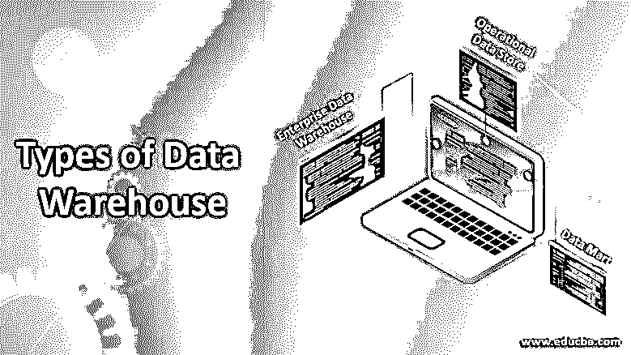

# 数据仓库的类型

> 原文：<https://www.educba.com/types-of-data-warehouse/>

## 数据仓库类型介绍

不同类型的[数据仓库](https://www.educba.com/what-is-data-warehouse/)只不过是以各种方式实现数据仓库，例如，数据集市、企业数据仓库& [运营数据存储](https://www.educba.com/operational-data-stores/)，这使得数据仓库成为商业智能(BI)系统的重要模块，通过对来自众多数据源的数据执行构建、管理和执行功能更改的过程，帮助生成报告和分析结果，用于对商业专业人员至关重要的重大决策措施。

### 数据仓库类型

有三种类型的数据仓库:

<small>Hadoop、数据科学、统计学&其他</small>

*   企业数据仓库。
*   操作数据存储。
*   数据集市。

#### 1.企业数据仓库

企业数据库是一个集合了一个组织的各种功能领域并以统一的方式将它们集合在一起的数据库。它是一个集中的地方，来自不同来源和应用程序的所有业务信息都在这里可用。存储后，它们可用于分析，并可供组织中的所有人员使用。可以根据主题对数据进行分类，并按照必要的分类提供访问权限。企业数据仓库已经处理了提取、转换和整合步骤。

EDW 的目标是提供数据模型中任何特定对象的完整概述。这是通过识别和处理来自不同系统的数据来实现的。然后将它加载到一个一致的模型中。毕竟，所有的信息都是由 EDW 收集的，它有能力提供一个单一的位置，在那里可以使用不同的工具来执行分析功能和创建不同的预测。研究团队可以识别新的趋势或模式，并关注它们以帮助业务增长。

可以构建数据集市，这使得分离数据更容易，可以建立实体之间的关系，并作为将数据加载到 EDW 的一部分来实施。除此之外，还可以按照不同的类别对代码进行切片和切块。此外，它还有助于减少代价高昂的停机时间，这可能是由于自适应和[机器学习方法](https://www.educba.com/what-is-machine-learning/)的易错配置造成的。它将数据结构化，这有助于在相对较小的规模上操作、组织和构建数据。数据以逻辑和一致的方式存储。

#### 2.操作数据存储

作为具有操作决策支持系统应用的替代，使用操作数据存储。它有助于直接从支持事务处理的数据库中访问数据。存在于[操作数据存储器](https://www.educba.com/operational-data-stores/)中的数据可以被清除，并且存在的冗余可以通过检查相应的业务规则来检查和解决。它还有助于集成来自多个来源的对比数据，以便业务操作、分析和报告可以轻松执行，并在流程仍在继续时帮助业务。

在这里，当前正在执行的大多数操作在被移动到数据仓库进行更长时间的存储之前都会被存储。它对简单的查询和少量的数据很有帮助。它起着短期或暂时记忆的作用，储存最近的信息。数据仓库存储数据的时间相对较长，同时也存储相对永久的信息。

它有助于存储来自一个或多个生产系统的事务性数据，并松散地集成这些数据。它有时是面向主题和随时间变化的。这种整合是通过利用 EDW 的结构和内容实现的。数据集成可能涉及清理、解决冗余、检查业务规则的完整性。它通常被设计为包含存储有限数据的低级原子数据。

#### 3.数据集市

[数据集市专注于](https://www.educba.com/what-is-data-mart/)存储特定功能领域的数据，它包含存储在数据仓库中的数据子集。数据集市有助于增强用户响应，还减少了用于数据分析的数据量。这样更容易进行研究。数据集市是数据仓库的一个子集，很容易实现。与完整的数据仓库相比，它具有成本效益。它对变化更加开放，单个主题专家可以定义它的结构和配置。数据是分区的，粒度很容易控制。数据集市有三种类型。这些类型是:

*   依赖
*   自主的
*   混合物

#### 从属数据集市

通过从操作、外部或两者来源获取数据，可以创建一个相关的数据集市。它允许采购组织的数据来自单个数据仓库。所有数据都是集中的，可以帮助开发更多的数据集市。

#### 独立数据集市

这个数据集市不需要中央数据仓库。这通常是为一个组织中的较小的小组创建的。它与企业数据仓库或任何其他数据集市没有任何关系。所有数据都是独立的，可以单独使用。此外，该分析可以自主执行。拥有一致且集中的数据存储非常重要，以便多个用户可以使用它。

#### 混合数据集市

顾名思义，当来自不同来源的输入是数据仓库的一部分时，就使用混合数据集市。当用户想要一个特别的集成时，它是有用的。每当组织需要多个数据库环境和快速实施时，就可以使用这种设置。它需要最少的数据清理工作，并且数据集市支持大型存储结构。数据集市的最佳用途是在使用较小的以数据为中心的应用程序时。

### 结论

因此，数据仓库是数据行业中非常重要的组成部分。正如数据库有助于存储和处理数据一样，数据仓库有助于分析数据。因此，数据仓库有助于获得业务趋势和模式，这些趋势和模式随后可以以报告的形式呈现，从而为如何在业务增长过程中前进提供洞察力。因此，数据仓库在创建数据行业的接触基础方面起着至关重要的作用。

### 推荐文章

这是数据仓库类型的指南。这里我们讨论了不同类型的数据仓库的基本概念。您也可以浏览我们推荐的其他文章，了解更多信息——

1.  [什么是数据分析师？](https://www.educba.com/what-is-data-analyst/)
2.  [什么是 SQL Server 的介绍？](https://www.educba.com/what-is-sql-server/)
3.  [什么是 MapReduce？|工作原理](https://www.educba.com/what-is-mapreduce/)
4.  什么是 Cognos 的教程？
5.  [数据仓库测试的测试方法](https://www.educba.com/data-warehouse-testing/)

