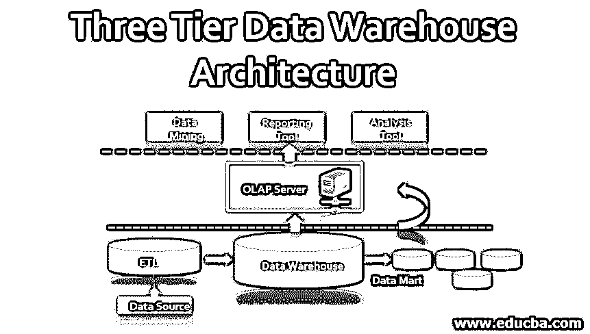
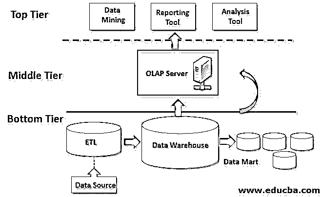

# 三层数据仓库体系结构

> 原文：<https://www.educba.com/three-tier-data-warehouse-architecture/>

## 数据仓库体系结构

三层数据仓库体系结构是常用的数据仓库设计，通过包括所需的数据仓库模式模型、所需的 OLAP 服务器类型和用于报告或分析目的所需的前端工具来构建数据仓库，顾名思义，它包含三层，如顶层、底层和中间层，这三层在程序上从底层(数据源)通过中间层(OLAP 服务器)到顶层(前端工具)相互链接。

数据仓库体系结构是构建数据仓库所基于的设计，以适应所需类型的数据仓库模式、用户界面应用程序和数据库管理系统，用于数据组织和存储库结构。基于项目团队提供的需求来选择架构的类型。三层数据仓库体系结构是常用的选择，因为它在结构上有详细说明。这里的三个不同层被称为:

<small>Hadoop、数据科学、统计学&其他</small>

*   顶层
*   中间层
*   底层

根据项目决策者提出的先决条件，每一层可以有不同的组成部分，但受各自层的新颖性的影响。

### 三层数据仓库体系结构

下面是三层数据仓库体系结构的图示

#### 1.底层

数据仓库三层体系结构中的底层由数据存储库组成。数据存储库是从各种数据源提取的数据的存储空间，它经历了作为 ETL 过程的一部分的一系列活动。ETL 代表提取、转换和加载。作为一个初步的过程，在数据被加载到存储库之前，从系统的几个源中识别所有相关的和需要的数据。这些数据然后被清理，以避免重复或垃圾数据从其当前存储单元。下一步是将所有这些数据转换成单一的存储格式。ETL 的最后一步是将数据加载到存储库中。几种常用的 ETL 工具是:

*   信息
*   微软 SSIS 公司
*   Snaplogic
*   支流
*   阿帕奇卡夫卡
*   阿洛玛
*   从头开始
*   IBM Infosphere

储存库的存储类型可以是关系数据库管理系统或多维数据库管理系统。关系数据库系统可以保存简单的关系数据，而多维数据库系统可以保存不止一个维度的数据。每当存储库包括关系和多维数据库管理系统时，就存在一个元数据单元。顾名思义，元数据单元由从关系数据库和多维数据库系统获取的所有元数据组成。这个元数据单元将传入的数据提供给下一层，即中间层。从用户的角度来看，来自底层的数据只能通过使用 SQL 查询来访问。查询的复杂性取决于数据库的类型。来自关系数据库系统的数据可以使用简单的查询来检索，而多维数据库系统需要使用多个连接和条件语句的复杂查询。

#### 2.中间层

这里的中间层是拥有 [OLAP 服务器](https://www.educba.com/what-is-olap/)的层。数据仓库可以有多台 OLAP 服务器，也可以有多种 OLAP 服务器模型，这取决于要处理的数据量和底层保存的数据类型。有三种类型的 OLAP 服务器型号，例如:

##### ROLAP

*   关系联机分析处理是一种联机分析处理模型，它对存储在关系数据库中的数据进行主动多维分解，而不是将关系数据库重新设计为多维数据库。
*   这适用于存储库中只包含关系数据库系统的情况。

##### 莫拉普

*   多维在线分析处理是在线分析处理的另一种模型，它直接在其多维数据库系统上对目录进行编目并由目录组成。
*   当存储库只包含多维数据库系统时，这种情况适用。

##### 霍拉普

*   混合联机分析处理是关系和多维联机分析处理模型的混合。
*   当存储库包含关系数据库管理系统和多维数据库管理系统时，HOLAP 是数据库系统之间平稳功能流的最佳解决方案。HOLAP 允许以关系和多维格式存储数据。

中间层充当顶层和数据存储库之间的中间组件，即顶层和底层。从用户的角度来看，中间层给出了数据库的概念前景。

#### 3.顶级

顶层是前端层，即允许用户连接数据库系统的用户界面。这个用户界面通常是一个工具或 API 调用，用于获取所需的数据，以便进行报告、分析和数据挖掘。工具的类型完全取决于预期结果的形式。它可以是报告工具、分析工具、查询工具或数据挖掘工具。

就可用性而言，顶层应该简单，这一点很重要。只有用户友好的工具才能产生有效的结果。即使底层和中间层的设计非常谨慎和清晰，如果顶层使用笨拙的前端工具，那么[整个数据仓库架构](https://www.educba.com/data-warehouse-architecture/)可能会彻底失败。这使得选择用户界面/前端工具作为顶层，它将作为数据仓库系统的表面，是三层数据仓库体系结构设计过程中非常重要的一部分。

下面是一些常用的顶层工具。

*   IBM Cognos
*   微软商务智能平台
*   SAP 业务对象网站
*   Pentaho
*   水晶报表
*   SAP BW
*   SAS 商业智能

### 结论

总而言之，三层架构中涉及的过程是 ETL、查询、OLAP 和在这个三层系统的顶层产生的结果。报告、分析结果或数据挖掘等前端活动也是数据仓库系统流程的一部分。顶层产生的最终结果用于业务决策。因此，可授予的质量和效率是显而易见的。它还取决于其他两层的能力。这种三层数据仓库体系结构有助于实现数据仓库系统所期望的卓越性和价值。

### 推荐文章

这是一个三层数据仓库架构的指南。在这里，我们讨论简介和三层数据仓库体系结构，包括顶层、中间层和底层。您也可以看看以下文章，了解更多信息–

1.  [业务中数据湖用途指南](https://www.educba.com/data-lake-architecture/)
2.  [如何创建样本数据库？](https://www.educba.com/sample-database-for-oracle/)
3.  [使用数据仓库设计](https://www.educba.com/data-warehouse-design/)
4.  [Oracle 数据仓库的特点](https://www.educba.com/oracle-data-warehousing/)

