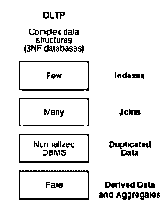

# 什么是 OLTP？

> 原文：<https://www.educba.com/what-is-oltp/>

## OLTP 概述

OLTP 或在线事务处理是一种数据处理方法，其中事务在数据库中的数据操作中起着主要作用。这为业务决策过程所需的业务智能提供了事实和统计数据。OLTP 通常应用在与电子商务、网上银行、网上购物、销售和服务平台等相关的应用上。这种类型的数据处理以其高性能、更快的可访问性和可靠一致的数据而闻名。

### 了解 OLTP

OLTP 只支持那些已经定义的操作。例如，在网上预订机票的情况下，我们需要预订与数据库中的插入相关的航空公司。OLTP 确保了购物车的可用性和并发性，以防大量用户同时访问同一个网站。这是通过 OLTP 的以下特征来实现的

<small>Hadoop、数据科学、统计学&其他</small>

1.  **3NF 数据库—**它使用完全规范化的数据库来确保所有事务性任务的一致性和优化。
2.  **预定义操作—**它只对少量记录严格执行预定义操作。
3.  最终用户可以直接更新数据库。
4.  **少量记录—**它只处理少量记录。例如，“从自动取款机取钱”
5.  **维护历史数据-** 存储最近几天或一周成功执行交易的记录。

### OLTP 是如何让工作变得如此简单的？

*   在线事务处理关注并发性和原子性。

当两个用户试图访问特定数据库系统中的相同数据时，在一个用户完成处理之前，他们中没有人能够改变数据。一般来说，一个用户将进行处理，另一个用户将等待进行任何修改。这被称为并发控制。

原子性控制保证在一个事务中，所有步骤作为一个组成功完成。也就是说，如果事务之间的任何步骤失败，所有其他步骤也必须失败。

*   OLTP 只能在分散式系统中一次处理少量记录的规范化数据库上工作，这种系统可以优化所有预定义给系统的事务性任务。OLTP 存储更少的历史数据，这使其效率更高。
*   由于它只执行与插入/删除相关的任务，所以它维护数据库中数据的一致性和并发性，从而始终确保数据库的可用性。

### 你能用 OLTP 做什么？

*   它的目标是可用性、速度、并发性和可恢复性。
*   大量用户可以使用 OLTP 系统进行短期交易。
*   我们可以设计这样的系统，帮助执行数据库查询通常很简单的操作，要求不到秒的响应时间，返回相对较少的记录。

### 使用 OLTP

*   在线事务处理(OLTP)包括收集信息作为输入，根据需要处理数据，以及更新数据以反映处理信息。它用于客户机-服务器系统。
*   对于各种分散的数据库系统，OLTP 代理程序在网络上的多台计算机之间分配事务处理。
*   OLTP 也被引入到面向服务的架构(SOA)和 Web 服务中。

### 影响 OLTP 性能的一些关键部分是

*   **回滚段:**回滚段是数据库中记录被回滚的事务的部分。这确保了几个用户之间数据库的一致性。它还记录回滚的事务，并帮助恢复数据库以避免丢失。
*   **Clusters:** 这是一个模式，它记录了不同表中常见的列，这将进一步有助于集群。这些聚类操作有助于优化连接操作。
*   **离散事务:**在最后一次提交之前恢复对数据库所做的所有更改的事务是指离散事务。在短期和非分布式事务的情况下，这些是至关重要的。
*   **块大小:**块的大小应该是操作系统大小的倍数，以避免不必要的 I/O 操作。
*   **缓冲区缓存大小:**用于避免 SQL 语句不必要的资源占用。
*   **动态分配:**分配给表和回退段的空间
*   **事务处理:**用于协调多个计算设备上的不同事务。它类似于一个操作系统来维护多线程操作。
*   **分区(数据库):**用于提高定期进行事务处理的部件的性能，并保持可用性和安全性。
*   **数据库调优:**使用数据库调优，OLTP 系统可以尽可能高效、快速地最大化其性能。

### 优势

**1。并发性:** OLTP 确保数据库中的事务不会耗尽不同用户之间的并发性。否则，用户将无法更改，或者他必须等待其他用户完成，这样就不会出现死锁情况。

**2。Acid Compliance:** ACID 是指保存原子性、一致性、隔离性、持久性等属性的数据库。该属性是记录货币交易的数据库的重要组成部分。一次失败可能导致更大的损失。因此，OLTP 确保没有事务丢失，并维护其数据库的 ACID 属性。

**3。可用性:**当并发性得到适当维护时，最新的数据对所有用户都是可用的。

**4。Integrity:** 随着规范化数据库的维护，OLTP 事务的每一步都保持了完整性。

### 不足之处

为了实现这种并发性、可用性和更快的事务处理，OLTP 通常需要支持包括许多公司网络的事务处理。因此，在今天的时代，我们需要一个更加分散的系统。

### 例子

OLTP 系统的一些例子包括

1.  订单输入
2.  零售
3.  金融交易系统
4.  [CICS](https://en.wikipedia.org/wiki/CICS)–有时，OLTP 依赖事务管理软件和数据库优化策略来处理大量并发的面向 OLTP 的数据库。

### 为什么我们应该使用 OLTP？

1.使用更少的纸张，更快、更准确地预测收入和费用。
2。需要离线维护的系统对在线事务处理提出了很好的要求。
3。数据的可用性、并发性和原子性更加重要。

### 我们为什么需要 OLTP？

我们需要 OLTP 来执行通常由系统执行的任务，并且只需要少量的记录。这些任务与数据库中数据的插入、更新或删除有关。执行此类任务需要一致性和并发性，从而确保其更高的可用性。OLTP 维护规范化的数据库和分散的系统，这提供了更高的可用性和一致性。这也确保了维护数据库之间的并发性。在批处理和网格计算的情况下，OLTP 通常以不同的方式工作。相反，OLAP(在线分析处理)处理大量与主要商业智能任务中使用的复杂数据库相关的任务。

### 结论

OLTP 是一种数据处理类型，其中大量用户进行事务处理，即处理少量记录的更新、插入或删除。它总是使用规范化的数据库、分散的系统和较少的历史数据来确保数据的并发性、原子性和可用性。

### 推荐文章

这是什么是 OLTP 的指南。这里我们讨论了 OLTP 的基本概念、定义和优点。您也可以浏览我们推荐的其他文章，了解更多信息——

1.  [什么是大型机？](https://www.educba.com/what-is-mainframe/)
2.  [数据仓库职业](https://www.educba.com/career-in-data-warehousing/)
3.  [什么是数据分析](https://www.educba.com/what-is-data-analytics/)
4.  [什么是神经网络？](https://www.educba.com/what-is-neural-networks/)

