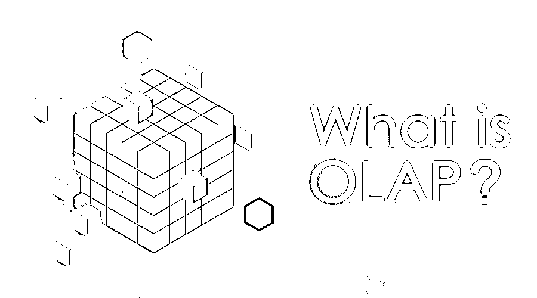
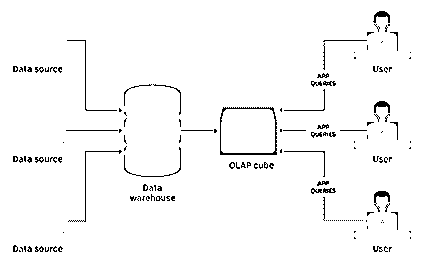

# 什么是 OLAP？

> 原文：<https://www.educba.com/what-is-olap/>

## OLAP-定义

OLAP 是在线分析处理，因为其名称本身表明了数据分析的目的；因此，它使我们能够同时分析来自多个数据库系统的信息。我们可以看出，它是一种计算方法，允许用户方便地提取所需的数据和查询数据，以便从不同的角度进行分析。它基本上是基于被称为数据仓库的巨大数据；它从数据仓库中收集所需的数据，并执行业务所需的分析，以在业务中做出一些决策，从而提高利润、销售、品牌和营销等所有方面。因此，它在商业智能中用于帮助趋势分析、销售预测、财务报告、计划目的、预算等等。

### 什么是 OLAP？

OLAP 是 OLAP(在线分析处理)是许多商业智能(BI)应用程序背后的强大技术，这些应用程序发现数据、报告查看功能、复杂的分析计算以及预测性“假设”情景、预算规划和预测规划。

<small>Hadoop、数据科学、统计学&其他</small>

例如，用户可以请求对数据进行分析，以显示一个电子表格，显示 8 月份在孟买上映的所有电影，将收入数字与同一部电影在 12 月份的收入数字进行比较，然后查看其他电影的比较，以检查在同一时期是否取得了更高的成功并盈利。因此，通过这种分析，将能够决定电影应该在哪里上映，以及他们通过哪种方式获得更多利润，甚至这种数据分析有助于规划营销策略，如在哪里营销，如何营销，通过哪种渠道营销等等。

现在我们来看看 OLAP 是如何工作的——首先从多个数据源收集数据(如电子表格、视频、XML 等)。)并存储在数据仓库中，然后对数据仓库进行清理并组织成数据立方体。术语“多维数据集”使用“多维数据集”,因为它是由三个维度分类的，多维度甚至可以对其进行分类。因此，每个多维数据集都包含按某些维度(如客户、期间、地理销售区域和产品)分类的数据，这些数据来自数据仓库中的多维表。维度可以由成员填充，也可以由采用值(如客户名称、国家和月份)的维度填充，这些维度按层次结构组织，并希望分析特定的值。OLAP 立方体是在跨维度的频繁查询上预先总结的，这提高了 q，改善了关系数据库的时间。就像这样，它有助于在一段时间内进行不同的分析。

像 OLAP 一样，我们使用的另一个术语是 OLTP，即在线事务处理；两者都是在线处理系统；OLTP 是交易处理，主要关注交易任务，而 OLAP 是分析处理系统，主要关注分析和报告，并为他们提供有价值的见解以改进业务。

OLAP 使销售业务报告、管理报告、营销、业务流程管理、财务报告、预算和预测等工作变得非常简单。

它可用于对多维数据库执行五种类型的分析操作:

*   **汇总:**也称为上钻或合并，用于将操作数据与维度一起汇总。
*   **Drill-down:** 在数据的维度中进行更深入的分析。例如，从“时间段”向下钻取到“年”、“月”和“天”等等，以绘制产品的销售增长。
*   **Slice:** 为了执行分析，取一个级别的信息进行显示，例如“2019 年的销售额”
*   **Dice:** 执行分析，从多个维度选择数据进行分析，如“2019 年班加罗尔青苹果销量”
*   **Pivot:** 执行分析，可以通过旋转立方体的数据轴获得数据的新视图。

由于 OLAP 给出了维度的立方体，然后找到维度的交集，例如，所有电影在孟买在特定时间段是有利可图的，并显示结果。每个 OLAP 立方体包含数百个度量值，其中至少有一个是可能的，这些度量值来自存储在数据仓库的事实表中的信息。

如图所示，它通过从多个来源收集数据并存储在数据仓库中开始工作。此外，OLAP 立方体是在清理过的数据仓库上创建的，用户可以对其运行查询。

OLAP (在线分析处理)基本有三种[:](https://www.educba.com/types-of-olap/)

*   **MOLAP(多维 OLAP):** MOLAP 是基于多维数据库索引的 OLAP。
*   **ROLAP(关系 OLAP ):** ROLAP 是一种 OLAP，它对关系数据库存储的数据执行动态多维分析。
*   **HOLAP(杂交 OLAP ):** HOLAP 是 ROLAP 和 MOLAP 的各种整合。它用于通过 MOLAP 开发 ROLAP 数据容量，MOLAP 是满足处理要求的高级处理能力。

### OLAP 的优势和劣势

下面给出了提到的优点和缺点:

#### 优势:

*   它可用于数据提取或挖掘、分析和报告，以找到数据项之间的关系。
*   我们可以使用 ODBC(开放式数据库连接)从现有的关系数据库中导入数据来创建 OLAP 多维数据库。
*   趋势分析并不需要所有的交易数据，因此 OLAP 数据库不需要像数据仓库一样大。

#### 缺点:

*   OLAP 的一些缺点是预先建模，这是必须的，对它的依赖性很大，计算能力差，反应慢，缺乏交互分析能力，模型抽象，潜在风险大。

一些分析工具(OLAP)有 IBM Cognos、Micro Strategy、Palo OLAP 服务器、Apache Kylin、Oracle OLAP、icCube、Pentaho BI、JsHypercube 等。

### 结论

OLAP(在线分析处理)是许多商业智能(BI)应用程序背后的强大技术，这些应用程序可以发现数据、报告查看功能、复杂的分析计算以及预测场景、预算规划和预测规划。它首先从多个数据源(如电子表格、视频、XML 等)收集数据。)并存储在数据仓库中，然后对数据仓库进行清理并组织成可以运行用户查询的数据立方体。可以对多维数据库执行的五种类型的分析操作是上滚、下钻、切片、切片和透视。有三种 OLAP 类型:MOLAP、ROLAP 和 HOLAP。一些分析工具(OLAP)有 IBM Cognos、Micro Strategy、Palo OLAP 服务器、Apache Kylin、Oracle OLAP、icCube、Pentaho BI、JsHypercube 等。

### 推荐文章

这是一本关于什么是 OLAP 的指南？这里我们分别讨论了基本概念、所需技能、优点和缺点。您也可以浏览我们推荐的其他文章，了解更多信息——

1.  [什么是 XML？](https://www.educba.com/what-is-xml/)
2.  [什么是数据分析师？数据分析师的技能](https://www.educba.com/what-is-data-analyst/)
3.  什么是蜂巢？
4.  [HOLAP 完整指南](https://www.educba.com/holap/)

