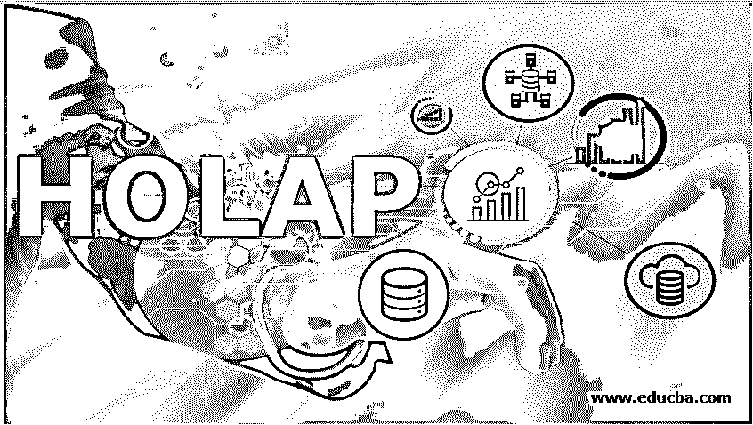
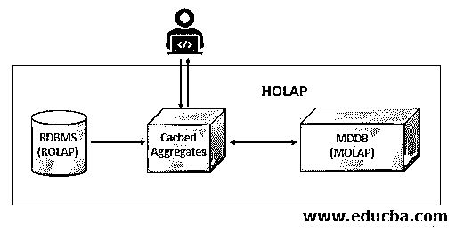

# 霍拉普

> 原文：<https://www.educba.com/holap/>

## HOLAP 简介

HOLAP 代表混合在线分析处理。顾名思义，它是由两种[不同类型的 OLAP](https://www.educba.com/types-of-olap/) 组成的混合模型，如关系联机分析处理(ROLAP)和多维联机分析处理(MOLAP)。OLAP 只不过是一种应用于商业智能活动的方法，如管理和分析数据仓库系统中的数据。在基于 HOLAP 的模型中，系统由使用关系和多维数据库管理系统构建的表和数据库组成。换句话说，HOLAP 允许在关系型数据库和多维型数据库中存储数据，利用它的缓存特性来存储重复使用的数据集和多维表的复杂查询。

### 霍拉普建筑

在 HOLAP 系统中，用户可以使用对关系数据库的简单查询和对多维数据库的复杂聚集查询来访问来自关系数据库系统和多维数据库系统的数据。由于查询过程很复杂，并且相同的查询可以在多维系统上重用，因此只为聚集和从关系数据库中重复提取的数据构建缓存数据服务器是很有效的。HOLAP 架构的一个示例模型可以描述为

<small>Hadoop、数据科学、统计学&其他</small>

用户，即分析师或报告专家，查询 HOLAP 以检索所需的数据。查询涉及关系数据库和多维数据库。对关系数据库的简单查询将数据带到缓存系统，而复杂查询本身与当前流的查询数据一起保存在缓存系统中。从两个系统中恢复的数据随后呈现给用户，供用户分析或创建用于业务决策过程的报告。

由于多维系统很复杂，缓存需要不断地维护，也就是每次在 MDDB 系统上执行更新时。由于结构简单，RDBMS 不需要任何缓存。RDBMS 使用缓存系统将结果与从 MDDB 获取的结果相结合。这种模式使数据流更加有效，因为关系数据库关注的是数据的数量，而 MDDB 关注的是数据的价值。当聚合被缓存时，查询被存储，以便不浪费重复创建和应用相同查询的努力。

这有助于提高 HOLAP 系统的性能，同时占用大量存储空间。由于 HOLAP 可以同时拥有 ROLAP &和 MOLAP 的优点，所以牺牲存储空间是必然的。

### HOLAP 的可用性

HOLAP 促进了 ROLAP 和 MOLAP 的不同组合。HOLAP 模型可以根据项目提供的需求进行设计。与其他可用的 OLAP 系统不同，这为数据库系统架构师提供了更多创造性的选择。本质上，HOLAP 可以存储来自关系和多维数据库系统的数据。从两个数据库的组合中访问数据有助于获取更准确的数据，因为 HOLAP 系统减少了冗余。由于这种灵活性，用户可以放松对最适合给定应用的所需数据的管理。

在升级现有数据库时，HOLAP 还有另一个优势。在现有系统的情况下，如果现有系统是关系数据库，并且如果存在为同一应用程序安装多维数据库的新需求，而不是将这些数据库单独应用到应用程序的相同功能特征上，则组合数据库更有效。因此，将 ROLAP & MOLAP 系统转换成一个单一的 hub，即 HOLAP，可以提高效率，减少应用程序的处理时间。

HOLAP 中可以有任意数量的 ROLAP 和 MOLAP 系统。应用于小型应用程序的中型数据库可以减少 HOLAP 系统。而使用多个数据库获取数据的大型多级集成应用程序通常会有不同类型的数据库。在这里，HOLAP 将帮助集成所有的数据库，并形成一个包含所有类型的数据库的单一模型。缓存将是简化这种复杂数据库的一个关键特性。

### HOLAP 的优点和缺点

以下是 HOLAP 的优点和缺点

| **优势** | **缺点** |
| 与 ROLAP 和 MOLAP 模型相比，具有更好的可访问性。 | 更大的数据量，因为 ROLAP 和 MOLAP 组合在一起形成了 HOLAP。 |
| 更快的查询速度，因为缓存特性有助于避免频繁往返。 | 它占用了大量的存储空间，因为它由来自关系数据库和多维数据库的数据组成。 |
| 中等查询性能，比 ROLAP 快，比 MOLAP 慢。 | 当查询涉及更多的关系数据库时，处理可能会很慢，因为 ROLAP 包含所有的分类数据。 |
| 多维数据集比 MOLAP 小，因为只提取精确的数据进行处理。 | 每次在数据库中更新、插入或删除数据时，都需要进行系统处理。 |
| 当数据量预计会随着时间的推移而增加时的最佳解决方案。 | 每当与存储的查询和关系数据相关的数据库发生更新时，都需要更新缓存 |
| 与 ROLAP 和 MOLAP 系统相关的更高处理能力。 | 维护是复杂的，因为更新可能会非常频繁。 |
| 卷占用大量数据，因为它在 HOLAP 中有一个关系数据库。 | 设计 HOLAP 系统时，很难在存储和性能之间找到平衡。 |

### 结论

发明 HOLAP 是为了避免在 ROLAP 和 MOLAP 之间选择的困惑，因为两者都有自己的优势。由于关系数据库是处理大量数据的最佳解决方案，而多维数据库则是高性能的最佳解决方案，因此将两者结合起来会更有优势。如果项目要求数据的易访问性和良好的性能，即使数据量很大，HOLAP 也将是最好的解决方案。或者，如果遗留应用程序有一个包含大量数据的关系数据库，而新功能需要多维可访问性，那么可以在现有的 ROLAP 中添加一个新的 MOLAP，形成一个 HOLAP 系统。

### 推荐文章

这是一本霍拉普指南。在这里，我们讨论 HOLAP 的架构和可用性以及优缺点。您也可以看看以下文章，了解更多信息–

1.  [OLAP 工具](https://www.educba.com/olap-tools/)
2.  [OLAP 的种类](https://www.educba.com/types-of-olap/)
3.  [什么是 Laravel？](https://www.educba.com/what-is-laravel/)
4.  [正向链接](https://www.educba.com/forward-chaining/)

