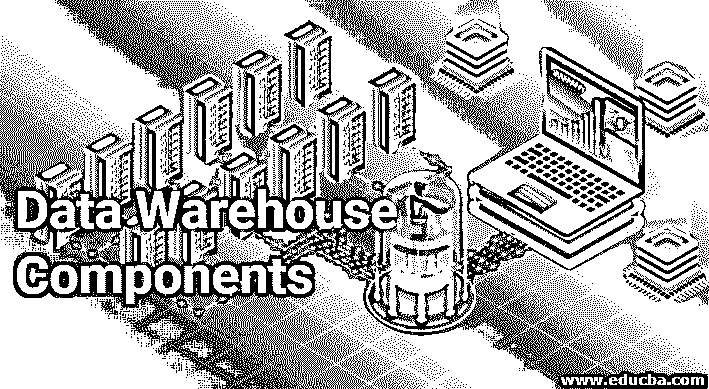
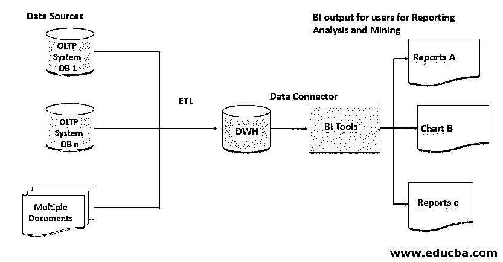
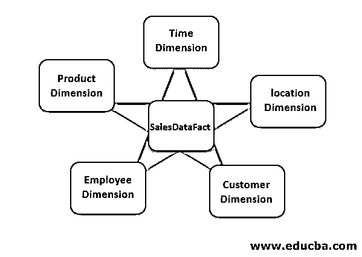
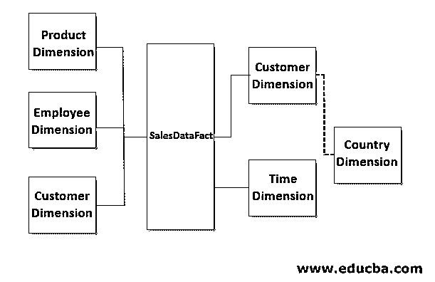

# 数据仓库组件

> 原文：<https://www.educba.com/data-warehouse-components/>

## 数据仓库组件简介

在文章《数据仓库组件》中，数据仓库(缩写为 DWH)是为商业智能(BI)实践在关系数据库中捕获和维护业务数据的过程。DWH 数据库的设计非常高效，可以存储大量的历史业务交易，用于数据分析和支持业务决策。此外，DWH 数据库是为查询处理和多维分析而设计和优化的，这有助于企业进行比较研究、历史数据模式分析和改进决策。

在商业智能领域有几个相关的行业术语，例如

<small>Hadoop、数据科学、统计学&其他</small>

*   决策支持系统
*   商业信息系统
*   历史数据库
*   企业数据仓库(EDW)

### 数据库的类型

有两种类型的数据库:

#### 1.在线跨国处理

*   这些类型的数据库是为实时业务操作或事务而设计的。
*   针对从数据库表中一次插入或检索一条记录进行优化，并对这些表应用业务验证规则。
*   这些数据库通常支持大量的并发用户交互，以支持常规的业务活动。
*   OLTP 的例子包括处理和处理应收账款交易或发票。

#### 2.OLAP(在线分析处理)

*   这些数据库是为业务数据的报告和分析而设计的。
*   针对大容量加载和复杂查询处理进行了优化，以支持大容量数据集的报告需求。
*   OLAP 数据库是为商业智能或数据分析部门的特定用户配置的。
*   OLAP 的例子是腌泡销售数据或订单返回的业务数据。

### 基础建筑

基本的 DWH 架构由以下四个主要组件组成

*   源系统
*   ETL 工具
*   DWH 数据库
*   商务智能工具

#### 1.源系统

源系统通常是业务应用程序，如 ERP 和 CRM 系统，它们从前端广告应用程序中捕获交易数据。交易数据主要存储在关系数据库或文件中。ETL 工具通过连接器连接这些数据源并处理这些数据。

#### 2.ETL 工具

有一个与 DWH 相关的流行概念，称为 ETL(提取、转换和加载),它执行从源系统、数据库或文件到 DWH 数据库的数据移动。有几个行业需求的企业 ETL 工具很受欢迎，如 Informatica power center、IBM Data Stage、Ab Initio、Alteryx、Oracle Data Integrator 和 Talend 等开源工具。

#### 3.DWH 数据库

DWH 是 RDBMS 系统，通常使用 Oracle、SQL Server 或 DB2 等流行的数据库供应商创建。此外，由于云的流行，来自云供应商的几种产品，如提供亚马逊红移数据库的 AWS，或微软 Azure SQL 数据仓库解决方案的需求正在增长。

#### 4.商务智能工具

类似地，有几个 BI 工具使用 EDW 数据来创建 BI 报告和图表，业务用户可以参考这些数据来做出数据驱动的业务决策。一些 BI 或可视化工具有 Tableau、Microsoft Power BI、SAP Crystal Reports、Quick View。一些组织更喜欢使用 MS Excel 来完成基本的数据分析任务。

此外，通过引入临时表和数据集市，还有一些增强 DWH 基本架构的最佳实践。

#### 5.暂存表

这些通常作为预处理数据表，对于开发和维护高效的 ETL 管道非常有用。

#### 6.数据集市

数据集市是一种与特定主题或特定业务单元数据相关的实践。而 DWH 是更广泛的数据，是数据集市的超集。

示例:特定业务单位的收入部门数据分析或销售数据分析。而 DWH 的例子将是该组织的财务分析。

### 实施方法-数据仓库组件

基于数据集市方法，使用了两种类型的实现方法或设计。

#### 1.英蒙方法论

*   这也被称为自顶向下的方法或企业明智的方法。
*   它包括首先创建 DWH，然后构建多个数据集市。

#### 2.金博尔方法论

*   这也称为自底向上方法或数据集市方法。
*   它包括首先创建多个数据集市，然后构建 DWH。

### 数据建模

接下来，我们将讨论 DWH 的数据建模部分，这是管理大量分析就绪数据的设计原则。有两种流行的模式正在被使用。

*   星形模式
*   雪花模式

在详细阐述这些模式之前，让我们根据它捕获的数据来理解几个重要的表类型，它们是模式设计的组成部分。

#### 事实表

*   这些是存储度量或事实的表的类型。
*   这些表包括数值度量列和其他维度表的外键。
*   示例–销售数据事实表，其中包含以美元表示的销售额和时间戳列。
*   事实表可能没有实际的事实列，这被称为无事实事实表。
*   示例-在一个教育系统中，DWH 用于学生、教师和课程数据分析。
*   此外，还有不同类型的事实
    *   附加事实–这些事实可以通过事实表中的所有维度进行总结
    *   非可加事实——这些事实不能用事实表示例中的任何维度来概括——高度、宽度、百分比。
    *   半累加性事实——这些事实是用事实表中的一些维度总结出来的

#### 维度表

*   这些是存储业务属性的描述性或文本值的表类型，并且大多数数据本质上是静态的。
*   这些表通过外键引用连接到事实表。
*   示例–包含产品名称、产品类别、产品子类别的产品维度表。
*   另外，有一种特定类型的维度表正在被使用，它被称为确认维度表。
    *   这些维度表由多个数据集市或多个事实表共享。
    *   例如:购买产品并退货。

#### 星形模式

*   事实表被称为星型模式的星型结构中的维度表包围。这些维度对于 DWH 来说通常是非标准化的。
*   该模式支持开发报告和查询输出汇总的简易性。
*   下面是销售数据分析的星型模式的图示。

#### 雪花模式

*   事实表被非规范化的维度表包围，如果任何一个或多个维度表被细分为另一个维度表，那么它被称为雪花模式。
*   该模式通过从维度表中检索相关数据来支持对报告的进一步深入研究。
*   示例:雪花型架构的销售数据 DWH，其中客户维进一步细分为国家维。
*   以下是用于销售数据分析的雪花模式的图示。

在组织中，数据建模师或数据架构师是为多维 DWH 开发这些模式的专业人员。他们通常遵循这三个阶段的设计过程。

*   概念建模——数据模型或模式的概念层次。
*   逻辑建模——数据模型或模式的逻辑层次。
*   物理建模–特定于数据库的数据模型或模式。

### 结论–数据仓库组件

数据仓库已经在业界实践了很长时间。它通常通过批处理或处理历史数据进行分析来支持 BI。数据仓库在实时数据分析或捕获和处理异构数据结构方面取得了一些进步。与数据湖相关的概念和技术是业界的最新趋势，是企业数据仓库概念的进步。

### 推荐文章

这是数据仓库组件的指南。在这里，我们还将讨论它们的类型、架构、实现方法和数据建模。您也可以看看以下文章，了解更多信息–

1.  [甲骨文数据仓库](https://www.educba.com/oracle-data-warehousing/)
2.  [信息学与数据阶段](https://www.educba.com/informatica-vs-datastage/)
3.  [AWS 数据库](https://www.educba.com/aws-databases/)
4.  [数据仓库建模](https://www.educba.com/data-warehouse-modeling/)

