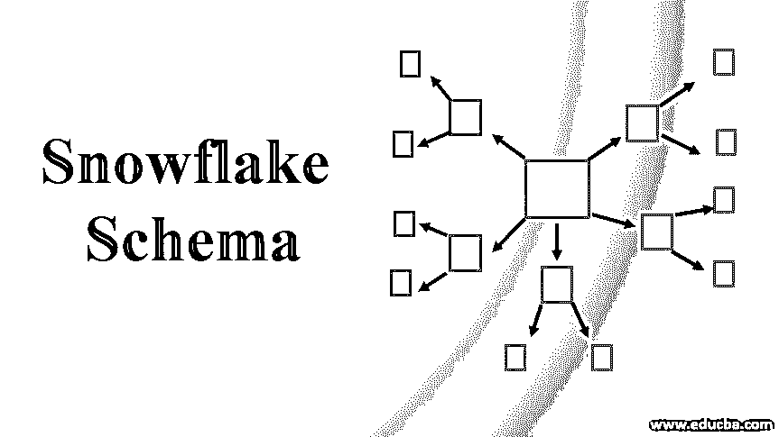
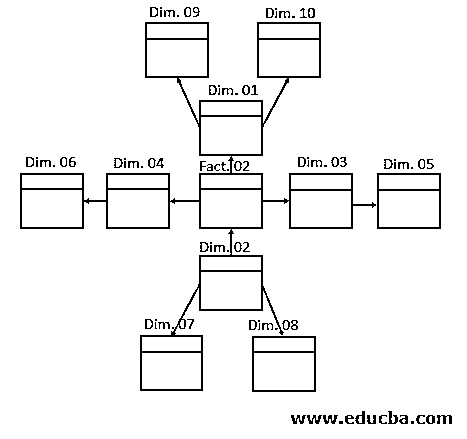
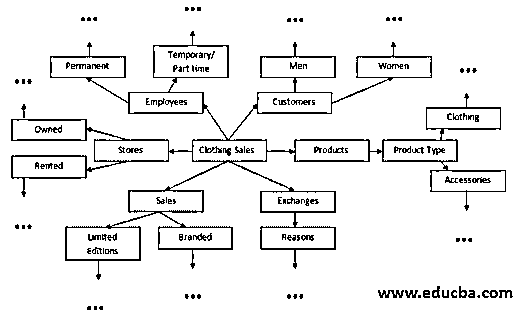

# 雪花模式

> 原文：<https://www.educba.com/snowflake-schema/>

## 雪花模式简介

雪花是用于实现数据仓库系统架构的许多模式类型之一。在这种类型的模式中，数据仓库结构在中间包含一个事实表，多个维度表连接到该事实表，并且相互连接。它应该将所有维度表规范化到规范化的最后一级，直到没有更多空间用于进一步规范化。

雪花模式必须在中心包含一个事实表，其中包含一个或多个级别的维度表。所有维度表都是完全规范化的，可以导致任意数量的级别。规范化只不过是将一个维度表分解成两个或更多个维度表，以确保最少或没有冗余。虽然所有第一级维度表都链接到中心事实表，但如果需要，所有其他维度表也可以相互链接。这种结构类似雪花(图 01)，因此得名“雪花模式”。

<small>Hadoop、数据科学、统计学&其他</small>

### 为什么是雪花模式？

项目管理团队基于对特定项目至关重要的多个限制来选择雪花模式类型。这是雪花的基本特征

在这个决策过程中有帮助的模式，

*   该模型只能包含一个事实表和多个维度表，这些表必须进一步规范化，直到没有进一步规范化的空间。
*   与其他模式相比，雪花模式可以更好地定义数据库中的数据，因为规范化是这种模式类型的主要属性。
*   规范化是雪花模式区别于数据库管理系统架构中其他模式类型的关键特性。
*   事实表将拥有所有的事实/度量，而维度表将拥有外键来连接事实表。
*   雪花模式允许维度表链接到其他维度表，除了第一级中的维度表。
*   这种多维性使得在复杂的关系数据库系统上实现变得容易，从而产生有效的分析和报告过程。
*   就可访问性而言，需要复杂的多级连接查询来从中央事实表获取聚合数据，使用外键来访问所有需要的维度表。
*   作为规范化的结果而创建的多个维度表在使用联接进行查询时充当查找表。
*   与其他模式相比，将所有维度表分解为多个小维度直到完全规范化的过程会占用大量存储空间。
*   由于查询过程复杂，数据检索的速度非常慢。

### 雪花模式的工作流程

在这里，我们将通过解释如何创建雪花模式以及优缺点来讨论雪花模式的工作流程。

#### 如何创建雪花模式？

当需要创建一个包含事实表“A”的模式，而事实表“A”有 6 个维度表“B，C，D，E，F，G”，并且每个维度表都有进一步的规范化时，那么雪花模式将是这种情况下的正确选择。

这些维度表' B，C，D，E，F，G '被进一步分解成更多维度表。这个过程会一直继续下去，直到没有进一步的方法来打破已经规范化的维度表。

假设我们的“A”是“服装销售”，它可以有以下维度作为其“B、C、D、E、F、G”，这有进一步规范化的空间——

*   雇员
*   顾客
*   商店
*   制品
*   销售
*   交换

现在让我们为此设计一个雪花模式——

上述尺寸表可以进一步细分为

*   **商店—**自有&租赁，可根据可用数据和要求进一步细分为位置、国家、州、地区、城市/城镇等。
*   **销售—**限量版&其他品牌，可进一步分为季节性、非季节性等。
*   **交换——**原因为第二层次，交换为‘退款’&‘不同产品’为第三层次的维度。
*   **产品—**“产品类型”表作为二级维度，以及每类产品的级别。这可以持续到标准化的最后一级。
*   **客户—**“客户类型”如男性&女性，还可分为会员、非会员、会员类型等。
*   **员工—**员工类型为“永久”、“临时/兼职”员工。这里的下一级可以是部门、地点、薪资等级等。

这可以进一步规范化到维度表的最终级别，因为它有助于减少最终数据中的冗余。当焦点主要集中在服装销售(事实表)和上面指定的第一级维度时，该模式可用于分析或报告。

### 雪花模式的利与弊

以下是利弊——

1.  作为规范化的结果，最少或没有冗余，这是雪花模式的核心品质。
2.  雪花模式是一个复杂的系统，因为根据给定数据库的深度，它可以有任意数量的规范化级别。
3.  数据质量将是非常好的，因为规范化有利于定义良好的表格/数据形式。
4.  如果任何新的需求产生了反规格化的需求，数据质量将会降低，并且可能会出现冗余。这可能会导致整个模式的重组。
5.  当使用连接进行查询时，将检索清晰准确的数据。
6.  维护非常困难，因为更高级别的维度需要不断扩展。
7.  高数据质量和准确性有助于促进高效的报告和分析。
8.  低性能，因为它需要复杂的连接查询。
9.  提供多部分关系数据库时，实现过程简单。
10.  完全规范化和复杂的查询过程需要大的存储空间。

### 结论

总而言之，如果需求包括更多存储选项、对低性能的容忍度、允许用单个事实表构建的复杂表、用于完全规范化的时间和空间，雪花模式将是最佳选择。虽然它使用复杂的连接查询，但输出将是数据的准确汇编，这可以使分析和报告异常高效。

### 推荐文章

这是雪花模式的指南。这里我们通过解释如何创建雪花模式来讨论雪花模式的工作流程。您也可以浏览我们推荐的其他文章，了解更多信息——

1.  [什么是星型模式？](https://www.educba.com/what-is-star-schema/)
2.  [什么是 MySQL 模式？](https://www.educba.com/what-is-a-mysql-schema/)
3.  [MD5 算法](https://www.educba.com/md5-alogrithm/)
4.  [Tableau 加入](https://www.educba.com/tableau-joins/)
5.  [雪花架构指南](https://www.educba.com/snowflake-architecture/)

