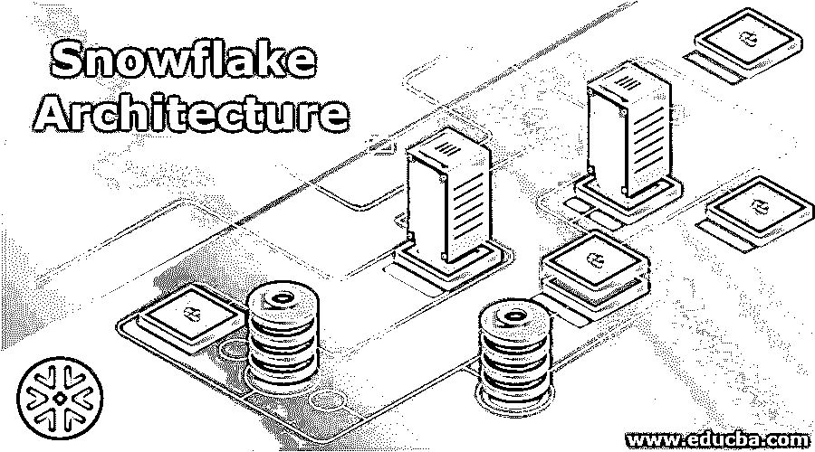

# 雪花建筑

> 原文：<https://www.educba.com/snowflake-architecture/>

## 雪花架构简介

雪花模式是数据仓库中的一种多维数据库，其中有不同的逻辑表，这里实体关系表格图被管理到雪花图的维度中。它被表示为与多个维度相关联的集中式事实表的一部分。此外，这些维度表被细分成多个维度表，这些维度表被进一步标准化以消除表中的冗余。例如，我们可以考虑一个产品表，它被细分为 n 个包含产品及其子产品的表。

雪花模式类似于星型模式架构。但是，星型模式的维度表通常是规范化表，用于将单个表与每个维度相关联。构建雪花模式是为了简化对更复杂的关系及其表的查询。它最适合维度级别之间的一对多或多对多关系，通常与数据仓库中的数据集市和维度表相关联，在数据仓库中，数据的检索速度比数据操作能力更重要。雪花模式主要使用高级查询工具来构建客户端和原始表之间的任何抽象层，例如，具有大量详细规范的查询。

<small>Hadoop、数据科学、统计学&其他</small>

### 雪花模式的特征

在数据仓库体系结构中，雪花是维度建模的一种模式，其中维度聚集在 n 个链接到维度的表中。

雪花架构的维度架构模式是在以下条件下构建的:

*   数据仓库中的雪花模式占用更少的空间内存。
*   当维度停止在模式级别时，构建维度会容易得多。
*   模式中有许多表会降低仓库的性能。
*   数据库中的维度表有两组或多组属性，它们确定不同级别的信息。

### 雪花架构的优点& **缺点**

以下是雪花架构的优点和缺点:

**优点:**

下面列出了雪花架构的两个重要优势:

*   这种模式提供了一种结构化的数据方式，消除了数据完整性的问题。
*   雪花模式在数据仓库中使用较少的磁盘空间，因为数据是非常结构化的。

**缺点:**

下面列出了雪花架构的一些缺点，并进行了简要描述:

*   雪花模式中的雪花减少了维度表所使用的空间，然而，当与数据仓库中的整个模式集相比时，空间节省是非常微不足道的。
*   除了必要和重要的时候，最好减少维度表的雪花化或规范化。
*   建议不要分离任何一维表的层次结构。
*   相似维度表的层次数设计为至少可能的级别。

### 雪花架构的组件

雪花模式是一个基于云的数据仓库，构建在云基础设施之上，云基础设施是[亚马逊网络服务(AWS)](https://www.educba.com/what-is-aws/) 和[高效的 SaaS 提供模式](https://www.educba.com/what-is-software-as-a-service-saas/)。没有这样的虚拟或物理硬件来选择选项，如选择、安装、配置或管理。所有当前的活动，如维护、管理或调优，都由雪花架构处理。雪花数据仓库有三个重要的组成部分。下面的层会给你一个架构视图和雪花模式的组件视图。

下面列出了构成雪花模式的 3 个主要组件及其简要说明:

#### 1.数据库存储

该模式中正确的基本文件系统由雪花的数据库帐户中的 S3 使用，其中所有数据被压缩、组织并均匀分布在表中，以便优化效率水平。在 AWS S3 实例中，数据是非常冗余的，它还提供了有效的数据持久性和仓库中数据的可用性。计算节点用于与体系结构中的存储层进行交互，以获取数据来处理查询。但是，存储层是不依赖的，用户只使用一个月内使用的平均数据存储。由于云服务支持雪花模式，存储是灵活的，并按每月使用量计费。

#### 2.询问处理

雪花模式将为用户提供一个在系统中开发“虚拟仓库”的选项，通常用于确定 AWS EC2 中的集群。虚拟设置的仓库负责处理数据或启动查询，并能够并行运行任务。在数据仓库中建立的虚拟仓库可以加速，否则当它未被使用时将被中断，以最小化计算速度。

在这个组件层中运行查询使用来自存储层的数据。通常，虚拟仓库服务器拥有自己独立的计算机集群，它不会与其他数据仓库进行交互。

#### 3.云服务

雪花模式将协调和处理其他服务，包括会话类、认证服务器、SQL 编译查询、加密数据等。数据仓库中有许多虚拟仓库，当需要其他资源来快速加载查询和达到正常的性能水平时，可以拥有这些虚拟仓库。雪花架构的设计是以这样一种方式设计的，即 3 层的每个组件都可以独立扩展，并具有更多冗余。

### 结论

雪花比标准 SQL 语言更有优势。这对于管理人员来说是一个优势，因为他们不需要“重新掌握技能”。雪花架构支持 Avro、ORC、Parquet、XML 和 JSON 等数据文件格式。简化存储结构、非结构化数据和少量半结构化数据的能力可以使用地址来解决问题，以处理可能在特定数据仓库中的冲突数据类型。这是一条通向数据的巨大道路，为提供高级分析方法的数据提供了更多价值。

### 推荐文章

这是一本雪花建筑指南。这里我们讨论雪花架构的介绍，它的优点和缺点以及它的特点。您也可以浏览我们推荐的文章，了解更多信息——

1.  [免费数据分析工具](https://www.educba.com/free-data-analysis-tools/)
2.  [数据分析技术的类型](https://www.educba.com/types-of-data-analysis-techniques/)
3.  [数据分析 vs 数据分析](https://www.educba.com/data-analytics-vs-data-analysis/)
4.  [什么是数据集成？](https://www.educba.com/what-is-data-integration/)

