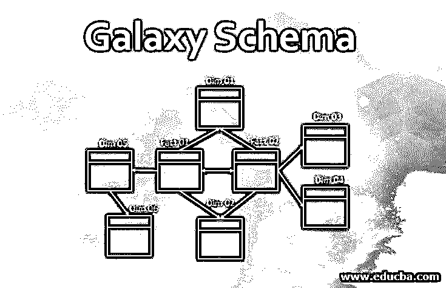
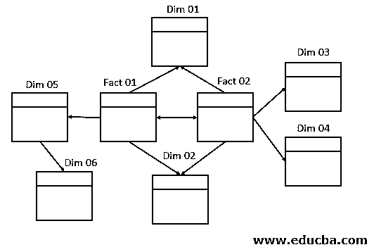
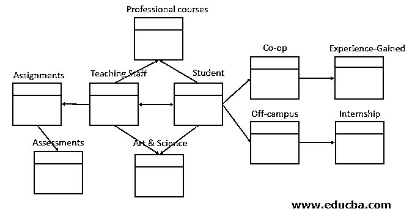

# 星系模式

> 原文：<https://www.educba.com/galaxy-schema/>

## 银河模式简介

星系图式也被称为事实星座图式，顾名思义，在空间中看起来就像一个星系。该设计涉及多个事实表，这些事实表与完全规范化的多个维度表进一步连接。事实表包含所有事实，而维度表包含对象和属性，其中维度表使用每个维度表的外键连接到事实表。

从本质上讲，星系模式可以被导出为一组相互连接并完全规范化的星型模式，以避免数据的冗余和不准确。它也可以是一个[雪花模式和一个星型模式](https://www.educba.com/star-schema-vs-snowflake-schema/)的有意义的关联，其中两个模式的事实表可以链接。两种结构的维度表可以根据需要进行链接。最终的系统在结构上看起来像一个星座，其中事实表就是这里的星星。这解释了星系模式的名称。这种模式也称为“事实星座”模式，因为它有多个事实表。

<small>Hadoop、数据科学、统计学&其他</small>

因为它可以包含星型和雪花型模式，所以 Galaxy 模式是完全规范化的。规范化只不过是将信息分解成更多的层次，以便在事实表和维度表之间建立有意义的关系。这确保了系统中数据的准确性、组织性和明确性。

### 选择雪花模式的理由

通常，项目管理团队根据对任何给定项目都很重要的多个参数来选择模式类型。以下是星系模式的基本特征，有助于做出选择，

*   这个模型可以包含多个事实表和多个维度表
*   所有维度表都被规范化，直到没有更多空间用于进一步规范化。
*   Galaxy 模式使数据库中的数据更加清晰，这与星型模式不同，但与雪花型模式相似。
*   事实表将拥有所有的事实/度量，而维度表将拥有外键来连接事实表。
*   Galaxy Schema 允许维度表链接到其他维度表，包括第一级的维度表。
*   这种多维性使得在复杂的关系数据库系统上实现变得容易，从而产生有效的分析和报告过程。
*   就可访问性而言，需要复杂的多级连接查询来从中心事实表获取聚合数据，使用外键来访问所有需要的维度表，因为系统本身更复杂。
*   作为规范化的结果而创建的多个维度表在使用复杂的多级联接查询进行查询时充当查找表。
*   与其他模式相比，将所有维度表分解为多个小维度直到完全规范化的过程会占用大量存储空间。
*   由于系统和查询过程是多方面的，从数据库系统中检索数据的速度非常慢。
*   不同的事实表被明确分配给每个可用的维度。这对于与给定维度表相关联的事实是有利的，对于具有更深维度级别的其他事实也是有利的。

### Galaxy 模式的工作流程

在这里，我们将通过解释如何创建 Galaxy 模式及其优缺点来讨论 Galaxy 模式的工作流程。

#### 如何创建星系模式？

当系统由连接到维度表 C、D、E、F、G、H、I 的事实表 A & B 组成时，可以构建银河模式。根据规则，事实表可以相互连接，维度表可以与系统中的任何事实表和维度表连接，下面的例子将有助于更好地理解 Galaxy 模式的基本概念。

在这个例子中，学生数据库有两个事实表——学生和教师。两个事实表可以有共同的维度——专业课程、艺术和科学，基于它们各自的部门。此外，从学生的角度来看，标准化适用于衍生合作社和校外工作。这可以进一步细分，以提及经验类型和实习。

另一方面，教师会给学生布置作业。而且，这些分配维度表可以进一步规范化以定义评估细节。基于项目为设计团队提供的信息的限制，所有这些维度表可以进一步规范化。

#### 星系模式的利与弊

以下是利弊——

**优点:**

1.  它的多维特性有助于有效地构建复杂的数据库系统。
2.  作为标准化的结果，最少或没有冗余。
3.  考虑到系统的复杂性，这是一个灵活的模式。
4.  数据质量会很好，因为规范化为定义良好的表格/数据格式提供了优势。
5.  当使用连接进行查询时，可以提取清晰准确的数据。
6.  高数据质量和准确性有助于创建出色的报告和分析结果。

**缺点:**

1.  星系模式在结构上可能很复杂。
2.  处理这个模式是乏味的，因为模式和数据库系统的复杂性使得它更加错综复杂。
3.  数据检索是通过结合条件表达式的多级连接来完成的。
4.  根据给定数据库的深度，需要规范化的级别数。
5.  随着 Galaxy schema 应用于具有复杂结构的大型数据库系统，维护和支持任务变得更加困难。
6.  较大的设计布局和详细的查询过程需要较大的存储空间。
7.  分析变得很困难，因为它对可以拥有多少事实和维度表没有限制。

### 结论

当向项目团队提供不止一个事实表时，这些事实表既有单独连接的维度，也有在事实表之间共享的维度，Galaxy Schema 可能是一个组织良好的解决方案。大多数高级应用程序可能需要多个事实表来共享维度表，Galaxy Schema 就是这种情况下的一个例子。如果需要更多的存储空间、接受低性能、具有多个事实表和多个维度表的结构、标准化的时间和空间，Galaxy Schema 将是该特定数据库系统的最佳解决方案。

### 推荐文章

这是一个星系模式的指南。这里我们通过解释如何创建 Galaxy Schema 来讨论 Galaxy Schema 的工作流程？利弊分别。您也可以浏览我们推荐的其他文章，了解更多信息——

1.  [什么是星型模式？](https://www.educba.com/what-is-star-schema/)
2.  [什么是 MySQL 模式？](https://www.educba.com/what-is-a-mysql-schema/)
3.  [码头工人备选方案](https://www.educba.com/docker-alternatives/)
4.  [什么是微服务？](https://www.educba.com/what-is-microservices/)

