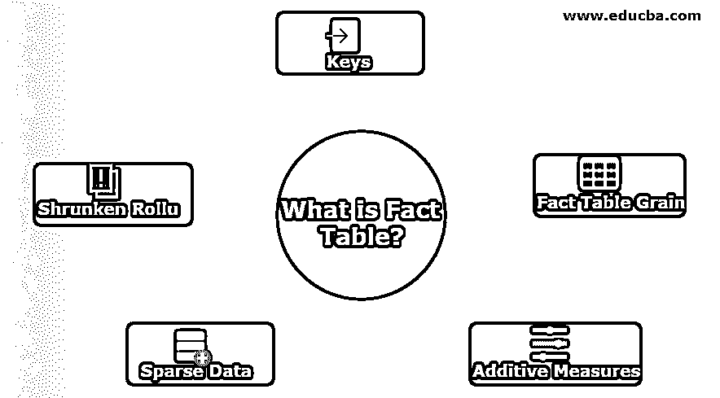
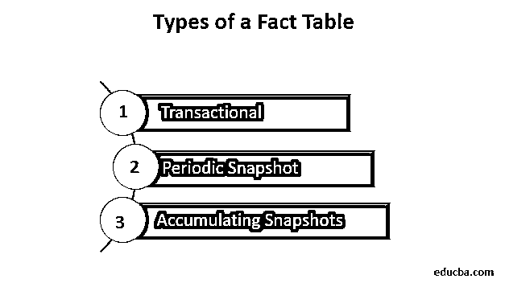
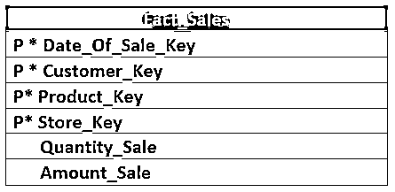
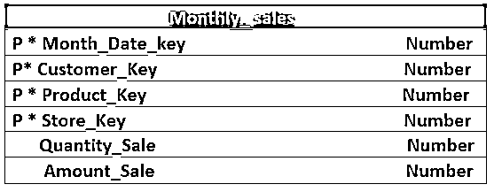
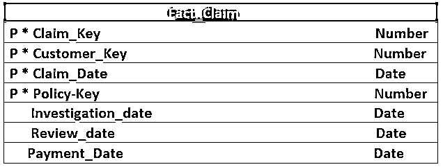

# 什么是事实表？

> 原文：<https://www.educba.com/what-is-fact-table/>

## 事实表概述

数据仓库系统中的事实表只不过是包含所有事实或业务信息的表，需要时可以对其进行分析和报告活动。这些表包含表示直接事实的字段，以及用于将事实表与数据仓库系统中的其他维度表连接起来的外部字段。根据用于设计数据仓库的模型类型，数据仓库系统可以有一个或多个事实表。

### 事实表的特征

以下是事实表的特征:

<small>Hadoop、数据科学、统计学&其他</small>

*   **key:**它有一个 key 或者主键，是所有维度表所有主键的累加，所有维度表都链接到它。该键称为连接键，有助于唯一标识行。
*   **事实表粒度:表的粒度**描述了表中包含的信息的详细程度或深度。越有水平，桌子越有效率。
*   **可加性度量:**此处呈现的属性可以是完全可加性、非可加性或半可加性。完全可加性或可加性度量被添加到所有维度。半累加性度量是添加到某些维度而不是所有维度的度量，非累加性度量是存储的业务流程的基本度量单位。
*   **稀疏数据:**存在属性包含空值或度量的记录。他们没有提供任何信息。
*   **缩减的累计维:**缩减的累计维是基本维的细分。

### 事实表的类型

它分为三个基本测量事件:

*   事务性的
*   定期快照
*   累积快照

让我们基于简单的测量来理解这一点。

#### 1.交易事实表

这是商业运作的一个基本观点。它用于表示事件在任意瞬时点的发生。事实测量只对特定的瞬间和事件有效。与事务表相关联的粒度指定为“事务中每行一行”。通常，它包含详细级别的数据，这导致它有大量的维度与之相关联。它在最基本或原子水平的维度上捕捉测量。这有助于表格为用户提供强大的维度分组、上滚和下钻报告功能。有密有疏。它可能很大，可能包含数十亿条记录。让我们看一个杂货店销售的例子。

#### 2.快照事实表

快照给出了事物在某一特定时刻的状态或“当时的画面”。它通常包括更多的非加性和半加性事实。它有助于定期和可预测的时间间隔审查业务的累积绩效。在这种情况下，活动在每天或一周或一个月或任何其他时间间隔结束时的表现被表示出来，这与事务事实表不同，在事务事实表中，为每个事件的发生添加一个新行。但是快照事实表或定期快照依赖于事务事实表来获取事务事实表中的详细数据。定期快照表大部分是密集的，可以像事务事实表一样大。让我们看一个与事务事实表中相同的杂货店销售的定期快照的例子。

#### 3.累积事实表

这些用于表示任何过程的活动，这些过程有明确的开始和结束。累积快照通常具有多个数据戳，这些数据戳表示生命周期中发生的可预测阶段或事件。有时会有一个额外的列包含显示行上次更新时间的日期。让我们看一个例子。

### 它在数据仓库中是如何工作的？

它基本上代表了与事件相关的指标。任何事实表的含义都必须由表名或表的主键组成来表示。要做的最重要的选择是决定主键。也可以创建代理键作为主键。如果用户不想使用代理键，那么他可以使用外键的组合，指向与事实相关的维度的组合。外键的使用提供了关于表的粒度的概念。

Kimball 描述了设计可以遵循的四个步骤:

1.  选择要建模的业务流程。
2.  申报粮食。
3.  选择维度。
4.  识别事实。

### 事实表的优点

*   它包含用于分析的定量信息。
*   它包含的性能指标通常是标准化的。
*   它可以包含不同的措施，如添加、半添加和非添加。

### 结论

在本文中，我们讨论了它的类型、工作原理和优点。它是星型或雪花型模式的中心部分。它连接到维度表，给出一个星形或雪花的结构。

### 推荐文章

这是什么是事实表的指南？这里我们讨论事实表的特征和各种类型以及它们的优点。您也可以阅读以下文章，了解更多信息——

1.  [什么是 OSI 模型？](https://www.educba.com/what-is-osi-model/)
2.  [DOS 有什么特点？](https://www.educba.com/what-is-dos/)
3.  什么是可用性测试？
4.  [金博尔方法的主要优势](https://www.educba.com/kimball-methodology/)

