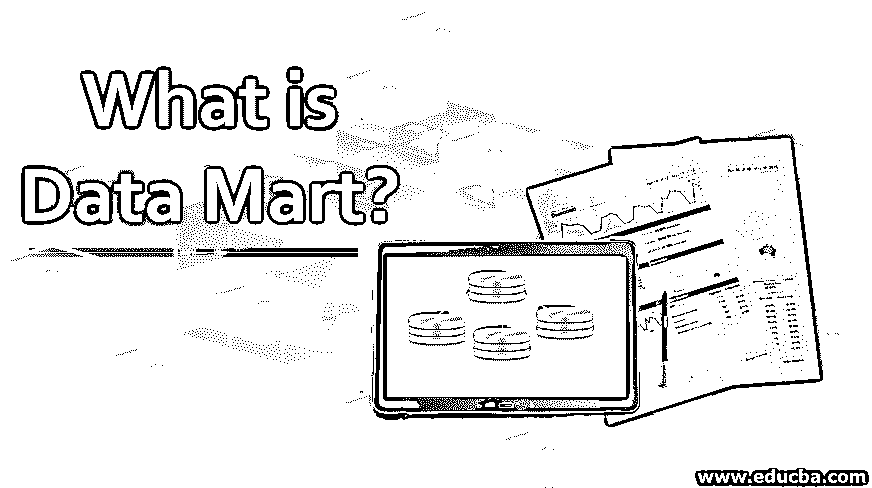
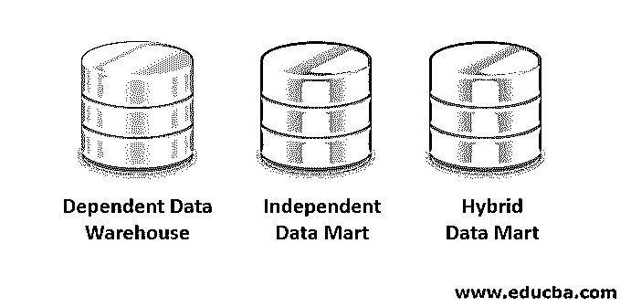
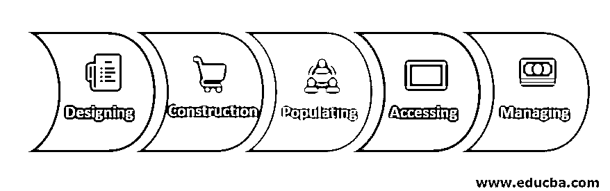

# 什么是数据集市？

> 原文：<https://www.educba.com/what-is-data-mart/>

## 数据集市简介

数据仓库环境中用于检索客户端数据的模式称为数据集市。它是特定于数据仓库的结构，由团队中的业务领域使用。每个组织都有一个位于数据仓库存储库中的数据集市。不同类型的数据集市是依赖的、独立的和混合的数据集市。从属数据集市获取已经创建的数据，而独立数据集市从外部来源和数据仓库获取数据。我们可以称数据集市为数据仓库的逻辑子集。

**数据集市与数据仓库:**

<small>Hadoop、数据科学、统计学&其他</small>

*   数据仓库是一个拥有来自主题的多个流的数据集合的仓库。维护和控制部分，如原始数据的收集和处理，主要由向母公司提供各种服务的公司信息技术 IT 小组处理。
*   数据仓库也称为中央或企业数据仓库。因此，数据仓库的来源将是多重的，而数据集市在某些情况下是数据仓库的子集。

### 数据集市的类型

通常有三种类型:

#### 1.从属数据仓库

*   一个依赖的数据集市完全来自于数据仓库，所有被分组的依赖者将形成一个企业数据仓库。它纯粹是数据仓库的一个子集，因为它是从中央数据仓库创建的。
*   因为干净和概括的数据已经存在于中央数据仓库中，所以 ETT 过程或提取转换和传输被简化了。我们只需要在这里识别特定的子集，并在其上执行 ETT。这些数据集市通常是为了实现更好的可用性和更好的控制和效率而构建的。

#### 2.独立数据集市

*   这不是从中央数据仓库创建的，其来源可能不同。由于数据来自中央数据仓库之外，ETT 流程略有不同。
*   大多数独立的数据集市被一个较小的组织团体所使用，其来源也是有限的。当我们需要在相对较短的时间内获得解决方案时，通常会创建独立的数据集市。

#### 3.混合数据集市

*   混合数据集市将允许您对除中央数据仓库 DW 之外的所有其他来源的数据进行分组。
*   当我们处理临时集成时，这将极大地有利于外部添加到组织中的所有产品的顶层工作。

### 数据集市的特征

下面是提到的一些功能:

*   由于数据的来源集中在主题上，因此通过使用它可以提高用户响应时间。
*   对于经常需要的数据，使用数据集市将是有益的，因为它是中央数据仓库的子集，因此数据大小会更小。
*   此外，由于数据量有限，与中央 Dws 相比，处理时间将大大减少。
*   这些基本上是敏捷的，与数据仓库相比，可以非常快速有效地适应模型中的变化。
*   与仓库数据不同，数据集市需要一个主题专家来处理我们在多个主题仓库中需要的专业知识。正因为如此，我们说数据集市更加敏捷。
*   我们可以使用分区数据和数据集市将访问类别隔离到较低的级别，这非常容易。
*   基础架构依赖性非常有限，数据可以通过分段存储在不同的硬件平台上。

### 实现数据集市的步骤

下面是实施它所需的步骤:

#### 1.设计

这将是实施的第一步，即确定收集技术和业务信息所需的所有任务和资源。稍后，逻辑计划被实施，并且在审查时，这将被转换为物理计划。此外，数据的逻辑和物理结构也在这里决定，比如如何对数据进行分区，以及分区的字段，比如日期或任何其他文件。

#### 2.建筑

这是实现的第二阶段，在 RDBMS 的[帮助下生成物理数据库，这被确定为设计过程和逻辑结构的一部分。创建了所有的对象，如模式、索引、表、视图等。](https://www.educba.com/what-is-rdbms/)

#### 3.落户于

这是第三个阶段，在此阶段，在获取数据时，数据被填充到其中。在向其中填充数据之前，实现了所有必需的转换。

#### 4.接近

这是实现的下一步，我们将使用填充的数据进行查询以创建报告。最终用户使用此步骤来理解使用查询的数据。

#### 5.管理的

这是实现数据集市的最后一个阶段，在这里需要处理各种任务，例如访问管理、系统优化、调优、管理新数据并向数据集市添加新数据，以及规划恢复场景以处理任何故障情况。

### 利益

以下是使用它的一些好处:

*   对于只需要处理一小部分数据的数据仓库来说，它是最具成本效益的替代方案之一。
*   从数据源分离数据将使数据集市更有效，因为特定的一组人可以处理来自特定数据源的数据，而不是所有人都使用数据仓库。
*   如果我们知道需要访问哪个子集，通过使用数据集市可以更快地访问数据。
*   数据集市更容易使用，因此最终用户可以在其上轻松地进行查询。
*   与数据仓库相比，进入实现时间数据集市需要的时间更少，因为数据是分组隔离的。
*   特定主题的历史数据可用于简单的趋势分析。

### 结论

因为它集中在一个单一的功能领域，所以对过程实现者和最终用户都有许多好处。因此，组织中需要高效的 marts 实现和数据仓库。

### 推荐文章

这是什么是数据集市的指南。在这里，我们将讨论简介、功能、前 3 种类型及其功能和步骤。您也可以阅读以下文章，了解更多信息——

1.  [甲骨文数据仓库](https://www.educba.com/oracle-data-warehousing/)
2.  [R 数据类型](https://www.educba.com/r-data-types/)
3.  [Cassandra 数据建模](https://www.educba.com/cassandra-data-modeling/)
4.  [Cassandra 中数据模型的完整指南](https://www.educba.com/data-model-in-cassandra/)

