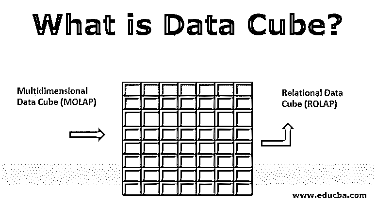

# 什么是数据立方体？

> 原文：<https://www.educba.com/what-is-data-cube/>

## 数据立方体简介

顾名思义，数据立方体是二维数据立方体或二维矩阵(列和行)的扩展，只要有大量复杂的数据需要聚合，并且需要抽象相关或重要的数据。这就产生了对数据立方体的需求。

数据立方体基本上是用来表示要从大量复杂数据中检索的特定信息。例如，你去了一个购物中心，那里有很多东西放在购物中心的不同角落，在需要的时候很难找到需要的东西。现在，如果你知道了购物中心里物品的顺序，那么购买该物品将变得容易和没有麻烦。这表示数据立方体具有完美的维度和更高的值范围，或者我们也可以说是对三维数据的引用。

<small>Hadoop、数据科学、统计学&其他</small>

### 什么是数据立方体？

它有如下许多特点:

*   它可以远远超出包括更多的维度。
*   通过分析所有数据临时制定商业策略。
*   通过建立趋势和性能分析，它有助于获得最新的市场情况。
*   它通过创建中间数据立方体来满足需求，并在数据仓库和所有报告工具(尤其是数据仓库报告工具)之间架起桥梁[,从而发挥了非常关键的作用。](https://www.educba.com/what-is-data-warehouse/)
*   在其他阶段，将同时监控和管理源输入，目标是通过与服务器交互的中间数据立方体在源和目的地之间创建连接和端到端流。

### 数据立方体的类型

有两种类型的数据立方体最常用于商业或企业:

#### 1.多维数据立方体

顾名思义，多维数据立方体主要用于有大量数据集的业务需求中。开发和遵循的产品涉及 MOLAP 的结构，MOLAP 的[具有多维数组](https://www.educba.com/multidimensional-array-in-php/)格式。这种结构有助于通过更稀疏和更高级别的 MOLAP 来改进庞大的数据集。由此，我们可以得出这样一个事实，即这并不代表数据集中的任何特定数据或聚类数据值。

这最终会增加空间或存储需求，而这些需求有时并不需要。因此，使该结构不合需要会妨碍数据值和表示数据的维度集。

这个 MOLAP 的一个有趣的目标是，它有一个表示数据立方体的每个维度的索引格式，这改进了整体开发和结构，以收集更多的相关信息。

但是任何事物都有优点也有缺点，在这种情况下，讨论的是大型数据集和稀疏矩阵，这有时是不可取的。因此，为了避免这种结构，我们将使用压缩技术，这将减少对 MOLAP 非常需要的业务模型的索引属性的阻碍。

#### 2.关系数据立方体

这也是数据分析数据立方体的另一个类别，它严格遵循关系数据库模型。如果与多维数据立方体相比，那么它拥有双倍数量的关系表来指定具有数据集和需求的维度。每张桌子都包含一个被称为长方体的特定视图。

有更多的类别正在被研究和关注，因为它们正在蓬勃发展，如 SOLAP、DOLAP、WOLAP 等。

混合 OLAP 也存在，它只不过是 ROLAP 和 MOLAP 的组合。它的使用也非常重要，但也取决于业务需求。混合 OLAP 不是最常用的数据立方体，但由于其优越的数据处理能力，许多组织更喜欢它。另一个非常好的特性是，它包含对多维和关系数据库的检查，这有助于非常有效地管理数据库中的数据。这有助于通过优化和管理单元来优化时间消耗。由于其管理能力，霍拉普公司可以优先考虑这两个[公司。](https://www.educba.com/holap/)

就数据分析数据的数据挖掘概念而言，cube 对于 MOLAP 和 ROLAP 两个类别都起着非常关键的作用。

### 利益

*   提高企业的生产率。
*   提高整体性能和效率。
*   庞大而复杂的数据集的表示得到简化和精简。
*   大型数据库和复杂的 SQL 查询也是可管理的。
*   索引和排序为分析和数据挖掘技术提供了最好的数据集。
*   因为它将拥有预先定义和预先计算的数据集或数据立方体。
*   数据的聚合使得在每个微观层次都可以非常快速地访问所有数据，最终实现简单高效的维护并减少开发时间。
*   OLAP 将有助于获得快速响应时间、快速学习曲线、多功能环境、广泛接触所有应用程序、部署所需的资源以及更少的等待时间和高质量的结果。

### 结论

在今天的场景中，所有大企业巨头都在尽最大努力制定战略，并通过某些数据模型和数据立方体简化业务。研究人员也试图想出更多样化和增强的商业模式，使整个生产和发展的商业组织。

### 推荐文章

这是一个什么是数据立方体的指南？在这里，我们讨论什么是数据立方体和数据立方体的类型以及好处。您也可以阅读以下文章，了解更多信息——

1.  [Python 中的抽象类](https://www.educba.com/abstract-class-in-python/)
2.  [Java 中的抽象类](https://www.educba.com/abstract-class-in-java/)
3.  [c++中的构造函数和析构函数](https://www.educba.com/constructor-and-destructor-in-c-plus-plus/)
4.  [在 C++中覆盖](https://www.educba.com/overriding-in-c-plus-plus/)

