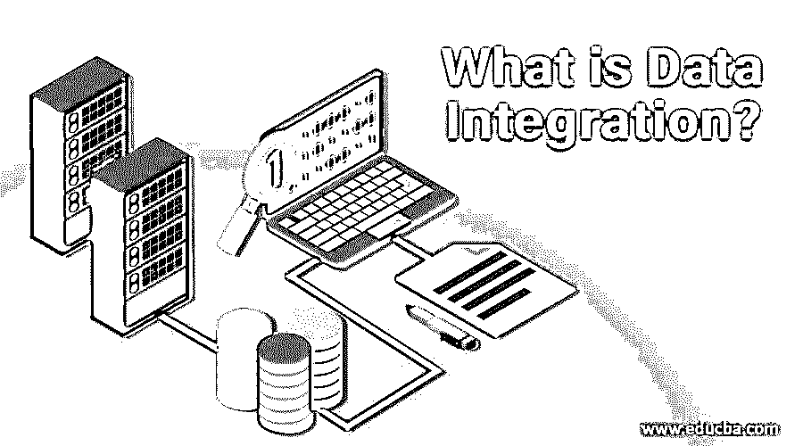

# 什么是数据集成？

> 原文：<https://www.educba.com/what-is-data-integration/>

## 数据集成简介

数据集成被定义为合并来自各种资源的数据并将其转换成有价值的信息以向用户提供数据的统一视图的系统；它还允许工具生成有效的商业智能和行动，因为数据集成中涉及的基本操作是客户端向主服务器发送请求以访问数据，作为回报，主服务器获取数据并将其发送给客户端，由于这些特征，它在商业和科学领域等各种情况下得到广泛使用。

### 五大数据集成类型

一些类型是从各种存储库中获取全面而有用的数据。

<small>Hadoop、数据科学、统计学&其他</small>

#### 1.数据整合

数据整合实质上是将来自几个独立系统的数据聚集在一起，建立一个单一的数据存储。数据整合旨在减少数据存储位置的数量，这是由 ETL(提取、转换和加载技术)支持的。ETL 从存储库中获取数据，将其转换为可读格式，然后将其传输到另一个数据仓库。

#### 2.数据传播

它使用应用程序将数据从一个位置复制到另一个位置。它可以在源和客户端之间以双重方式实现。企业数据复制和企业应用程序集成支持数据传播。EAI 管理应用系统共享消息，并且主要在实时场景中执行。EDR 在数据库之间传输大量数据，这些数据库用于在资源和服务器之间获取和分发数据共享。

#### 3.数据虚拟化

虚拟化管理一个接口，以提供来自具有不同数据模型的不同来源的当前唯一数据。数据虚拟化从任何池中解释和提取数据，无需任何单点联系。

#### 4.数据联邦

它是数据虚拟化的理论形式，利用虚拟数据库并为来自不同系统的混合数据构建通用数据模型。数据是从各种来源收集的，可以作为单一视图进行访问。数据抽象是通过企业信息集成提供来自混合源的数据的离散视图。可以通过许多应用程序对数据进行趋势分析。数据整合成本高昂，因为它具有高级安全功能和合规性。

#### 5.数据库

仓储被列为最后一步，因为它包含大量的数据。数据仓库实现了类似于数据注入的数据存储、重新格式化和清理。

### 我们为什么要用它？

数据集成通过提供即时服务改善了客户体验。它通过提高生产效率而没有任何处理延迟，提供了一个规范的流水线操作流程。它具有未来分析的特殊功能，并根据客户对其业务部署和改进想法的查询生成报告。

数据整合是一种成本效益高、省时的工具。它为应用程序的数据流和连接的服务器提供自动化和分析，并使流程更加高效。它减少了错误和返工。因为当从各种池中提取和过滤数据时，存在数据丢失或数据不匹配的可能性。但是所有这些影响都被数据集成系统恢复了，因为它提供了客户机和服务器之间的自动数据共享。它可以作为一个即时过程随时轻松更新和同步。数据集成基于可靠的数据。

它是一个集中的系统，向连接到主网络的各个域提供许多优质服务分支。因此，在整个网络中保持了数据的准确性和可靠性。它有助于利用复杂且数量过剩的大数据。像谷歌这样的受欢迎的组织，脸书在几毫秒之内向世界每个角落的数十亿人处理大量的信息。产生的信息规模被作为大数据处理。随着越来越多的大数据企业加入，越来越多的数据可供企业利用，这意味着可以轻松地为许多组织建立数据集成，以实现独特的目的。

它用于实现将多个数据源连接到关系数据库的数据仓库。数据仓库使客户能够执行查询、编译代码、生成报告，并从像 [AWS 和 Azure](https://www.educba.com/aws-vs-azure/) 这样的池中提取数据，以从他们的信息或数据中创建商业智能。来自多个来源的离散数据交付简化了商业智能的[视图](https://www.educba.com/what-is-business-intelligence/)。在数据集成的帮助下，公司可以轻松地查看和理解可用的数据集，以运行功能查询来提取企业的当前状态。它还可以高精度地编译更多的数据，而与数据的量和大小无关。

### 数据集成是如何工作的？

数据集成将来自多个输入的数据联合起来，并允许客户端从池中获取更多数据。这充当了大数据的中心[点。尽管它从不同的来源收集数据，但它向客户端或用户反映了访问系统的单一视图。在混合环境中，为了从内部和外部访问大量数据，数据集成通常是首选。在出现任何重复或错误的情况下，数据集成导致部署数据仓库，该数据仓库将各个领域的数据属性统一起来，以便可以有效地操作数据属性。简而言之，数据集成元素包括客户机-服务器、主服务器和在连接网络中建立的数据源。](https://www.educba.com/what-is-big-data/)

数据集成有基本操作；客户端向主服务器发送访问数据的请求。主数据从外部和内部资源获取，并作为单个数据元素提供给客户端。这是一种混合混合池中的数据，将其转换为有意义的数据，并根据用户或客户的业务需求提供给他们以实现高效目的的方法。它是一种连接技术和业务运营的方法，通过可靠、准确地分析正确的数据，根据业务需求从各种来源获取数据并交付给客户。

### 推荐文章

这是一本关于什么是数据集成的指南？.在这里，我们讨论数据整合、数据传播、数据虚拟化等五大数据集成类型。您也可以浏览我们推荐的其他文章，了解更多信息——

1.  [Talend 数据整合](https://www.educba.com/talend-data-integration/)
2.  [数据集成工具](https://www.educba.com/data-integration-tool/)
3.  [现代数据集成技术](https://www.educba.com/modern-data-integration/)
4.  [数据可视化的类型](https://www.educba.com/types-of-data-visualization/)

