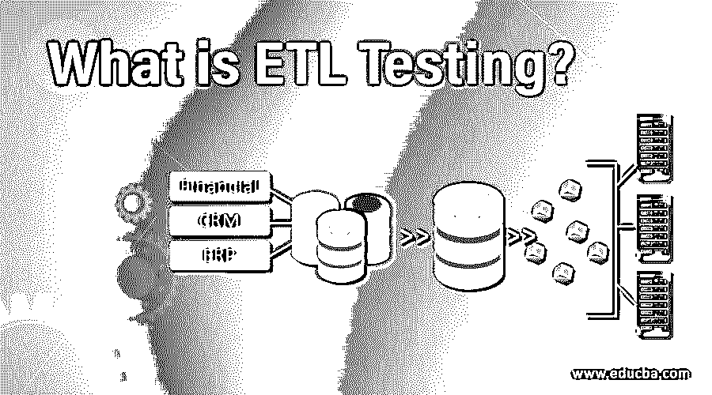

# 什么是 ETL 测试？

> 原文：<https://www.educba.com/what-is-etl-testing/>

## ETL 测试简介

ETL 测试是在 ETL 阶段执行的，包括从多个数据源提取数据、将所有数据转换为一种通用格式以及将格式化数据加载到目的地的过程的验证和确认。ETL 测试像任何其他类型的测试一样，通过不同的阶段来执行。测试阶段是“检测数据源和分析需求”、“获取数据和设计 ETL 流程”、“实施最终设计和数据库表示”、“构建数据库/表和放置数据”，以及最终根据需求规格“生成分析结果和报告”。

### 理解什么是 ETL 测试？

提取意味着从任何事务系统或其他 RDBMS(如 Oracle、Microsoft 和其他几个公司)获取数据。此阶段呈现的数据是非结构化的，是一大堆毫无意义的数据。转换是指借助于根据情况适合的操作对数据进行排序或过滤。加载意味着通过将数据移动到中央存储库或 OLAP 数据仓库来转换数据。

<small>Hadoop、数据科学、统计学&其他</small>

### ETL 是如何如此简单地工作的？

让我们用一个实时场景来解释 ETL 是如何工作的。我们知道数据无处不在，无论组织有多小。数据来自这些资源，如职员、雇员、他们为组织的业务所做的工作以及其他一些方式。因为每个组织都想研究他们的业务是如何运作的，所以最好的方法是分析过去或历史数据。拯救行动中的 ETL 概念来了。

例如，我们假设组织 A 有几个部门，如销售部、人力资源部、开发部、业务部等。所有这些部门都有不同的数据库。如果组织 A 想要分析数据并生成报告，它必须提取数据并将其转换到数据仓库中，以便为后期的分析工作保存数据。稍后，这些数据将由 BI 工具处理，以提供有意义的见解。

### 你能用 ETL 测试做什么？

这是一个单向过程，主要是为了提取数据而组织自己。一旦数据被提取出来，您就可以使用任意数量的工具来操作它。我们想告诉我们的读者不要把自己与数据仓库测试和数据库测试混淆。与前一个概念相比，后一个概念处理大量数据。

### 使用 ETL

使用 ETL 根本不是我们想告诉读者的东西。

ETL 工具内置了 3 层架构。

*   **Staging Layer:** 在这一层中，数据被累积在一个地方。数据可能来自不同的来源或数据系统。
*   **数据集成层:**该层将从暂存层接收的数据移动到数据库。在这里，数据被分为不同的层次组，也称为维度和事实。事实和维度的组合称为模式。
*   **访问层:**这主要由最终用户用于分析报告和信息的数据的最终检索。

### ETL 测试的优势

下面是提到的优点:

*   可视化流程:所有的 ETL 工具都具有向用户展示流程可视化流程的能力。这使得迁移过程更加透明，用户可以知道到底发生了什么。他们还生成脚本 IDE。
*   **编程代码的选择:**所有的 ETL 工具都允许用户使用大多数编程语言来操作工作。这些是用来写代码的。您必须检查您正在寻找的 ETL 工具的语言兼容性。
*   **模块:**大多数 ETL 工具都有一个针对仪表板的模块式分类。每个模块都有特定的用途。这为用户提供了良好的交互体验。
*   性能:测试模块在尽可能短的时间内高效地完成工作。
*   **易于理解和维护:**它具有点击和拖动功能来实现大部分要执行的任务。视觉外观更好理解。

### 所需技能

同样，开始从事 ETL 测试也不需要特定的知识。我们列出了一些最佳实践，以供希望在 ETL 领域建立职业生涯的读者和新生参考。

*   优先考虑拥有任何专业的 B.Tech 学位(CSC 和 IT 优先)。
*   看起来要有计算机学士学位硕士学位。
*   数据库知识是必须具备的，说到这一点，我们还想说 [SQL server 知识](https://www.educba.com/what-is-sql-server/)也是必须的。
*   尝试对 Tableau 和 Excel 等一些 BI 工具有一个大概的了解。

### 为什么要使用 ETL 测试？

执行数据仓库测试以及[单元测试](https://www.educba.com/unit-testing/)。深入挖掘我们杂乱无章的数据。这些数据可以是多种形式，如电子表格、日志和代码数据。

### 范围

为了让我们的读者满意，我们想说 ETL 对任何公司来说都是非常重要的，但是范围取决于可用性，而且它不是开发人员的工作，所以需求不会在需求中。随着新 BI 工具和新流程的出现，有了深入挖掘数据集的替代方法。这些因素影响了 ETL 测试人员和工具的范围。

### 这项技术将如何帮助职业发展？

经验和多种技能知识是我们向希望从事 ETL 职业的读者推荐的。请获取更多的知识，因为这将是在 it 世界中最好的生存技巧，在这个世界中，事情每天都在变化。

让我们来看看该行业提供给员工的一些薪资数据。

*   数据工程师——66228 美元
*   商业智能——52381 美元
*   高级数据工程师——78000 美元

### 结论

对 ETL 测试人员的需求是存在的，而且会一直存在，然而，人们担心的是这项技术产生的大量工作。随着新技术的出现和通过在一种产品中提供多种功能来获取市场的竞争。我们希望我们的读者深入挖掘并检查每一种可能性。我们只关心全球市场上的工作数量。

### 推荐文章

这是什么是 ETL 测试的指南？这里我们讨论了 ETL 测试的组成、工作、技能、职业发展和优势。您也可以浏览我们推荐的其他文章，了解更多信息——

1.  什么是敏捷项目管理？
2.  [软件测试职业](https://www.educba.com/careers-in-software-testing/)
3.  [什么是 SQL](https://www.educba.com/what-is-sql/)
4.  [什么是数据分析师？](https://www.educba.com/what-is-data-analyst/)

