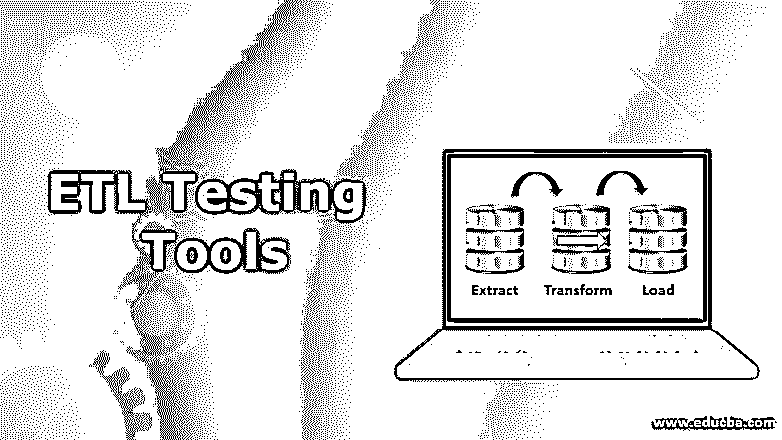
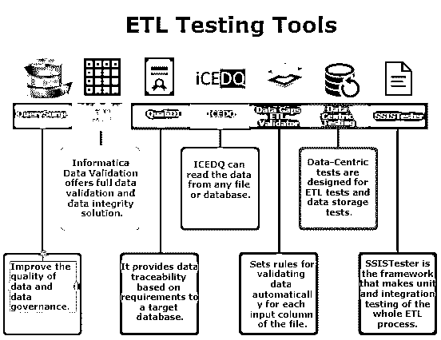

# ETL 测试工具

> 原文：<https://www.educba.com/etl-testing-tool/>

## ETL 测试工具概述

ETL 测试工具用于测试 ETL 流程，即数据仓库系统中的提取、转换和加载过程。对于手动测试 ETL 过程，SQL 查询测试是通常选择的方法，这是一个繁琐的过程，耗时的工作和缺陷滑动可能很高。因此，推荐使用 ETL 测试工具，它可以提供完整的测试覆盖，自动化，没有任何人工干预，并且可以包含所有重复的测试流程。Informatica 数据验证、数据中心测试、SSIS 测试器、QuerySurge、TestBench、RightData 等是著名的 ETL 工具。

### 概念

如前所述，ETL 是三个主要的数据库特性，如提取、转换和加载。

<small>Hadoop、数据科学、统计学&其他</small>

**提取**:从数据库中读取数据。

**转换**:将存储的数据转换成需要存储在不同数据库中的形式。

**加载**:将信息写入目标数据库。

### ETL 测试工具流程

ETL 测试工具过程类似于另一个测试过程，一些阶段包括

1.  确定业务需求
2.  测试计划
3.  设计测试用例及测试数据
4.  测试执行和错误报告
5.  汇总报告
6.  测试结束

### 顶级 ETL 测试工具

以下是 ETL 的各种测试工具:

#### 1.查询

QuerySurge 是 RTTS 开发的 ETL 测试解决方案。它专为数据存储和大数据测试的自动化而设计。它保证在目标方案中，从来源获得的信息也保持完整。

**查询的特点**

*   提高数据和数据治理的质量。
*   加快您的数据传输周期。
*   随着[的自动化，手动测试](https://www.educba.com/manual-testing/)变得容易。
*   它在各种平台上提供测试，比如 Oracle、Amazon、IBM、Teradata 和 Cloudera。
*   它提高了测试速度，并提供高达 100%的信息覆盖率。
*   它包括一个现成的 DevOps 解决方案，可用于大多数构建、ETL 和 QA 软件管理
*   为信息安全提供共享的自动化电子邮件报告和控制面板

#### 2.信息数据验证

信息数据验证是最强大的工具之一。将存储库和集成服务与 Power-Center 集成。它允许开发人员和公司分析师开发测试映射信息的指南。

**信息数据验证的特征**

*   Informatica 数据验证提供完整的数据验证和数据完整性解决方案。
*   识别并避免信息问题，提高公司生产力。
*   Informatica 数据验证还包括一个用于重用的设计和查询片段。
*   这个 ETL 测试工具可以在几分钟内分析数百万行和列
*   它有助于将源数据和数据存储数据与目标数据仓库进行比较。
*   它可以提供信息报告、自动化结果和更新报告。

#### 3.QualiDI

QualiDi 允许客户削减开支、增加投资回报率并加快上市时间。在这个 ETL 工具中，测试周期的每个元素都是自动化的。它允许客户减少开支，获得更大的回报，并加快上市时间。

**质量特性**

*   它提供了基于目标数据库需求的数据可追溯性。
*   它支持更快的项目交付和功能。
*   它提供了一个由需求、测试用例以及测试结果组成的易于维护的集中存储库
*   QualiDI 确保更多的缺陷。在初始阶段被检测到，因此在产品支持期间的测试成本会更低，因为不会有更多的错误或缺陷。
*   它支持数据验证
*   测试周期的管理可以在报告和仪表板的帮助下完成
*   与[缺陷跟踪工具](https://www.educba.com/defect-tracking-tools/)接口的集成缺陷跟踪和监控。
*   只需在仪表板上点击一下，即可获得测试执行结果和报告
*   它促进敏捷开发和快速冲刺交付。

#### 4.ICEDQ

它旨在自动测试数据迁移和数据生产。它允许用户识别在 ETL 过程中出现的各种信息问题。iCEDQ 对源系统和目标系统进行验证、确认和协调。

**ICEDQ 的特点**

*   ICEDQ 可以从任何文件或数据库中读取数据。
*   它可以基于单个列匹配内存信息
*   它基于比较和表达评估来识别不正确的信息。
*   执行后，它向订阅的消费者发送警告和通知。
*   Web 服务和命令行界面

#### 5.数据缺口 ETL 验证程序

数据缺口 ETL 验证器是一个用于数据仓库的 ETL 测试工具。它简化了数据集成、数据迁移和数据仓库项目的测试。它有一个嵌入式 ETL 引擎，可以比较数百万个文档。

**ETL 验证器的特性**

*   为文件的每个输入列设置自动验证数据的规则。
*   它有助于组装和安排测试计划
*   它为用户提供了日程安排功能
*   它支持数据集成和数据质量测试

#### 6.数据中心测试

以数据为中心的测试工具执行可靠的数据验证，以防止转换过程中出现任何故障，如数据丢失或数据不一致。它比较系统之间的数据，并确保加载到目标系统的数据在数据量、数据类型、格式等方面与源系统完全匹配。

**以数据为中心的测试特征**

*   以数据为中心的测试是为 ETL 测试和数据存储测试而设计的。
*   它支持不同的关系数据库、平面文件等。
*   自动化数据验证方法产生的 SQL 查询减少了成本和工作量。
*   它比较异构数据库，如 Oracle T2 SQL Server T1，并保证两个应用程序中的信息格式正确。

#### 7.SSISTester

SSISTester 是对整个 [ETL 过程](https://www.educba.com/etl-process/)进行单元和集成测试的框架。SSISTester 有一个很棒的用户界面，允许实时监控测试执行。在 SSISTester 中，测试的实现很容易，因为它提供了一种访问数据库资源、包等的直观方式。它带有一个内置的项目模板。SSISTester 提供测试参数，如当前执行的测试、测试中的错误和结果。测试结果可以[导出到 HTML](https://www.educba.com/html-style-sheets/) 。它允许轻松保存和发送测试结果。

### 推荐文章

这是 ETL 测试工具的指南。这里我们讨论了 ETL 的基本概念、过程和一些顶级测试工具及其特性。您也可以浏览我们推荐的其他文章，了解更多信息——

1.  [什么是 ETL 测试？](https://www.educba.com/what-is-etl-testing/)
2.  [白盒测试](https://www.educba.com/white-box-testing/)
3.  [物联网面试问题](https://www.educba.com/iot-interview-questions/)
4.  [黑盒测试](https://www.educba.com/black-box-testing/)

