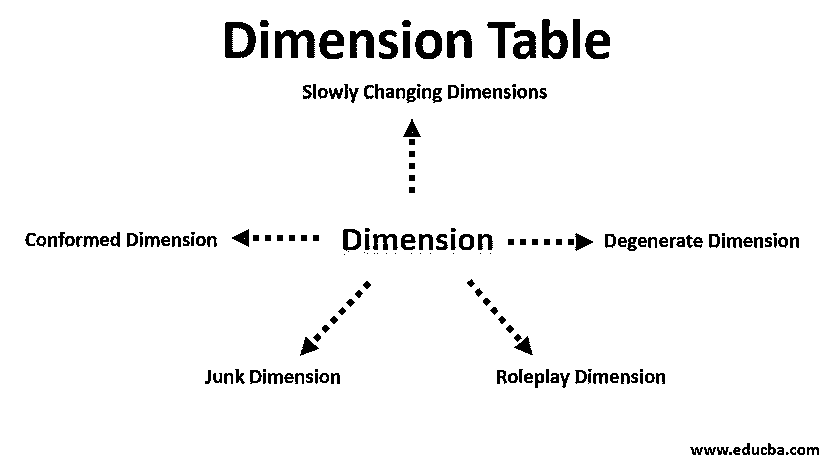

# 维度表

> 原文：<https://www.educba.com/dimension-table/>

## 维度表简介

星型或雪花型架构中存在维度表。“维度表”有助于描述维度，即维度值、属性和键。它通常体积较小。大小从几行到几千行不等。它描述了事实表中的对象。维度表是指与任何可测量事件相关的信息的集合或组。它们构成了维度建模的核心。它包含一个可被视为主键列的列，有助于唯一标识每个维度行或记录。它通过这个键与事实表连接。创建时，系统生成的名为代理键的键用于唯一标识维度中的行。

### 为什么我们需要使用？

*   它有助于存储信息的历史或维度信息。
*   它比规范化的表格更容易理解。
*   可以向表中添加更多的列，而不会影响使用这些列的现有应用程序。

### 维度表的类型

以下是不同类型的维度表:

<small>Hadoop、数据科学、统计学&其他</small>

#### 1.SCD(渐变尺寸)

倾向于随时间缓慢变化而不是以有规律的时间间隔变化的维度属性称为缓变维度。例如地址和电话号码改变，但不定期。让我们看一个例子，一个人去不同的国家旅行，所以他需要根据那个国家改变他的地址。这可以通过三种方式实现:

**Type1:** 覆盖之前的值。这种方法易于实施，有助于节省空间，从而降低成本。但是，历史在这种情况下消失了。

变更前的表格

| **ID** | **名称** | **国家** | **国籍** |
| **第 1001 章** | 雷切尔 | **印度** | **印度** |

变更后的表格

| **ID** | **名称** | **国家** | **国籍** |
| **第 1001 章** | 雷切尔 | **中国** | **印度** |

**Type2:** 用新值添加新行。在这种方法中，保存了历史记录，并可以在任何需要的时候使用。但是它需要很大的空间，因此增加了成本。

变更前的表格

| **ID** | **名称** | **国家** | **国籍** |
| **第 1001 章** | 雷切尔 | **印度** | **印度** |

变更后的表格

| **ID** | **名称** | **国家** | **国籍** |
| **第 1001 章** | 雷切尔 | **印度** | **印度** |
| **第 1001 章** | 雷切尔 | **中国** | **印度** |

**Type3:** 添加新列。这是最好的方法，因为历史很容易保存。

变更前的表格

| **ID** | **名称** | **国家** | **国籍** |
| **第 1001 章** | 雷切尔 | **印度** | **印度** |

变更后的表格

| **ID** | **名称** | **国家** | **故国** | **国籍** |
| **第 1001 章** | 雷切尔 | **中国** | **印度** | **印度** |

#### 2.符合尺寸

这个维度在多个主题领域或数据集市之间共享。相同的可以在不同的项目中使用，而不需要在相同的项目中做任何修改。这用于保持一致性。符合维度是指那些与任何其他维度完全相同或为其真子集的维度。

#### 3.垃圾维度

垃圾维度是一组低基数的属性。它包含与任何其他属性无关的不同或各种属性。这些可用于实现 RCD(快速变化维度),如标志、权重等。

#### 4.退化维数

它的属性存储在事实表本身中，而不是作为一个单独的维度表，这些属性被称为退化维度。例如，票号、发票号、交易号等。

#### 5.roleplay dimension 角色扮演维度

与事实表有多重关系的维度称为角色扮演维度。换句话说，就是当同一个维度键及其所有相关属性被连接到事实表中的许多外键时。它可以在同一个现有数据库中实现多种目的。

### 它在数据仓库中是如何工作的？

*   维度是指与任何可测量事件相关的信息的集合或组。它们构成了维度建模的核心。创建维度时，会生成项目的结构。Created 可以跨不同的项目使用，它反映了可重用性的思想。当其中任何一项发生更改时，其影响仅反映在该特定表中。创建报告时，用户可以从维度表中获取数据，因为维度表包含所有必要的信息。
*   当执行维度建模时，原子数据被加载到维度结构中。然后，围绕业务流程生成或构建维度模型。在创建时，必须记住过滤域值并在这些表中存储报告的标签。必须确保代理键(在创建维度表期间使用的系统生成的键，有助于唯一识别维度表中存在的每个记录。)必须在创建维度表时使用。它必须是非规范化的，因为它们的任务是让用户轻松高效地读取和分析数据，而不是管理事务。dimension 的主要目的是提供过滤、执行分组和有效的标记。

### 优势

以下是维度表的不同优势:

*   它具有简单的结构。
*   很容易分析和理解。
*   非规范化数据。
*   有助于维护任何维度的历史信息。
*   很容易从中检索数据。
*   快速创建和实施。
*   它给出了任何业务流程的上下文环境。

### 结论维度表

这是数据建模不可或缺的一部分。它用于星形或[雪花模式](https://www.educba.com/snowflake-schema/)。它包含事实表属性的维度、键和值。在不同的场景中使用不同类型的。

### 推荐文章

这是维度表的指南。这里我们已经讨论了类型，维度表如何在数据仓库中工作的优点。您也可以浏览我们的其他相关文章，了解更多信息-

1.  [事实表 vs 维度表](https://www.educba.com/fact-table-vs-dimension-table/)
2.  [什么是事实表？](https://www.educba.com/what-is-fact-table/)
3.  [什么是 Tableau？](https://www.educba.com/what-is-tableau/)
4.  [Tableau 中的数据混合](https://www.educba.com/data-blending-in-tableau/)

