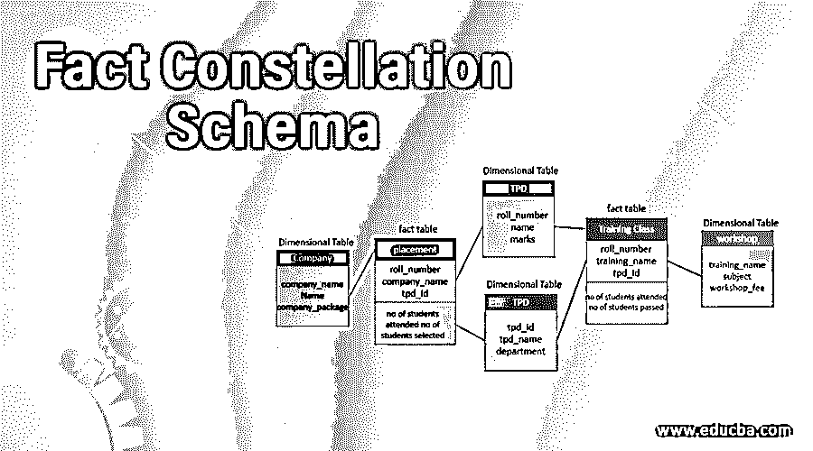
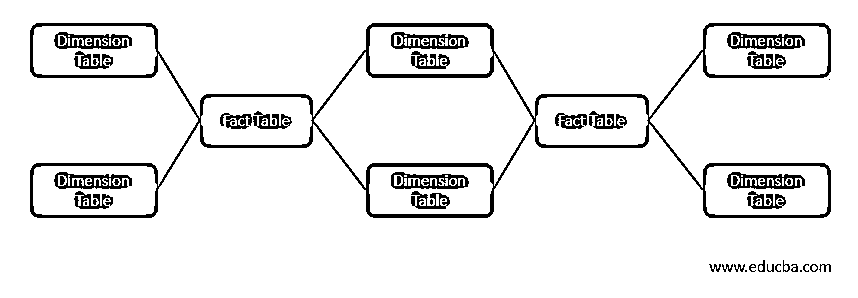
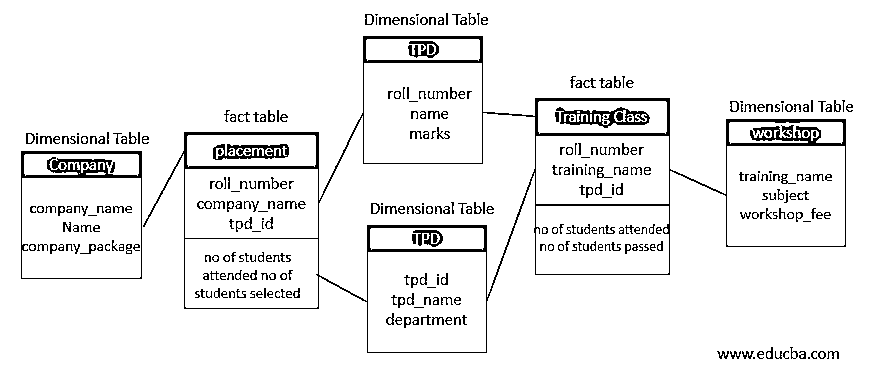

# 事实星座模式

> 原文：<https://www.educba.com/fact-constellation-schema/>

## 事实星座模式介绍

事实星座模式是表示表的多维模型的模式。这个模式是一组不同的事实表，这些事实表几乎没有相似的维度表。它可以表示为一组多星模式，因此，它也被称为星系模式。事实模式是设计数据仓库最常用的模式，它比星型和雪花型模式稍微复杂一些。

事实星座图是一个通过在线[分析处理](https://en.wikipedia.org/wiki/Online_analytical_processing)的工具，它有一个数量庞大的[事实表](https://en.wikipedia.org/wiki/Fact_table)组，这些事实表共享[维度表](https://en.wikipedia.org/wiki/Dimension_table)，也聚合为一组星星。我们也可以称之为[星座模型](https://en.wikipedia.org/wiki/Star_schema)的延伸。

<small>Hadoop、数据科学、统计学&其他</small>

### 什么是事实星座图式？

一个事实星座模式可以有多个关联的事实表。它是设计数据仓库的常用模式，比任何其他模式(如星型和雪花型模式)都复杂。我们可以通过将星型模式分割成一个或多个星型模式来创建事实星座模式。也有人说，一个事实星座模式可以有许多事实表和一个共享维度表。

### 事实星座的一般结构

为了理解事实星座图式，我们在下面给出了它的一个框架。

这是与事实和维度模式相关联的任何事实星座模式的基本模式。一组组合的星模式称为事实星座模式。

这里粉红色的框是两个星型模式共有的维度表。绿色是负责每个星型模式的事实表。

### 事实星座模式架构

在上面的架构中，下面是简要的分析:

*   学生是一个维度表，其中 roll_number、name、marks 是它的属性。
*   TPD 是一个维度表，其中 tpd_id、tpd_name、department 是它的属性。
*   Placement 是一个事实表，其中 roll_number、company_name、tpd_id 是它的属性，它的事实是参加的学生数、选择的学生数。
*   培训班是一个事实表，其中 roll_number、training_name、tpd_id 是它的属性，参加的学生人数、选择的学生人数是它的事实。
*   workshop 是一个维度表，其中 training_name、subject、workshop_fee 是它的属性。
*   Company 是一个维度表，其中 company_name、name、company_package 是其属性。

在上面的模式中，placement 和 training_class 是两个不同的星型模式，星型模式中的维度表是学生、TPD 和公司，而 placement 是事实表。

另一个星型模式是学生、TPD 和 workshop，它们是维度表，training class 是事实表。

这里，上面的两个星模式具有共同的二维表，因此它们形成一组事实星座模式。

### 优点和缺点

以下是一些使其更有用的优点:

*   表被细分为事实和维度，以理解它们之间的关系。
*   它是一个灵活的模式，使用户可以使用它。
*   这里，维度表由多个事实表共享。
*   它是雪花和星形模式的规范化形式。
*   我们可以使用复杂的查询来访问数据库中的数据。

下面列出了一些缺点:

*   这很难理解，因为它是一个实现起来非常复杂的模式。
*   与星型模式相比，它在数据库中使用更多的空间。
*   它在维度表和事实表之间有许多连接，因此很难理解。
*   这很难维护和操作。

### 结论

事实星座图式也被称为星系图式。在一组星型模式中，一个事实表可以共享两个或多个维度表。它是雪花模式和星型模式的规范化形式。它的主要缺点是，这是一个非常具有挑战性的设计架构，因为它可能已经加入了维度表和事实表之间的聚合关系。

### 推荐文章

这是一个事实星座图的指南。在这里，我们讨论一个介绍，一般结构，以及优缺点的架构。您也可以浏览我们的其他相关文章，了解更多信息——

1.  [数据仓库模式](https://www.educba.com/data-warehouse-schema/)
2.  [星系模式](https://www.educba.com/galaxy-schema/)
3.  [什么是星型模式？](https://www.educba.com/what-is-star-schema/)
4.  [PostgreSQL 模式](https://www.educba.com/postgresql-schema/)

