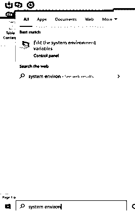
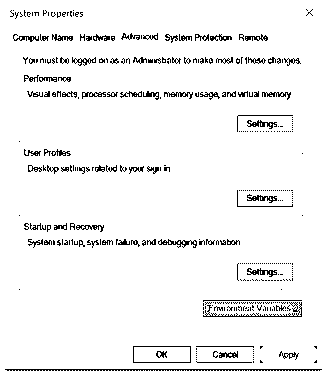
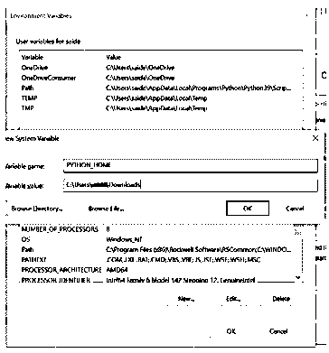
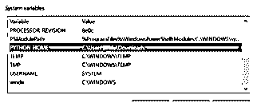
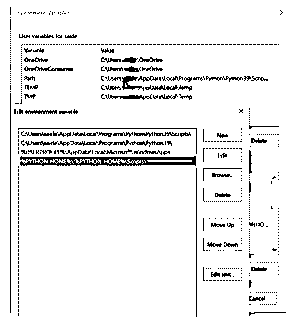
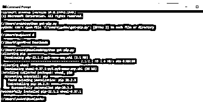
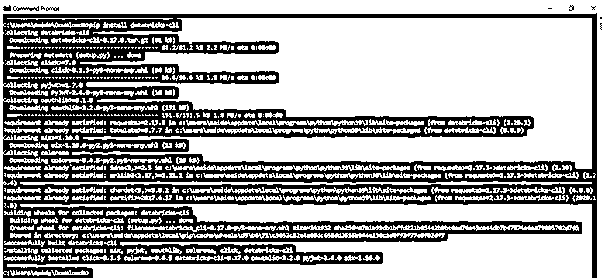

# Databricks CLI

> 原文：<https://www.educba.com/databricks-cli/>

## Databricks CLI 简介

Databricks CLI，命令行界面为 Azure Databricks 平台提供了一个易于使用的界面。这个命令行界面构建在 Databricks REST APIs 之上，可以与 DBFS、集群、作业、工作区、Secrets API 和库一起使用。命令行接口在开源平台 GitHub 上有其代码。Databricks 工作区是一个管理所有 Databricks 资产的环境，该工作区允许组织表格、集群、笔记本并帮助管理作业。让我们看一下 CLI 命令，了解 CLI 的数据块、配置和安装。

### Databricks CLI 命令

对于命令行界面，Python 是先决条件，要求版本为 2.7.9v 及以上。对于 Python2 和 Python3，是 3.6v 及以上。

<small>Hadoop、数据科学、统计学&其他</small>

如上所述，Databricks Workspace 是管理 Databrick 资产的基本环境之一。尽管界面非常用户友好，但是导入或导出笔记本、将每个笔记本链接到 Git repo 以及启动集群都很困难。如果用户不得不管理平台中的多个工作区，情况会变得更糟，这变得很难管理。

要查找命令行界面版本，

数据块–版本

D.命令行界面分为许多子 CLI，如下所示:

**集群策略 CLI:**

运行数据块群集策略的命令 CLI:数据块群集-策略–帮助

**集群 CLI:**

运行集群 CLI 子命令的命令(需要附加上述命令):data bricks Clusters–h

DBFS CLI: 通过将 DBFS CLI 命令附加到 databricks fs 或 dbfs:data bricks fs–h 来运行这些命令

d .命令行接口子命令被附加到数据块组

数据块组–帮助

实例池 CLI: 此池 CLI 需要 0.9.0v 或更高版本的数据块。

数据块实例-池-h

库 CLI: 可以通过附加到数据块库来使用 d .命令行接口子命令。

数据块库-h

**Repos CLI:** 要求 CLI 0 . 15 . 0v 以上。d .命令行界面命令附加到 CLI 报告中

databricks rest–h

Secrets CLI: 需要 CLI 0.7.1 或以上版本的数据库。d .命令行接口子命令被附加到数据块秘密中。

数据块秘密–帮助

堆栈 CLI: 数据块需要 0.8.3v 或以上的电压。它让位于管理一堆数据块资源。

数据块堆栈–帮助

令牌 CLI: D .命令行接口子命令被附加到数据块令牌上，

数据块令牌–帮助

数据块工作区: CLI 子命令附加到数据块工作区。

数据块工作空间–h

### 配置数据块 CLI

**步骤 1** :使用适当版本的 python 运行 pip install databricks-cli。

**步骤 2** :一旦用户安装了所需的库，用户可以通过命令检查安装的软件版本:数据块–版本

**步骤 3** :要开始编写 CLI 命令，用户必须首先设置用户想要管理的 Databricks Workspace 的身份验证，该操作只需执行一次。

**步骤 4** :需要使用 DPAT (Databricks 个人访问令牌)设置认证，可以直接从工作区创建。

**步骤 4a** :在工作区点击用户档案，选择用户设置。

**步骤 4b** :这里有一个创建新令牌的选项。在生成令牌之前，必须设置生存期，并且需要复制令牌。

**步骤 4c** :同样，从浏览器中抓取如下格式的工作空间 URL，

**错误！超链接引用无效。**

**步骤 5:** 然后，用户可以通过命令行使用命令 databricks configure–token 在本地机器上配置身份验证。

**第六步:**要求用户进入数据块主机；工作区 URL 将由浏览器提供。然后，要求用户输入生成的令牌。

**步骤 7:** 要检查认证是否有效，运行命令 databricks workspace list 用户将能够在控制台上看到 databricks 工作区中的目录列表。

**第八步:**但是，它允许用户管理单个工作区；那么，如果用户想要管理属于不同环境的多个工作区，或者用户为不同的客户端工作，并且每个客户端都有一个专用的工作区，该怎么办呢？

**步骤 9:** 因此，可以通过设置连接配置文件在控制台上配置这个特定的场景。

**步骤 10:** 添加连接概要文件，设置一个惟一的名称来标识一个特定的工作区，比如开发或 UAT。

**步骤 10a:** 下达命令数据块配置-令牌-配置文件<T3】配置文件名称>T5】。这将在 CLI 上为每个工作区创建一个别名以供纪念。

**步骤 10b:** 如上所述输入令牌和主机名。

**步骤 10c:** 要使用连接配置文件，用户需要用–profile<T3】profile _ name>T5】来补充 CLI 命令

**步骤 10d:** 如果用户需要切换到另一个工作空间，必须更改一个配置文件。

* *可以重复相同的配置步骤来设置工作区，因此为每个工作区指定唯一的名称将有助于进一步识别。

### 安装 Databricks CLI

**第一步**:安装 Python 2 . 7 . 9 或以上版本。可以从下面的链接下载最新版本的 Python。https://www.python.org/downloads/

**第二步**:Python 下载完成后，需要添加指向 Python 安装目录的 PYTHON_HOME 系统变量。

**第三步**:搜索“系统”，选择“编辑系统环境变量”，如下图。

**第四步**:在这个系统属性中，移动到高级选项卡，点击环境变量。

**第五步**:点击 New，输入变量名 PYTHON_HOME，变量值 PYTHON 安装的路径。

点击确定，

**第六步**:然后，PYTHON_HOME 变量必须添加到 path 环境变量中。在“环境变量”窗口中，单击 Path 系统变量并编辑à New à。以“%PYTHON_HOME%”的形式输入路径；%PYTHON_HOME%\Scripts\ "

保存更改。

**第 7 步**:如果是第一次安装 Python，用户还需要安装 pip。PIP 是 python 的标准包管理器，允许用户安装和管理不属于 Python 标准库的附加包。

**步骤 8** :从【https://bootstrap.pypa.io/get-pip.py T2】安装 PIP，右键点击另存为，保存。

**第九步**:打开命令提示符，移动到保存文件的文件夹，输入 python get-pip.py

步骤 10 :然后执行以下命令，pip install databricks-cli

**步骤 11** :为数据块创建访问令牌；通过 Databricks CLI 访问 data brick 需要生成访问令牌。这需要安装 Azure Databricks 门户。

帐户à用户设置à访问令牌à生成新令牌à添加生命周期和注释。

然后可以在与 Databricks CLI 连接时使用令牌，建议将其存储在安全的地方，如 Azure Key Vault。

**第 12 步**:然后，从命令提示符下登录到 Databricks 运行时

数据块配置-令牌

主机数据块 URL 看起来像这样，**错误！超链接引用无效。** >

如果成功，用户将能够通过使用多个命令来管理数据块。

### 结论

至此，我们将结束“数据块 CLI”主题我们已经了解了 Databricks CLI 的含义，以及它在为各种问题提供解决方案方面的作用。还介绍了 databricks 中的一些 cli 命令，以及如何配置 databricks cli 以供使用。已列出安装 databricks cli 的逐步步骤，并附有清晰解释的屏幕截图。希望本文有助于理解 Databricks CLI 的概念。谢谢！快乐学习！!

### 推荐文章

这是 Databricks CLI 的指南。这里我们讨论简介、Databricks CLI 命令和配置步骤。您也可以看看以下文章，了解更多信息–

1.  [Nginx 添加 _header](https://www.educba.com/nginx-add_header/)
2.  [Nginx 位置指令](https://www.educba.com/nginx-location-directive/)
3.  [Nginx 晶圆](https://www.educba.com/nginx-waf/)
4.  [Nginx FastCGI](https://www.educba.com/nginx-fastcgi/)

