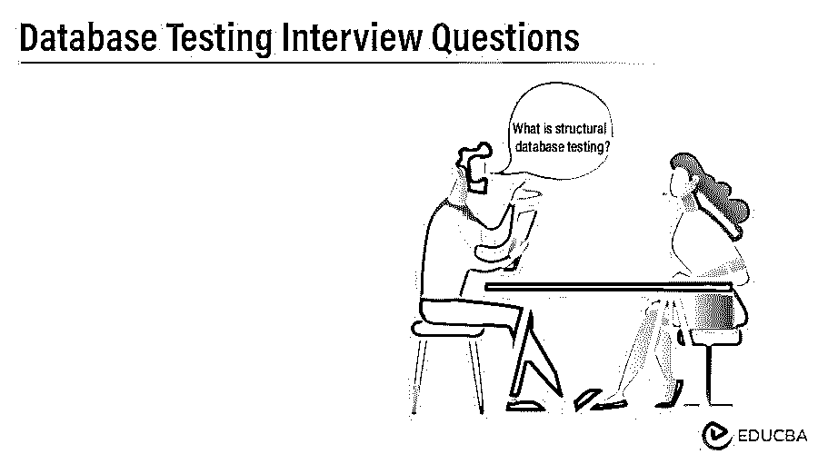

# 数据库测试面试问题

> 原文：<https://www.educba.com/database-testing-interview-questions/>

## 数据库测试面试问题及答案

如果你想找一份和数据库测试相关的工作，你需要准备 2022 年数据库测试面试题。虽然每个数据库测试面试都是不同的，工作范围也是不同的，但我们可以帮助您解决顶级数据库测试面试问题和答案，这将帮助您迈出这一步，并在面试中取得成功。牢记这一点，我们设计了最常见的数据库测试面试问题和答案，以帮助您在面试中取得成功。

以下是 2022 年数据库测试面试中最常被问到的问题列表，该列表分为以下两部分:

<small>Hadoop、数据科学、统计学&其他</small>

### 第 1 部分-数据库测试面试问题(基础)

第一部分包括基本的数据库测试面试问题和答案

#### 1.什么是数据库测试？

**答案:**
它会检查所有对象模式、触发器、过程、函数。它检查数据的完整性和一致性。

#### 2.有哪些不同类型的测试？

**回答:**
[结构测试](https://www.educba.com/structural-testing/)
功能测试
非功能测试

**结构化数据库测试**
它涉及所有元素/对象的验证，主要用于数据存储。不直接暴露给最终用户。数据库服务器的验证(即严格配置)也是数据库测试的一个非常重要的部分。

**功能数据库测试**
功能数据库测试涉及到用户交易需求的规格要求。作为输入或输出。
它涉及到空值句柄，一列的长度，一列的数据类型。它还将检查派生的输出表或列是否可用。根据业务需求，所有字段名称都应遵循标准命名约定。

**非功能性数据库测试**
在这种背景下，多重测试涉及多个类别，如压力测试、[安全测试、](https://www.educba.com/security-testing-tools/)、可用性测试、[兼容性测试](https://www.educba.com/compatibility-testing/)。压力和负载测试只涉及性能测试。

让我们转到下一个数据库测试面试问题

#### 3.什么是结构化数据库测试？

**答案:**
这是数据库测试面试中常见的问题，它涉及到数据库的结构，即依赖于模式、表、过程、函数、触发器和数据库服务器的测试。

**模式测试**
模式测试的主要方面是，确切的模式名称应该是前端和后端之间的映射。以下是一些重要的检查点

模式格式的验证非常重要，因为有时候模式的表格式与业务需求或前端应用程序不同。它还包括对未映射的表/视图/列的验证。

**表测试**
涉及表名和列测试。列映射到前端，后端应该相同。列的大小和数据类型应符合业务要求，并应映射到前端应用程序。它还涉及约束测试，如什么是主键、外键、什么是自动标识列、根据业务需求什么是分区。在表测试中一个重要的事情是索引，需要检查聚集索引或非聚集索引是否已经创建。

程序和功能测试
程序和功能测试中涉及到一系列重要的事情。

开发团队确实遵循了要求。这涉及到编码标准，正确的编码缩进会让其他开发者更容易理解，正确的变量命名约定，删除开发者使用的不必要的变量和注释。
·检查开发人员是否按照业务需求构建了代码。
·输入和输出变量的参数是什么？
检查开发者是否已经构建了代码来处理所有异常。像算术异常，空值异常。
检查过程和函数是否正在将数据插入到名称、数据类型、长度都正确的表中，并且应该进行修剪。

**触发测试**
该测试规则与程序和功能测试相同。此外，还需要检查触发器是否在特定的需求事件上执行。

**数据库服务器**
我需要检查数据库服务器的配置。执行处理能力、RAM 和存储能力应能够根据业务需求进行输出。

#### 4.联接有哪些不同的类型？

**答案:**
有如下 6 种类型的连接:-
1 .内部联接–将匹配精确的列数据。
2。left outer join–将显示左表中匹配和不匹配的所有数据。
3。右外部连接–将显示右表中匹配和不匹配的所有数据。
4。[完全外部连接](https://www.educba.com/oracle-full-outer-join/)–将显示两个表中匹配和不匹配的所有数据。
5。交叉连接–将显示两个表的乘积。
6。Union 和 Union All–将合并两者的数据。

#### 5.指数是什么？有哪些不同类型的索引？

**答案:**
索引是在表列中创建的数据库对象。频繁执行的查询，索引的执行速度会更快。索引有以下 6 种类型:-
B 树索引
位图索引
聚集索引
覆盖索引
非唯一索引
唯一索引

#### 6.在数据库测试中，如何知道触发器是否被触发？

**答案:**
我们需要启用审计日志。利用这一点，我们能够看到扳机是否被击发。

### 第 2 部分-数据库测试面试问题(高级)

现在让我们来看看高级数据库测试面试问题。

#### 7.数据库测试中数据加载测试涉及的步骤有哪些？

**回答:**
数据库测试中的数据加载测试如下:
应该知道源数据
应该知道目标日期
源数据和目标数据的兼容性
我需要检查源列和目标列。
源和目标的有效行数。
我们需要在源发生任何变化后检查目标的效果。
需要检查空值和垃圾值。

#### 8.可以用来操作数据和表的 SQL 命令是什么？

**答:**
要操纵数据我们可以使用 select、insert、update、delete 和 for table 创建表、alter table、drop table。

#### 9.你如何测试负载/压力测试？

**答案:**
需要在最短的时间内通过处理大量数据来检查负载或压力测试。它将检查系统响应，负载测试已完成。如果负载超过了用户的进程，这就是负载/压力测试。负载/压力测试的例子是下载数据集，在一台计算机上执行多个应用程序。

让我们转到下一个数据库测试面试问题

#### 10.如何手动测试数据库？

**答:**
手动数据库测试是指在前端增加、更新或删除数据时，从后端检查数据。

#### 11.我们可以在一个表上创建多少个聚集索引？

**答:**
我们只能创建一个聚集索引，它将引用单个表上的主索引。这是数据库测试面试中问得最多的问题。

#### 12.如何检查多个数据库对象已经被创建？

**答案:**
我们可以用 2 种方法检查所需的数据库对象是否已经创建。
1。使用对象资源管理器，我们可以看到数据库对象，如模式、表、过程、函数、触发器、索引等。
2。使用 sys 或 master 表存储所有数据库对象的所有元数据。

#### 13.如果我们有超过 1000 行的程序，我们将如何测试或者在测试的时候它在哪里失败了？

**回答:**
我们可以使用下面的方法来测试这个特定的条件
1。当时编译
2。在每次执行之前或之后做适当的注释，这将给出关于什么过程正在进行以及我们在哪里被卡住的提示。

### 推荐文章

这是一个数据库测试面试问题和答案列表的指南。这里我们列出了 13 个最有用的面试问题，这样求职者就能轻松应对面试。您也可以阅读以下文章，了解更多信息——

1.  [投资银行的错误](https://www.educba.com/investment-banking-interview-mistakes/)
2.  [有经验员工的面试技巧](https://www.educba.com/interview-tips-and-tricks/)
3.  求职面试中保持冷静的步骤
4.  [电话面试成功指南的 10 个关键(提示)](https://www.educba.com/telephone-interview-tips/)

