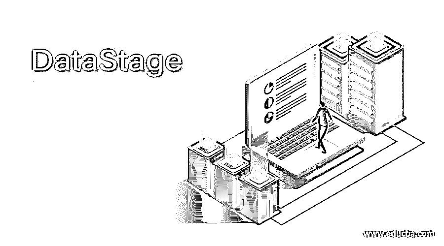
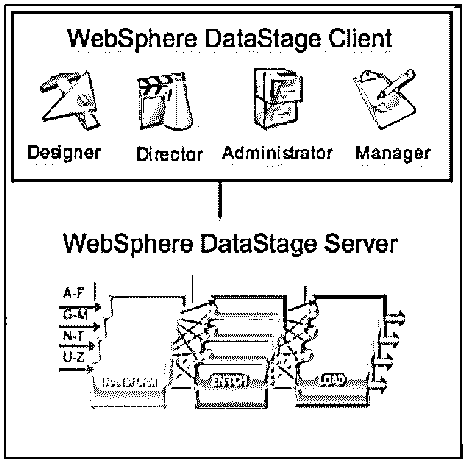
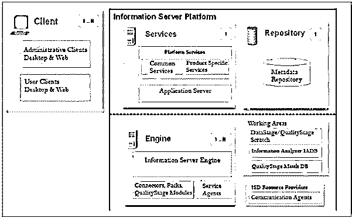

# 数据库阶段

> 原文：<https://www.educba.com/datastage/>

## DataStage 的定义

DataStage 是一个 ETL 工具，用于从不同的数据源提取数据，根据业务需求转换数据，并加载到目标数据库中。数据源可以是任何类型，如关系数据库、文件、外部数据源等。使用 DataStage ETL 工具，我们提供高质量的数据，这些数据反过来用于商业智能。DataStage 最初由 Vmark 推出，后来被 IBM 收购。DataStage 以前被称为“数据集成器”。

### 我们为什么需要 DataStage？

在查询“我们为什么需要 DataStage”之前。让我们了解一下传统的批处理。

<small>Hadoop、数据科学、统计学&其他</small>

以下是传统批处理中遵循的流程:–

1.将数据从源加载到磁盘

2.磁盘来执行转换，然后保存到磁盘。

3.磁盘到目标。

在中，对于大数据量，批处理变得不切实际，管理满足要求所需的大量小作业变得非常复杂。

为了克服上述缺点，我们需要可以并行进行的批处理。针对这种需求，我们得到了 ETL 批处理系统来处理大容量并行数据。并行处理可以基于流水线和分区来完成。

### DataStage 是如何工作的？

Datastage 通常会执行以下步骤:

*   我们以顺序作业方式或并行方式设计用于提取、转换和加载的作业。
*   计划、运行和监控作业。
*   创建批处理作业。

### Datastage 架构

Datastage 通常有不同的组件来帮助我们完成整体的提取、转换和加载。

*   管理员:–管理全局设置并与系统交互。
*   Designer:这里的 designer 用于创建 Datastage 作业，作业序列又被编译成可执行程序。设计师主要是为开发者服务的。
*   director:–这用于监控和管理 Datastage 作业。由 DataStage 支持角色用来监视作业和修复作业故障。
*   Manager:它用于管理、浏览和编辑数据仓库存储库。

我们使用的术语如下:

*   项目
*   职位
*   阶段
*   环

作业类型:–并行作业、作业序列和服务器作业。

**并行作业:**

*   组合在共享容器中的阶段和链接。
*   在各种其他并行作业中重用共享容器的实例。但是容器只能在定义的作业中使用。

**服务器作业:**

*   用于表示源、转换阶段或目标。
*   我们有两个阶段:主动或被动阶段。

**链接:**

*   链接作业中的各个阶段，并指示作业运行时的数据流。

### 服务器架构

**处理阶段类型**

Datastage 作业通常由阶段、链接和转换组成。这些阶段只不过是从数据源到目标数据源的数据流。该阶段可以有最少的单个数据源作为输入，或者多个数据源和一个或多个数据输出。

让我们讨论一下我们在 DataStage 中使用的各个阶段:在作业设计中，您可以使用的各个阶段有:

*   转换阶段
*   过滤阶段
*   聚集阶段
*   删除重复项阶段
*   加入阶段
*   查找阶段
*   复制阶段
*   分类阶段
*   容器

### Datastage 的优点和缺点

| **优势** | **缺点** |
| 连接到多种类型的数据源 | 为了 ETL 工作，我们需要安装或连接到服务器。 |
| 大量数据。批量转移和复杂转换 | 没有自动化的错误处理和恢复机制。 |
| 根据需要刷新和同步数据。 | 我们没有 UNIX datastage 客户端。 |
| 可靠而灵活地连接到不同类型的数据库。 | 对于中小型公司来说，购买软件可能会非常昂贵。 |
| 分割算法 |  |
| 易于集成，通过单一界面集成异构数据源。 |  |
| 在 Windows 和 Unix 服务器上都表现良好。 |  |

### Datastage 的特性

*   它支持大量数据的转换。
*   实时数据集成，支持数据源和应用程序之间的连接。
*   优化硬件利用率。
*   支持收集和集成。
*   强大、可扩展、快速、灵活且有效地构建、部署、更新和管理您的数据集成。
*   支持大数据和 Hadoop。

**DataStage 在各种领域或公司的使用:**

目前，Datastage 的使用已经遍及全球。使用 DataStage 的领域或公司有库柏公司、SAS 等。

要了解更多这方面的信息，请使用下面的链接，它会提供图片:

[https://enlyft.com/tech/products/ibm-infosphere-datastage](https://enlyft.com/tech/products/ibm-infosphere-datastage)

【DataStage 的职业道路:

目前，ETL 工具的使用正在增加。而且我们可以看到 ETL 并不局限于某个特定的行业。每个行业都使用 ETL 来管理数据并使其成为可用的格式。

我们还有其他工具叫做 Informatica，Talend ETL 工具，比 datastage 便宜。

更具体地说，我们可以学习数据分析，这将更容易处理，并且是职业道路上的一个职业里程碑，因为你已经在 ETL 工具方面有很好的知识。

### 结论

从上面的会话中需要记住的是 datastage 作业的定义和流程。

DataStage 是一个 ETL 工具，用于从不同的数据源提取数据，根据业务需求转换数据，并加载到目标数据库中。数据源可以是任何类型，如关系数据库、文件、外部数据源等。使用 DataStage ETL 工具，我们提供高质量的数据，这些数据反过来用于商业智能。

Datastage 通常会执行以下步骤:

*   我们以顺序作业方式或并行方式设计用于提取、转换和加载的作业。
*   计划、运行和监控作业。
*   创建批处理作业。

关键方面如下:-

*   数据转换
*   乔布斯
*   并行处理

DataStage 有四个主要组件，

*   管理人员
*   经理
*   设计师
*   主管

根据需要刷新和同步数据。可靠而灵活地连接到不同类型的数据库。易于集成的分区算法和集成异构数据源的单一接口。

### 推荐文章

这是一个 DataStage 的指南。这里我们讨论一下定义，DataStage 是如何工作的？，Datastage 的特性、优点和缺点。您也可以浏览我们推荐的其他文章，了解更多信息——

1.  [橙色数据挖掘](https://www.educba.com/orange-data-mining/)
2.  [数据 vs 元数据](https://www.educba.com/data-vs-metadata/)
3.  [数据库管理软件](https://www.educba.com/database-management-software/)
4.  [数据字典](https://www.educba.com/data-dictionaries/)

