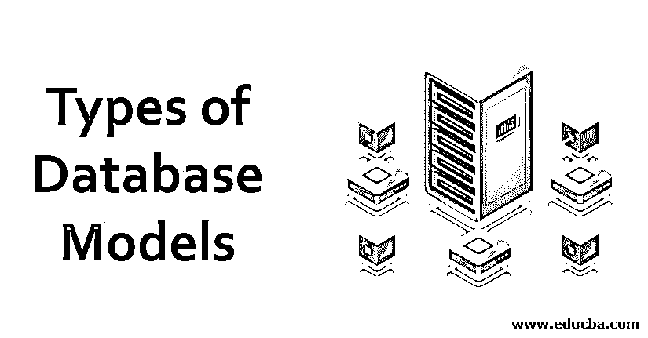

# 数据库模型的类型

> 原文：<https://www.educba.com/types-of-database-models/>

## 数据库模型类型介绍

数据库模型基本上被称为数据库模式，用于表示数据库结构和由数据库管理系统管理的数据库的格式。数据库模型代表了数据库的外观。有各种类型的数据库模型，如网络模型、[实体关系模型](https://www.educba.com/entity-relationship-model/)、层次模型、面向对象模型和对象模型。这些所有类型的数据库模型具有彼此不同的外观，并且在这种类型的数据库模型上执行的操作彼此不同。数据库模型的使用因用户需求而异。

### 数据库模型的类型

下面给出了不同类型的数据库模型:

<small>Hadoop、数据科学、统计学&其他</small>

#### 1.平面模型

在平面数据库模型中，有一个数据元素的二维数组，其中假设列具有相似类型的值，在行中，元素应该具有彼此相关的关系值。

例如，有两个名为 name 和 password 的列，可以被任何安全系统使用。所以每行用来存储不同的密码和用户名。在平面模型中，没有两个条目是相同的。在平面模型中，表格式用于存储数据库。这种数据库模型有一个缺点，因为它不能在二维数组中存储大量数据，因为在平面数据库模型中很难管理如此大的一组条目。

#### 2.层次模型

在分层模型中，数据存储在树状结构中，其中有一个根节点，数据从该节点开始存储。排序字段用于兄弟记录，以便在分层模型中存储数据时保持一定的顺序。当需要维护信息管理系统时，通常使用层次数据库模型。在这种数据库模型中，数据之间存在一对多的关系。在层次模型中，数据的检索有不同的技术。

该技术遵循使用指针向下导航的方向，以便可以顺序访问数据。由于这种技术，[层次数据库模型](https://www.educba.com/hierarchical-database-model/)有一个缺点，因为它不能处理所有类型的数据库操作。与其他类型数据库模型相比，数据的检索时间更长。记录没有连接到层次模型。并且该模型由用于表示存储在数据库系统中的数据的层次结构的向上链接组成。

#### 3.网络模型

与分层模型相比，网络结构数据库模型具有非常相似的结构。该模型允许树状结构模型中的多对多关系。这意味着可以有多个父母。网络模型使用两个基本概念，即集合和记录。记录包含文件和集合，文件可以是分层形式，集合用于定义记录之间的多对多关系。该集合使用循环链表[作为数据结构](https://www.educba.com/what-is-data-structure/)，其中一个父记录可以在一个循环中出现一次，而该特定父记录的子记录可以在每个循环中出现多次。

在网络数据库模型中，记录是相互连接的。以这种方式，在记录之间保持了层次结构。该数据库模型中的数据访问或者是顺序形式，或者可以是循环链表模式。并且可以有多条路径来访问任何特定的记录。这种网络模型的缺点是在记录中包含冗余，这意味着一个记录可以在数据库模型中出现多次。

#### **4** 。关系模型

关系数据库模型旨在消除数据库管理系统中的依赖性。关系数据库模型的开发主要针对微型计算机系统。关系数据库模型中使用的三个键是域、属性和关系。关系被定义为包含行和列的表。表中出现的列在关系数据库模型中被称为属性[。域被定义为一组可以插入到数据库模型中的值。该模型中使用的数据结构是一个表，数据以行和列的形式存储在模型中。这些行也称为元组。](https://www.educba.com/relational-database-model/)

例如，有一个名为“雇员详细信息”的关系。它可以有多个属性，如姓名、年龄、性别。一个名为雇员详细信息的关系可以有多个元组。可以用来唯一标识任何行的键称为主键。这些键可以用来同时连接多个表。例如，在 employee 表中可以有一个名为 location 的列，列 location 可以是 location 表的主键。

通过这个键，location 表和 employee 表这两个表可以连接起来，并且可以在连接表上执行操作。关系数据库模型使用结构化查询语言(SQL)在数据库系统上执行操作。关系模型包含多个看起来像平面数据库模型的表。这种模型的一个主要优点是，每当值在两个不同的记录中出现超过时间时，它们之间就存在某种关系。

#### **5。**维度模型

维度数据库模型被定义为关系数据库模型的专门版本。该模型用于表示数据仓库中的[数据，以便可以使用 OLAP 查询和在线分析处理来汇总数据。在多维数据库模型中，数据库模式由一个巨大的表组成，其中包含事实和维度。维度用于定义事实的上下文，并且是分层的形式。维度数据库模型使用星型模式，该模式包含一个具有事实和维度的高度规范化的表。](https://www.educba.com/what-is-data-warehouse/)

### 结论

数据库模型广泛用于以不同的结构形式存储数据。目标是正确维护结构，使数据检索时间尽可能短。并且可以在不同类型的数据库模型中容易地执行数据库操作。

### 推荐文章

这是一个数据库模型类型的指南。在这里，我们详细讨论介绍和 5 种不同类型的数据库模型。您也可以看看以下文章，了解更多信息–

1.  [云服务模式](https://www.educba.com/cloud-service-models/)
2.  [NoSQL 数据模型](https://www.educba.com/nosql-data-models/)
3.  [Laravel 型号](https://www.educba.com/laravel-models/)
4.  [关系数据库的八大优势](https://www.educba.com/relational-database-advantages/)
5.  [如何在 SQL 中使用主键？](https://www.educba.com/primary-key-in-sql/)
6.  [10 种不同类型的数据库](https://www.educba.com/types-of-database/)
7.  [数据结构中循环链表](https://www.educba.com/circular-linked-list-in-data-structure/)

