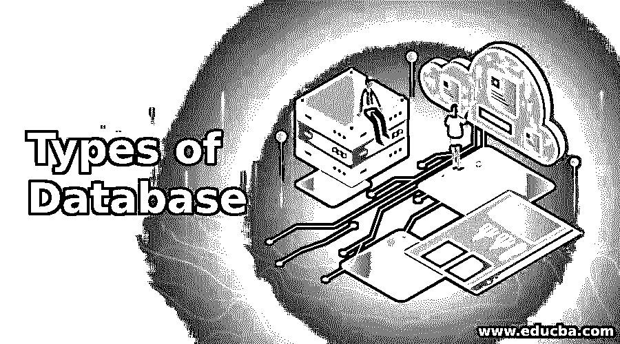
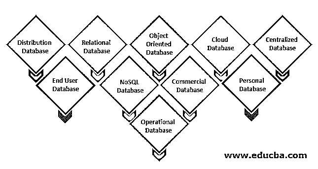

# 数据库的类型

> 原文：<https://www.educba.com/types-of-database/>

## 数据库类型介绍

基本上，数据库就是数据仓库。既然我们在公共图书馆也有一个书店，我们可以假设一个图书数据库就是一个图书馆。然而，严格来说，数据库是存储、组织、保护和提供数据的计算机框架。数据库系统是指用于管理数据库或 DBM 的系统。在本主题中，我们将了解数据库的类型。

### 不同类型的数据库

根据应用需求，市场上有以下类型的数据库:

<small>Hadoop、数据科学、统计学&其他</small>

#### 1.分发数据库

与集中式数据库相比，有来自通用数据库的输入和从本地计算机收集的信息。数据不能在单一位置访问，而是分布在公司的各个站点。这些站点通过通信链路相互连接，从而能够访问分布的数据。

可以想象一个分布式数据库，其中数据库的各个部分位于不同的物理位置，以及在网络中的不同点之间复制和分布的数据库。异构和同构是两种分布式数据库。运行在相同操作系统和应用程序上的具有相同基础硬件的数据库被称为同构 DDB。在 DDB 的不同站点，定义为异构 DDB，操作系统、底层硬件和应用程序可以不同。

#### 2.关系数据库

这种数据库通过一组表来分类，在这些表中，数据属于预定义的类别。该表由行和列组成，其中包含特定类别和行的数据输入，示例中的数据由类别标识。[结构化查询语言](https://www.educba.com/what-is-sql/)是关系数据库用户和应用程序的标准接口。可以向表中添加几个基本操作来扩展这些数据库，连接两个通常相关的数据库并修改所有现有的应用程序。

#### 3.面向对象的数据库

对象驱动数据库是对象驱动的关系数据库集合。不同的项目，如 java 和 C++，可以使用面向对象的编程语言保存在关系数据库中，但面向对象的数据库适用于这些组件。面向对象的数据库将围绕对象和数据而不是逻辑来组织而不是操作。与字母数字值相反，关系数据库中的多媒体记录可以是可定义的数据对象。

#### 4.云数据库

如今，数据存储在公共云、混合云或私有云，也称为虚拟环境。云数据库是这种虚拟化环境的自动化或内置数据库。云服务提供各种优势，包括按用户存储容量和带宽付费的能力，以及按需提供可扩展性和高可用性。此外，云平台允许公司支持企业应用程序交付[软件即服务](https://www.educba.com/what-is-software-as-a-service-saas/)。

#### 5.集中式数据库

数据集中存储，不同位置的用户都可以访问这些数据。该数据库包括帮助用户从远程位置访问数据的雇用流程。为了核实和确认最终用户，应用了各种类型的认证程序，应用程序跟踪和记录数据使用情况，并提供注册号。

#### 6.最终用户数据库

最终用户通常不担心不同层次的购买或交易，只了解商品、程序或应用程序。因此，它是一个专门为最终用户设计的协作数据库，各级管理人员也是如此。这个数据库提供了所有细节的列表。

#### 7.NoSQL 数据库

这些用于大型数据集。某些大数据性能问题由关系数据库有效处理， [NoSQL 数据库](https://www.educba.com/what-is-nosql-database/)可以轻松解决此类问题。大规模、非结构化信息的分析可以在几个云虚拟服务器上非常高效地完成。

#### 8.商业数据库

这些是大型数据库的付费版本，是为希望获得信息以寻求帮助的用户设计的。这些数据库都是特定的主题，如此庞大的信息是无法维护的。商业链接提供了对这些数据库的访问。

#### 9.个人数据库

数据被收集并储存在小型且易于管理的个人电脑上。这些数据通常由公司的同一个部门使用，并由少数个人查看。

#### 10.操作数据库

在这个文件夹中，存储了关于公司运营的信息。市场营销、员工关系、客户服务等职能部门需要这些数据库。

### 结论

在本文中，我们看到了不同类型的数据库以及它们是如何工作的。您可以根据自己的需求选择任何类型的数据库或数据库组合。

### 推荐文章

这是一个数据库类型的指南。这里我们以描述的方式讨论了数据库的基本概念和前 10 种类型。您也可以看看以下文章，了解更多信息–

1.  [Cassandra 数据类型](https://www.educba.com/cassandra-data-types/)
2.  [关系数据库模型](https://www.educba.com/relational-database-model/)
3.  [自动化类型](https://www.educba.com/types-of-automation/)
4.  [入侵防御系统的类型](https://www.educba.com/types-of-intrusion-prevention-system/)
5.  中的[数据库](https://www.educba.com/database-in-r/)

