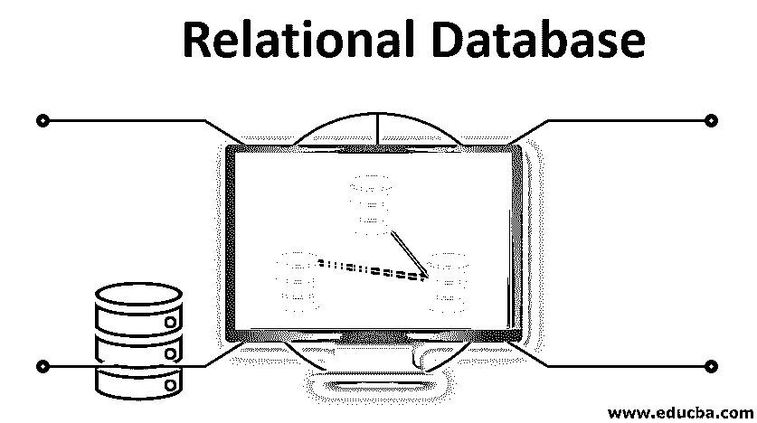

# 关系数据库

> 原文：<https://www.educba.com/relational-database/>

## 关系数据库简介

关系数据库是以表、列和行的形式排列的各种关系数据，以及它们的关系属性。每个表都有一个唯一标识的键值，称为主键，主键可以通过这些表中的外键连接到其他相关的表。通过使用 SQL(结构化查询语言)编程语言进行查询，可以访问、修改或管理来自关系数据库的数据。

### 用 R 访问 SQL 数据

r 对象在一个内存中管理。对于 R 中的数据分析，数据需要以数据帧的形式可用。数据帧是异构数据的二维数组。

<small>Hadoop、数据科学、统计学&其他</small>

如果数据以. csv 的形式存在，r 也可以帮助导入数据。我们可以使用 read.csv()这样的函数，而要导出数据，我们使用 write.xxx()。它能够将数据帧保存到类似磁盘的 saveRDS()、save()等。

### 为什么要使用关系数据库？

R 中的关系数据库可以处理大量的数据，保持数据的一致性。默认情况下，R 会在执行任何分析之前将所有数据读入内存。数据库服务器将决定通过查询获得结果的有效方法。

#### 数据类型

如上所述，我们使用数据框作为表，观察作为行(元组)，变量作为列(属性)，各种([]子集，顺序，排序)作为选择语句。

#### 连通性

r 可以连接到关系数据库，如 MYSQL、Oracle 和 sql server。我们使用数据帧来获取记录。一旦我们获取记录，它将成为 r 中的数据集。

我们可以使用强大的软件包和函数根据我们的需要来分析和操作数据。

#### 导入包

r 有一个名为“RMySQL”的内置包来提供到 MySQL 数据库的连接。

#### 安装软件包

Install.packages("RMySQL ")

软件包安装完成后，我们可以创建一个连接并连接到数据库。

`#creating connection
mysqlconnection = dbConnect(MySQL(), user = 'root', password = '', dbname = 'table1',
host = 'localhost')
# listing the tables in DB
dbListTables(mysqlconnection)`

对于 dbListTables，它显示特定数据库中的所有表。

#### 查询表格

**查询获取数据**

`result = dbSendQuery(mysqlconnection, "select * from names")`

**将结果存储在 R 数据框对象中。n = 3 用于获取前 3 行。**

`data.frame = fetch(result, n = 3)
print(data.fame)`

**输出:**

| 身份 | 名字 | 姓氏 |
| One | 约翰 | 坎贝尔 |
| Two | 卡尔 | 胡珀 |
| Three | 詹娜 | 泰勒 |

输出显示表“names”中的前 3 个结果。

#### 过滤和查询结果

我们可以通过任何列名过滤结果并显示结果。

让我们假设，我们想要显示姓氏为“Taylor”的所有行

**查询:**

`result = dbSendQuery(mysqlconnection, "select * from actor where Last_name = 'Taylor'")`

获取所有记录，并将其存储为一个数据帧。

`data.frame = fetch(result, n = -1)
print(data)`

**输出:****T3】**

| S.no | 名字 | 姓氏 |
| Three | 詹娜 | 泰勒 |
| Fifty-seven | 但 | 泰勒 |
| Ninety-six | 凯斯 | 泰勒 |

#### 更新行

在 RMySQL 中修改数据相当容易。让我们看看下面的查询，以了解相同的。

**查询:**

`dbSendQuery(mysqlconnection, "update names set last_name = Cooper where First_name = Jenna")`

#### 在 RMySQL 中删除表

我们还可以使用 drop 查询来删除表。

**查询:**

`dbSendQuery(mysqlconnection, 'drop table if exists names')`

我们可以用 RMySQL 包进行这样的操作，唯一的要求是安装这个包并连接到特定的数据库。这与 SQL 查询非常相似。

#### 使用 Dpylr 包

当数据库或内存中已经有数据时，这个 dplyr 包特别有用。

如果数据适合内存，那么如果数据存储在数据库中。与内存中的数据相比，它在访问和检索数据时变得更慢。

如果我们必须在 R 中进行数据分析，那么大部分数据都存在于数据库中。我们可以通过“dpylr”工具将数据导入本地数据库。

#### 安装 Dpylr

为了使用 dpylr 包。我们需要首先安装软件包。

在下面的例子中，让我们看看如何安装 dpylr 包。

**举例:**

install.packages("dbplyr ")

这个软件包允许我们根据需要连接到后端数据库。

| RMySQL | 我的 SQL 和 Maria |
| RPostgreSQL | Postgres 和红移 |
| sqlite | SQLite 数据库 |
| 开放式数据库连接性 | 商业数据库 |
| bigquery | 谷歌的 bigquery |

#### 连接到数据库

安装完 dpylr 之后，我们需要首先连接到特定的 db。

为了连接到数据库，我们使用 dbconnect()。

`library(dplyr)
conn <- DBI::dbConnect(RSQLite::SQLite(), path = ":dbname:")`

#### 编写查询

Dplyr 使得使用动词编写查询更加容易。他们中的大多数人可以使用 dplyr 包编写 SQL 查询。Dplyr 还自动生成 sql 查询。

**举例:**

`names_db %>% select(Id,First_name,Last_name)`

**输出:**

| 身份 | 名字 | 姓氏 |
| One | 约翰 | 坎贝尔 |
| Two | 卡尔 | 胡珀 |
| Three | 詹娜 | 泰勒 |

#### DBI

DBI 用于通过 DBMS 分离前端和后端之间的连接。后端与特定的数据库管理系统通信，如 SQLite、MySQL 等。此外，它还提供了使用方法调用的驱动程序。

### 推荐文章

这是关系数据库的指南。这里我们讨论用 R 访问 SQL 数据以及为什么使用关系数据库。您也可以阅读以下文章，了解更多信息——

1.  [MySQL 关系数据库](https://www.educba.com/mysql-relational-database/)
2.  [SQL 加入面试问题](https://www.educba.com/sql-joins-interview-questions/)
3.  [SQL 中的游标](https://www.educba.com/cursors-in-sql/)
4.  [关系数据库的优势](https://www.educba.com/relational-database-advantages/)

