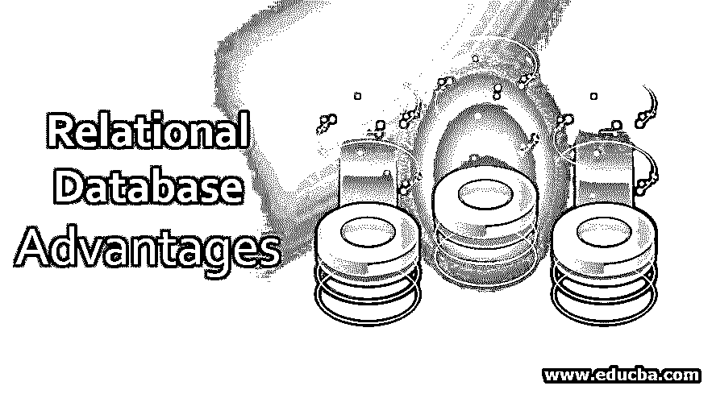
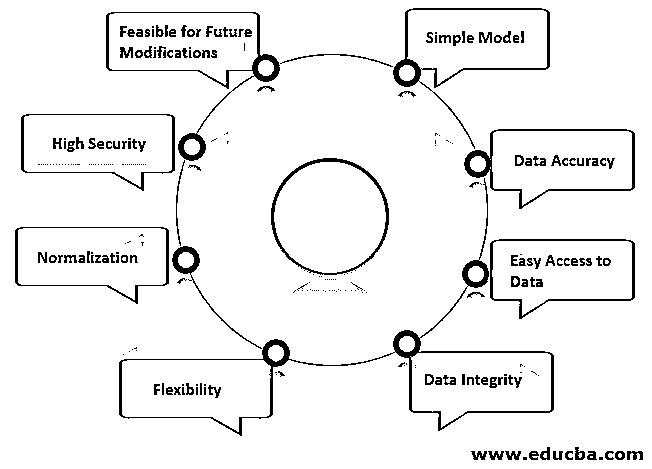

# 关系数据库的优势

> 原文：<https://www.educba.com/relational-database-advantages/>

## 关系数据库优势介绍

关系数据库由适当排列的表组成，从这些表中可以以各种不同的方式管理和操作数据，而不必重新排列整个数据库表集。SQL 查询既用于获取信息的交互式查询，也用于收集用于报告和分析目的的数据。这有助于方便重要的业务决策过程。

使用关系数据库的主要好处之一是，这种类型的数据库允许用户简单地将数据分类到不同的类别，并有效地存储它们。可以使用查询和过滤器进一步获取这种安排。创建新数据库后，不同类别下的任何数据集都可以纳入数据库，而无需对现有系统进行任何改动。与任何其他类型的数据库相比，关系数据库系统还有许多其他优点。

<small>Hadoop、数据科学、统计学&其他</small>

### 关系数据库的主要优势

与任何其他类型的数据库相比，关系数据库系统还有许多其他优点。以下是几个显著的优点，

#### 1.简单模型

关系数据库系统是最简单的模型，因为它不需要任何复杂的结构化或查询过程。它不涉及单调乏味的架构过程，如层次数据库结构或定义。由于结构简单，用简单的 SQL 查询就足够了，不需要设计复杂的查询。

#### 2.数据准确性

在关系数据库系统中，通过使用主键和外键概念，可以有多个彼此相关的表。这使得数据不重复。没有复制数据的机会。因此，关系数据库中数据的准确性高于任何其他数据库系统。

#### 3.轻松访问数据

在关系数据库系统中，没有访问数据的模式或路径，而另一种类型的数据库只能通过导航树或[层次模型](https://www.educba.com/hierarchical-database-model/)来访问。任何访问数据的人都可以查询关系数据库中的任何表。使用连接查询和条件语句，可以组合所有或任意数量的相关表来获取所需的数据。可以基于任何列、任何数量的列中的值修改结果数据，这允许用户毫不费力地恢复相关数据作为结果。它允许用户选择想要包含在结果中的列，以便只显示适当的数据。

#### 4.数据完整性

数据完整性是关系数据库系统的一个重要特征。可靠的数据输入和合法性验证确保数据库中的所有数据都限制在适当的安排范围内，并且存在创建关系所需的数据。数据库中表之间的这种关系可靠性有助于避免记录不完整、孤立或不相关。数据完整性有助于确保关系数据库的其他重要特征，如数据的易用性、精确性和稳定性。

#### 5.灵活性

关系数据库系统本身具有升级、扩展到更大长度的特性，因为它具有可弯曲的结构来适应不断变化的需求。这有助于增加传入的数据量，以及在需要时进行更新和删除。这种模型也支持对数据库配置的更改，可以毫无困难地应用这些更改，而不会导致数据或数据库的其他部分崩溃。

一个[数据分析师](https://www.educba.com/what-is-data-analyst/)可以在给定的数据库系统中方便快捷地插入、更新或删除表、列或单个数据，以满足业务需求。关系数据库可以容纳的行数、列数或表数应该没有限制。在任何实际应用中，开发和转换都受到关系数据库管理系统和服务器所包含的硬件的限制。因此，这些变化会改变连接到特定关系数据库系统的其他外围功能设备。

#### 6.正常化

保持有条不紊的风格是为了确保关系数据库结构没有任何差异，这些差异会影响数据库中表的完整性和准确性。规范化过程为数据库结构和关系数据库模型的评估提供了一组规则、特征和目的。

规范化旨在说明数据分解的多个级别。任何级别的规范化都应该在同一级别上完成，也就是说，在进入下一个级别之前。一个关系数据库模型通常被确认为是规范化的，只有当它满足第三种规范化形式的必要条件。规范化给人一种对数据库计划放心的印象，特别强大和可靠。

#### 7.高度安全

由于数据分散在关系数据库系统的表中，因此有可能将一些表标记为机密，而将其他表标记为非机密。与其他数据库不同，这种分离很容易用关系数据库管理系统来实现。当数据分析师尝试使用用户名和密码登录时，数据库可以为他们的访问级别设置界限，根据他们的访问级别，只允许他们访问允许他们操作的表。

#### 8.适用于未来的修改

由于关系数据库系统根据记录的类别将记录保存在不同的表中，因此插入、删除或更新符合最新要求的记录非常简单。关系数据库模型的这一特性允许业务提出的最新需求。根据所提供的条件，通过保持关系数据库管理系统的基本质量，可以插入或修改任意数量的新的或现有的表或数据列。

### 结论

综上所述，使用关系数据库优于任何其他类型的数据库的所有优点是，关系数据库有助于维护数据完整性、数据准确性、将数据冗余减少到最小或零、数据可伸缩性、数据灵活性，并使实现安全方法变得容易。最重要的是，关系数据库管理系统是一个更简单的数据库模型，无论是设计还是实现。

### 推荐文章

这是关系数据库优势的指南。这里我们详细讨论关系数据库的基本概念和八大优势。你也可以看看下面的文章来了解更多-

1.  [关系数据库](https://www.educba.com/relational-database/)
2.  [不同类型的 NoSQL 数据库](https://www.educba.com/types-of-nosql-databases/)
3.  [多维数据库](https://www.educba.com/multidimensional-database/)
4.  [Python 数据库连接](https://www.educba.com/python-database-connection/)

