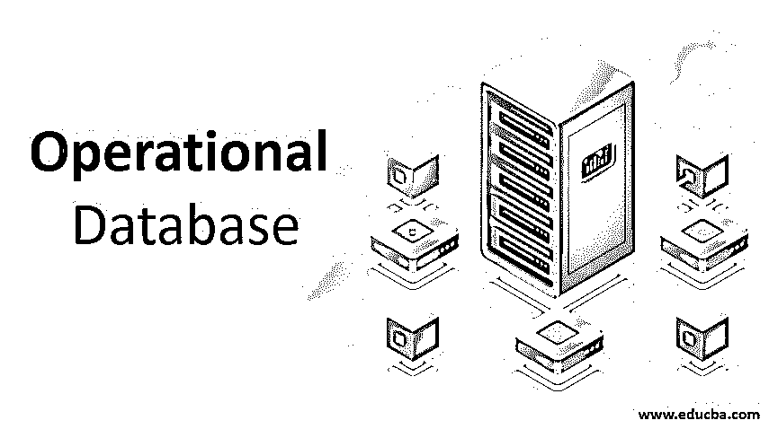

# 操作数据库

> 原文：<https://www.educba.com/operational-database/>

## 操作数据库简介

操作数据库或 OLTP(联机事务处理)是一种实时存储和处理数据的数据库管理系统。它们还提供了备受追捧的实时分析机会，可以管理基于 SQL 和 NoSQL 的数据库。他们还增加了对分布式数据库的支持，以提高可伸缩性、可用性和容错能力。操作数据库的一些例子是 Microsoft SQL Server、AWS Dynamo、Apache Cassandra、MongoDB 等。

### 对运行数据库的需求

想象一个在印度经营的全球鞋类销售企业。仓库数据中保存了原材料、在制品、成品等库存的所有详细信息，这有助于位于世界其他角落的采购团队了解下一步要订购什么以及订购的数量。从公司的财务数据、生产制造数据、销售营销数据、CRM 和 SCM 数据等。一切都由公司的运营数据库管理系统处理。这有助于他们实时分析数据和信息，并提供先进的复杂分析工具。

<small>Hadoop、数据科学、统计学&其他</small>

因此，一个可运行的 DBMS 变得极其重要，原因如下:

*   **分析能力:**它可以提供实时分析能力，帮助任何决策过程。它可以整合各种应用程序，在不改变数据库状态的情况下，根据用户需求增强分析能力。
*   **物联网:**它通过实时监控、审查和自行提供 apt 解决方案，帮助利用物联网的真正潜力。
*   **容错:**通过灌输分布式数据库，它可以创建一个容错系统，如果其中一个组件离线或出现故障，它不会影响整个系统。
*   **可伸缩性:**现代操作数据库系统随时准备根据请求进行伸缩，并具有高并发性和低延迟的额外优势。企业可以采用“随增长而使用”的原则。
*   **大数据:**分布式系统和基于 NoSQL 的系统的运营数据库可以利用 Hadoop 等技术以及 Cassandra 或 MongoDB 等运营 DBMS 来利用大数据的真正潜力

### 运行数据库的功能

给出了操作数据库的功能:

#### 1.索引和编目

数据库系统的主要功能是索引，索引是指有效地存储数据，以便在需要时可以轻松地检索。它分为主索引、辅助索引和聚集索引。编目指的是给一个文件分配关键属性，然后可以像一本书或一本日志一样有效地进行检索。

#### 2.复制

简而言之，它指的是在多个位置将文件或数据作为一个整体进行复制，以便于检索和存储过程。这在分布式系统中尤其重要，在分布式系统中，当相同的数据存储在多个位置时，可以更容易地访问它们，并且增加了一致性。

#### 3.文件存储，结构

文件存储是运行中的 DMS 的另一个重要功能，因为它的使用情况很复杂，所以存储文件的系统也很复杂。该系统需要足够强大，以便在相关位置分类和存储文件。文件组织系统可以在堆、顺序、散列、集群文件组织系统中组织文件。

#### 4.询问处理

操作数据库系统由于其优越的查询处理系统而获得分析能力。它是指从将用户向数据库系统提出的查询翻译成简单的低级指令，到对查询进行优化、分析和评估的整个过程。在该过程之后，系统将从数据库中提取相关数据并呈现给用户。这个过程发生在几分之一秒内。

#### 5.交易支持

事务系统可以被认为是操作数据库系统的逻辑单元。对于 it 部门来说，在稳定状态、并发状态下持续工作并提供恢复服务至关重要。事务支持处理这一点，同时使系统符合 ACID，这意味着原子性，它将事务与其他事务区分开来；一致性，它确保事务在处理过程中更改数据库不会使其不一致；隔离，它指的是在并发状态下保持事务独立；最后是持久性，它确保事务与处理的最终结果一起永久存储在数据集中。

### 优势

以下是下面给出的优点:

*   操作数据库系统非常通用，可以容纳分布式系统，如 NoSQL、SQL、新 SQL 数据库。
*   如前所述，这些系统具有高可用性、容错性和高可扩展性。
*   它们非常安全，因为它们提供了对加密、审计和网络防护的内置支持
*   它们非常灵活，可以处理多个应用程序，而不会丢失数据库的状态。因此，不同地点或不同部门的人可以根据自己的需要集成应用程序和服务，而不必担心数据库的状态。
*   这种系统通常更经济，因为操作数据库中的系统通常基于分布式网络和系统，从而大幅降低成本并确保一致性。

### 不足之处

以下是下面给出的缺点:

*   他们通常有一个学习曲线，需要人员提供相关的培训来管理这样的数据库，这增加了管理费用
*   即使这样的操作数据库系统的安装过程也需要时间和精力，其中它们需要以满足商业目标和从系统中提取最大利益的最佳方式来设置。
*   安全性也可能是一个问题，因为数据存储在远程位置，全面控制可能很困难，我们最近已经看到一些最著名的技术公司的客户数据被黑客攻击的例子。

### 结论

如上所述，尽管有一些缺点，但不可否认的是，操作数据库是管理组织中所有数据的最有效和高效的方式。大多数财富 500 强公司都使用这种数据库管理方法的应用程序。

因此，对于任何想在数据科学和大数据领域发展的人来说，了解运营数据库及其架构以及 Hadoop、Cassandra 和 MongoDB 等其他技术的工作知识是非常重要的。

### 推荐文章

这是一个操作数据库的指南。在这里，我们讨论了操作数据库的介绍、需求、功能以及优点和缺点。您也可以阅读以下文章，了解更多信息——

1.  [数据湖与数据仓库|主要区别](https://www.educba.com/data-lake-vs-data-warehouse/)
2.  [数据仓库测试](https://www.educba.com/data-warehouse-testing/)
3.  [测试用例的类型](https://www.educba.com/types-of-test-case/)
4.  [测试数据生成工具](https://www.educba.com/test-data-generation-tool/)

