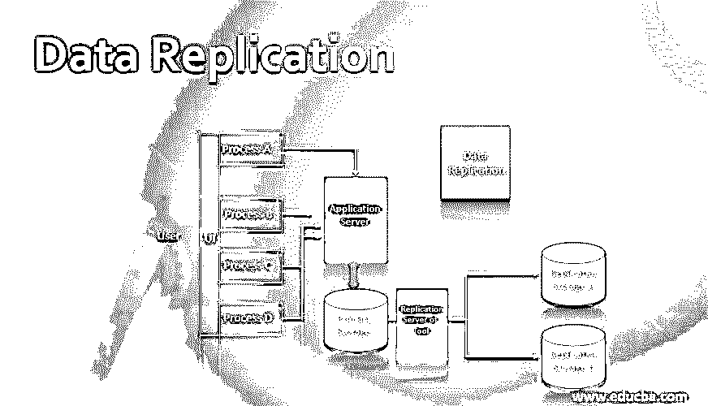
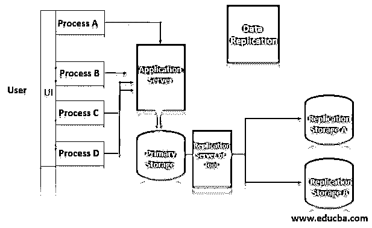

# 数据复制

> 原文：<https://www.educba.com/data-replication/>

## 数据复制简介

数据复制是复制数据并将其存储到不同节点、数据库或站点的过程。数据复制主要用于高可用性功能。对于业务关键型系统，数据复制是避免因服务器故障或系统硬件相关问题造成任何影响的最佳实践之一。数据复制有助于创建分布式数据库系统。实施数据复制是为了持续创建数据副本，而不是采用一批静态备份方法。数据复制通过与源同步来确保所有节点上数据的一致性。有几种方法和软件应用程序可用于实现数据复制。

### 为什么我们需要数据复制？

数据复制是数据库管理系统(DBMS)中的一个过程，与维护故障转移场景的数据相关。在任何主数据库系统停机的情况下，复制数据将有助于检索复制数据库的数据，这有助于业务运营的继续。数据复制也是 Apache Hadoop 等分布式系统中不可或缺的概念和方法，这些分布式系统跨数据节点维护至少三个数据集副本。在基于集群的分布式系统中，数据复制机制对于数据的高可用性至关重要。

<small>Hadoop、数据科学、统计学&其他</small>

### 数据复制是如何工作的？

下面是表示数据复制过程及其工作原理的概述图:

该图表示用户使用 UI 和为系统创建数据的过程与系统进行交互。系统通过应用服务器处理数据，并将其存储在主存储中。旁边的复制服务器或工具处理数据复制。

数据复制的工作原理是通过在两个或多个基于云的主机之间创建数据副本，将相同的数据创建或复制到相同或不同主机的不同起始位置。数据复制可以按需调配，也可以根据计划以批量模式或批处理模式传输数据，或者在主系统中写入、修改或删除数据时进行实时复制。

对于与数据库相关联的各种系统，有不同类型的数据复制过程可用，例如事务复制、快照复制和合并复制。

类似地，可以有完全复制和部分复制，前者复制每个存储位置中的全部数据，后者仅复制相关数据，不包括复制过程中不相关的数据。

如果系统不执行数据复制，则称为无复制。

#### #1.完全复制

完整复制是跨多个系统或站点创建数据的精确副本的过程。最佳做法是遵循，因为即使只有一个复制站点运行，企业也可以获取数据并启用系统。

完全复制的一些好处是高可用性、更快的查询执行和基于站点位置的系统性能。类似地，完整复制系统的一些缺点是并发性，并且由于涉及多个数据中心或位置，缓慢的更新过程需要多个。

#### #2.部分复制

部分复制包括将数据分离成多个部分或片段。部分的数量取决于数据和业务新闻，可以是一个，也可以是分布式存储选项上可用的站点或节点的总数。数据段或片段复制的描述称为复制模式。

部分复制过程的主要优点是，它基于“重要数据集”而不是所有数据创建数据副本。但是，如果主系统出现重大硬件故障，需要恢复整个系统，灾难恢复过程可能会很困难。

### 数据复制的优点和缺点

在本节中，我们将讨论数据复制过程的一些优点和缺点。

**优点:**

*   提高可靠性和可用性–实施数据复制有助于提高系统的可靠性和可用性。
*   网络性能改进——将相同的数据副本放在多个位置有助于减少数据访问延迟。数据检索可以来自由数据复制系统管理的边缘位置数据中心。这提高了网络性能。
*   灾难恢复——这是数据复制的主要目标。数据副本对于从任何重大问题(如硬件故障)中恢复系统非常有用。
*   数据分析功能——将数据复制到数据仓库系统有助于创建数据分析解决方案，并为商业智能系统提供数据。
*   测试系统性能改进——数据复制过程为需要快速数据可访问性的测试系统创建数据，并为生产系统创建相同的业务数据。

**缺点:**

尽管数据复制有几个优点，但是也有一些与数据复制相关的缺点或挑战。

*   实施和维护成本—将相同数据的拷贝保存到多个位置或存储设备需要存储和处理成本。
*   资源的带宽——跨位置或站点维护数据一致性会消耗网络带宽。
*   实施时间——实施和管理成熟的数据复制系统需要一个合适的时间框架，并消耗技术时间。

### 数据复制在各个领域的应用

数据复制在各个领域有多种应用，例如:

**1。**联机事务处理系统(OLTP)的企业数据维护对于灾难恢复和高可用性非常重要。

**2。**在多云环境中实施数据复制机制，以提供负载平衡、有效响应时间和可用性等改进功能。它简化了云计算的可扩展性。

**3。**数据复制是为 Apache Hadoop 和 Apache Spark 等大数据系统配置的，这些系统使用复制因子来管理系统将创建的副本数量。

**4。**SAP S/4 HANA 等大多数高级系统都支持数据复制框架。

### 结论

数据复制是数据管理的一个重要过程，它有一定的优点和缺点。根据业务需求选择适当的数据复制过程并为该过程实施适当的工具非常重要。此外，监控、日志记录和警报是与数据复制相关的功能。

### 推荐文章

这是数据复制指南。在这里，我们讨论数据复制及其不同类型的介绍，以及优缺点。您也可以浏览我们推荐的文章来了解更多信息-

1.  [八大免费数据分析工具](https://www.educba.com/free-data-analysis-tools/)
2.  [数据分析技术类型介绍](https://www.educba.com/types-of-data-analysis-techniques/)
3.  [数据库中的数据存储](https://www.educba.com/data-storage-in-database/)
4.  [什么是数据集成？](https://www.educba.com/what-is-data-integration/)

