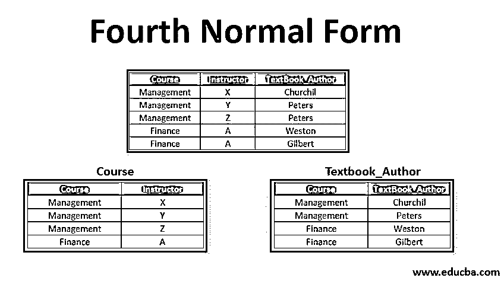

# 第四范式

> 原文：<https://www.educba.com/fourth-normal-form/>

## 第四范式介绍

第四范式是继 BCNF 之后的下一级规范化，它处理一种更普遍的依赖类型，称为多值依赖。第四范式和其他范式一样，引入了组织数据和消除异常和冗余的特性。每个规范化都有一组在创建数据库时应该遵循的规则。并且为了基于所希望的[归一化](https://www.educba.com/normalization-in-dbms/)的类型，较大的表格被分成较小的表格。这被称为表的分解。在 4NF，亲属应满足以下两个条件。这些条件是:

1.  它应该在 BCNF。
2.  不应该有多值依赖。

默认情况下，4NF 中的表满足前面范式的所有条件。在 4NF 之前，正常化的不同形式有:

<small>Hadoop、数据科学、统计学&其他</small>

*   1NF
*   2NF
*   3NF
*   BCNF

### 第四范式如何工作？

为了理解 4NF 是如何工作的，有必要理解多值依赖。多值依赖关系要求至少有三列，其中至少有两个属性依赖于第三个属性。这两个属性是相互依赖的。多值依赖的条件。

1.  一个表中至少应该有 3 列。
2.  对于每一个依赖 A-> B，对于 A 的每一个值，B 的多个值都存在，那么这个依赖称为多值依赖。
3.  在三列关系 R(XYZ)中，如果 X 和 Y 之间存在多值依赖，那么 Y 和 Z 应该是相互独立的。

要确立关系中存在多值依赖的事实，必须满足上述所有条件。

#### 示例#1

这里我们有一个学生表，其中有学生注册的科目和活动的信息。Subjects_Enrolled 和 Activty _ Enrolled 是两个相互独立的属性。给定的表格在 BCNF，它满足 4NF 的第一个条件。

让我们进一步检查多值依赖。

1.  这种关系中的依赖关系是:

**学生 _ 点名 _ 编号— >科目 _ 报名**
**学生 _ 点名 _ 编号— >活动报名**

2.  基于多值依赖的条件，检查存在的关系。
3.  一个表中至少应该有 3 列。––满意
4.  对于每一个依赖 A-> B，对于 A 的每一个值，B 的多个值都存在，那么这个依赖称为多值依赖。––第 45 号学生注册了经济学和历史学课程，并参加了绘画和曲棍球活动。因此，对于值 Student _ Roll _ 不存在不同的 Activity_Enrolled 值。
5.  在三列关系 R(XYZ)中，如果 X 和 Y 之间存在多值依赖，那么 Y 和 Z 应该是相互独立的。––Subject _ Enrolled 和 Activity Enrolled 相互独立。

当我们检查上述条件时，很明显该关系由多值依赖组成。为了将表规范化为 4NF，我们需要将它分解成更小的表。

学生关系现在被分解成位于 4NF 的 S1 和 S2 这两个较小的表。

##### S1:

##### S2:

#### 实施例 2

这里的课程是与下面的依赖关系。

**课程- >导师**
**课程- >教材 _ 作者**

对于某一个值，当然我们有一套教官的值，也有一套教科书 _ 作者的值。但是教官和课本没有关系。因此，该表具有多值相关性，不满足 4NF。为了解决这个问题，需要对表进行分解。该表将被分成两个表，其中一个表将保存课程->教师，另一个表将保存课程->教科书 _ 作者。这种分解将产生一个位于 4NF 的表。

##### C1:

##### C2:

### 第四范式的优势

以下是给出的优点。

*   帮助删除数据库中的冗余和异常。
*   数据的完整性和一致性可以通过规范化和限制性约束来维护。

### 结论

默认情况下，4NF 中的关系将满足 1NF、2NF、3NF 和 BCNF 的所有属性。表必须在 BCNF，并且没有多值依赖关系。它将确保数据的完整性和一致性。这些特定的规则集构成了规范化的基础，是在数据库中不会发生更新、删除和插入异常的。

### 推荐文章

这是第四范式的指南。在这里，我们讨论了一个简要的概述，以及第四范式如何工作，并详细举例和优势。您也可以看看以下文章，了解更多信息–

1.  [Matlab 中的 Simulink 是如何工作的？](https://www.educba.com/what-is-simulink-in-matlab/)
2.  [了解 Java 中 JNI 的优势](https://www.educba.com/what-is-jni-in-java/)
3.  [Ubuntu 与 Fedora 的正面比较](https://www.educba.com/ubuntu-vs-fedora/)
4.  [面向初学者的 Android 应用开发](https://www.educba.com/android-app-development-for-beginners/)

