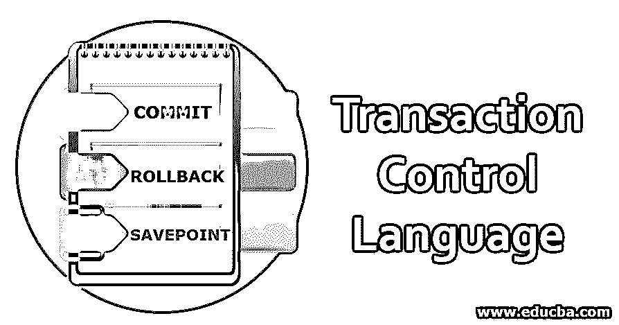

# 事务控制语言

> 原文：<https://www.educba.com/transaction-control-language/>

## 事务控制语言简介

在关系数据库管理系统(RDBMS)中，[结构化查询语言](https://www.educba.com/what-is-sql/) (SQL)用于执行多种操作，以存储、检索和操纵数据库中各种表之间的数据。让我们考虑几个场景，在这些场景中，我们可能错误地更新了一条记录，并希望恢复数据，或者我们插入了几条记录，并希望保存它们，这时事务控制语言(TCL)就出现了。事务控制语言用于维护存储在数据库中的数据的完整性和一致性。

### 交易控制语言的需求

事务控制语言管理由 DML 操作引起的数据变化。DML 命令(如 UPDATE、INSERT 或 DELETE)所做的更改不是永久性的，这些更改可以在当前会话关闭之前取消。为了控制数据的变化和处理，TCL 与[数据操作语言](https://www.educba.com/data-manipulation-language/)同时使用。当我们对数据执行许多操作时，数据库可能会在事务之间变得不一致。

<small>Hadoop、数据科学、统计学&其他</small>

因此，事务控制语言(TCL)用于维护一致性和管理数据库中的事务。执行提交后，数据库状态从一种一致状态更改为另一种一致状态。所有 DDL 和 DML 查询都会自动使用这些事务。

### 事务控制语言是如何工作的？

数据库中的事务是处理的逻辑单元，它可以由一个或多个数据库操作组成。通过使用事务将逻辑更新中的一系列低级更改组合在一起。例如，事务可能更新单个值或更新复杂的过程，如向不同的表中插入多行。通常，事务开始，然后随着各个 DML 命令的执行，它们成为事务的一部分，当逻辑过程结束时，事务被提交。commit 命令确保更改永久保存在数据库中。如果提交操作失败，事务将回滚，所有更改将被删除。

### 带示例的 TCL 命令

事务控制语言中的命令是提交、回滚和保存点。

#### 1.犯罪

该命令用于使事务在数据库中永久存在。因此，可以说 commit 命令通过在事务期间进行永久更改，保存了在结束当前事务时所做的工作。该命令的语法如下。

`COMMIT;`

例如，我们想更新“雇员”表中雇员的位置。雇员表示例如下:

| **雇员标识** | **雇员名称** | **EMP_LOC** |
| One thousand three hundred and fifty-six | 拉朱 | 德里 |
| Two thousand six hundred and seventy-eight | 尼塔 | 班加罗尔 |
| Nine thousand eight hundred and ninety-nine | 桑杰（男子名） | 海得拉巴 |

让我们更新 Raju 的 EMP_ LOC，如下所示:

**查询:**

`UPDATE EMPLOYEE SET EMP_ LOC = 'Hyderabad' WHERE EMP_NAME= 'Raju';
COMMIT;`

如上所述，使用 commit 命令完成更新事务，使用上述语句将更新雇员“Raju”的位置，并且该更改将永久保存在数据库中。

更新后的表格如下所示:

| **雇员标识** | **雇员名称** | **EMP_LOC** |
| One thousand three hundred and fifty-six | 拉朱 | 海得拉巴 |
| Two thousand six hundred and seventy-eight | 尼塔 | 班加罗尔 |
| Nine thousand eight hundred and ninety-nine | 桑杰（男子名） | 海得拉巴 |

#### 2.反转

此命令用于将数据库恢复到自上次提交命令以来的原始状态。Rollback 命令的语法如下:

`ROLLBACK;`

此外，ROLLBACK 命令与 savepoint 命令一起使用，以跳转到事务中的保存点。其语法如下所示:

`ROLLBACK TO <savepoint_name>;`

让我们以上面引用的雇员表为例。让我们考虑一下，我们后来已经将 Raju 的 EMP_LOC 更新为 Bangalore，并意识到更新是错误的，如下所示。然后，我们可以使用 Rollback 命令将“Raju”的 EMP_LOC 重新恢复到 Hyderabad，如下所示。

**查询:**

`UPDATE EMPLOYEE SET EMP_LOC= 'Bangalore' WHERE EMP_NAME = 'Raju';
ROLLBACK;`

错误更新后的表格如下:

| **雇员标识** | **雇员名称** | **EMP_LOC** |
| One thousand three hundred and fifty-six | 拉朱 | 班加罗尔 |
| Two thousand six hundred and seventy-eight | 尼塔 | 班加罗尔 |
| Nine thousand eight hundred and ninety-nine | 桑杰（男子名） | 海得拉巴 |

执行回滚后，Raju 的位置将恢复到上次提交的状态，如下所示。

| **雇员标识** | **雇员名称** | **EMP_LOC** |
| One thousand three hundred and fifty-six | 拉朱 | 海得拉巴 |
| Two thousand six hundred and seventy-eight | 尼塔 | 班加罗尔 |
| Nine thousand eight hundred and ninety-nine | 桑杰（男子名） | 海得拉巴 |

#### 3.保存点

该命令用于临时保存交易。因此用户可以回滚到所需的事务点。使用该命令的语法如下:

`SAVEPOINT savepoint_name;`

让我们以表“ORDERS”为例，它的列为 ORDER_ID 和 ITEM_NAME。

| **订单 ID** | **项目名称** |
| One hundred and ninety-nine | 电视机 |
| Two hundred and ninety | 照相机 |

让我们将下面的值插入到下面的订单表中，并使用保存点执行更新。

**查询:**

`INSERT INTO ORDERS VALUES ('355' , 'CELL PHONE');
COMMIT;
UPDATE ORDERS SET ITEM_NAME = 'SMART PHONE' WHERE ORDER_ID= '355';
SAVEPOINT A;
INSERT INTO ORDERS VALUES ('566' , 'BLENDER');
SAVEPOINT B;
Now the ORDERS table will be as below:`

现在，订单表如下所示:

| **订单 ID** | **项目名称** |
| One hundred and ninety-nine | 电视机 |
| Two hundred and ninety | 照相机 |
| Three hundred and fifty-five | 智能电话 |
| Five hundred and sixty-six | 搅拌机 |

现在，我们可以使用 SAVEPOINT 命令回滚事务。让我们将事务回滚到保存点 a。

**查询:**

`ROLLBACK TO A;`

订单表如下所示:

| **订单 ID** | **项目名称** |
| One hundred and ninety-nine | 电视机 |
| Two hundred and ninety | 照相机 |
| Three hundred and fifty-five | 智能电话 |

### 事务控制语言的优势

如果错误地更新了表中的数据，事务控制语言提供了回滚事务的权限。它通过使用 commit 命令锁定数据来执行对数据库的永久更改。同样在 savepoint 命令的帮助下，用户可以临时保存事务，如果需要，还可以使用保存点执行回滚。

### 结论

事务控制语言有助于维护数据的一致性和完整性。在 TCL 的帮助下，可以将数据库恢复到上次提交的状态，并且可以永久保存所做的修改。开发人员应该对 TCL 有敏锐的理解，以构建一个健壮的系统。

### 推荐文章

这是事务控制语言指南。这里我们讨论事务控制语言的工作和不同的命令，以及它们的例子和代码实现。您也可以看看以下文章，了解更多信息–

1.  [数据库管理系统中的散列类型](https://www.educba.com/hashing-in-dbms/)
2.  [数据库管理系统架构的类型](https://www.educba.com/dbms-architecture/)
3.  [不同类型的 NoSQL 数据库](https://www.educba.com/types-of-nosql-databases/)
4.  [数据库管理系统列表](https://www.educba.com/what-is-dbms/)
5.  [了解数据库管理系统的 7 大类型](https://www.educba.com/types-of-dbms/)
6.  [关系数据库八大优势指南](https://www.educba.com/relational-database-advantages/)

