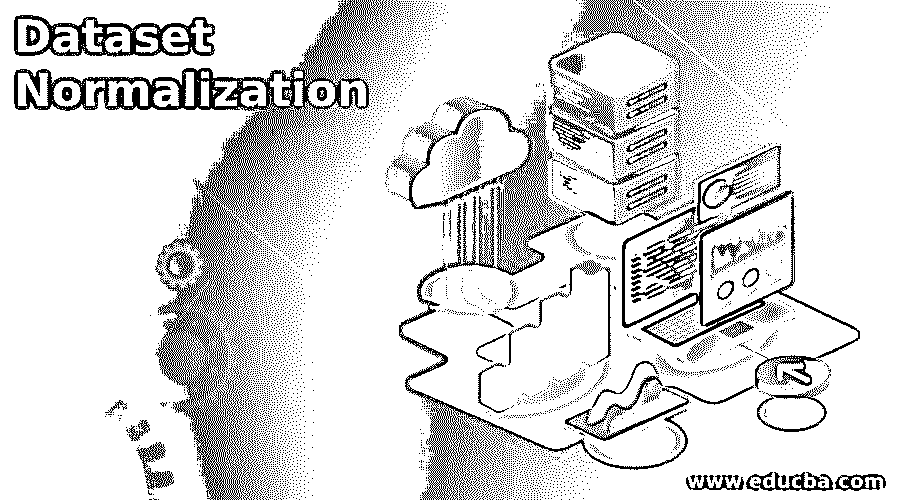
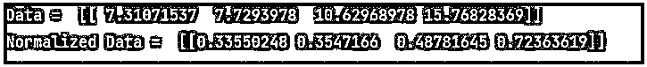
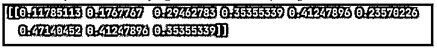

# 数据集规范化

> 原文：<https://www.educba.com/dataset-normalization/>

## 数据集规范化简介

基本上，数据规范化用于根据用户需求在 0 到 1 的范围内重新调整一个或多个属性。0 和 1 的符号，1 用于定义每个属性的最大值，0 用于定义每个属性的最小值。根据需要，我们可以通过使用规范化过滤器来规范化数据集的所有属性。在机器学习中，由于数据的变化，我们需要使用标准化。假设一个属性可能以千克为单位，而另一个以克为单位，这就是我们需要对数据集进行规范化以保持数据集一致性的原因。

### 什么是数据集规范化？

规范化是人工智能信息基础中经常使用的一种方法。规范化的目标是将数据集中数值部分的上端更改为典型比例，而不会使质量范围的对比出现偏差。对于 AI 来说，每个数据集都不需要归一化。只有当元素具有不同的范围时，才需要它。

<small>Hadoop、数据科学、统计学&其他</small>

规范化具有如下技术:

#### 1.缩放比例

缩放意味着将漂移点高光顶点从其正常范围(例如，100 到 900)更改为标准范围，通常为 0 和 1(或者偶尔为-1 到+1)。

我们可以使用下面的公式进行缩放。

Y’ = (y-ymin)/( ymax- ymin)

当两个附带条件都满足时，扩展到一个范围是一个不错的决定:

*   你知道你的信息推测的上限和下限，很少或没有异常。
*   你的信息大致一致地分散在这一范围内。
*   真正的模特是一个时代。大多数年龄范围在 0 到 90 之间，并且所有方面都有大量的个体。有趣的是，你不会利用工资的缩放，因为事实上有几个人的工资特别高。金钱的直接尺度的上限会非常高，而绝大多数会适合尺度的一小部分。

#### 2.剪报

如果你的信息指数包含令人愤慨的例外情况，你可以尝试包括切割，它涵盖了高于(或低于)特定价值到固定价值的所有元素。例如，你可以把所有超过 60 度的温度降低到 60 度。您可以在不同的标准化之前或之后应用高光切割。

#### 3.对数标度

当你的一部分品质有很多焦点，而大多数不同的品质没有很多焦点时，对数标度是有用的。这种信息分散被称为强制法挪用。电影评价是一个真实的模型。

对于对数标度，我们可以使用以下公式。

Y’ =log(Y)

#### 4.z 分数

Z-score 是一种标度，它处理平均值的标准偏差数。你可以利用一个 z 值来保证你的成分循环平均值= 0，性传播疾病= 1。当有几个异常时，这是有价值的，但是并不真的令人愤慨，你需要削减。

对于 Z 值，我们可以使用以下公式。

Y’ = (Y – µ)/a

### 为什么要使用数据集规范化？

让我们看看为什么在机器学习中使用数据集规范化，如下所示:

*   当你对你的信息的传播没有最模糊的概念，或者当你意识到散布不是高斯的(一个林格氏弯曲)时，标准化是一个不错的策略。
*   当您的信息具有波动的范围，并且您正在利用的计算没有对您的信息的传递做出假设(例如，k-最近邻和伪造的神经组织)时，规范化是有价值的。

### 数据集规范化的示例

下面是提到的例子:

#### 示例#1

**代码:**

`from sklearn import preprocessing
import numpy as npvalue
value = npvalue.array([2,3,5,6,7,4,8,7,6])
n_array = preprocessing.normalize([value])
print(n_array)`

**说明:**

*   通过使用上面的代码，我们尝试在数据集中实现规范化，这里我们首先导入 sklearn 和预处理，这里我们还导入数据集的 NumPy，如图所示。
*   上面程序的最终输出我们用下面的截图来说明。

**输出:**

#### 实施例 2

**代码:**

`from sklearn import preprocessing
import numpy as npvalue
value = npvalue.random.random((1, 4))
value = value*20
print("Data = ", value)
normalized = preprocessing.normalize(value)
print("Normalized Data = ", normalized)`

**说明:**

*   上面程序的最终输出我们用下面的截图来说明。

**输出:**

### 规范化与标准化

下面给出了标准化和规范化之间的基本区别:

| **归一化** | **标准化** |
| 在归一化中，我们可以使用最小值和最大值进行缩放。 | 在标准化中，我们可以用平均值和标准值来衡量。 |
| 当数据集的特征不同时，我们可以使用归一化。 | 当我们需要确保我们有一个零均值和单位标准差时，就使用它。 |
| 介于 0 到 1 和-1 到 1 之间的刻度值。 | 在标准化中，没有具体的范围。 |
| 它用于异常值。 | 在标准化中，受离群值的影响较小。 |
| 基本上，正常化是在我们不知道实际分布的情况下。 | 标准化是在发行过程中。 |
| 规范化也称为缩放。 | 标准化也被称为 Z 分数。 |

### 数据集规范化的特征

下面给出了数据集规范化的不同特征:

*   **Pipeline:** Scaling 有机会将 train-test split 中的部分测试数据泄露到训练数据中。管道主要用于交叉验证。我们可以独立地扩展训练和测试数据集，以远离这种情况。通过使用 sklearn，我们可以轻松地在数据集中实现管道。
*   **缩放:**这是数据集归一化的一个主要特征。
*   **持久性:**我们可以使用一个 scaler 对新数据集进行归一化，所以我们可以使用 pickle 或者 joblib。

### 结论

从上面的文章中，我们了解了数据集规范化的基本思想，也看到了数据集规范化的表现形式。从本文中，我们看到了如何以及何时使用数据集规范化。

### 推荐文章

这是数据集规范化的指南。这里我们讨论一下入门，为什么要使用数据集归一化？示例和功能。您也可以看看以下文章，了解更多信息–

1.  [数据库管理系统中的标准化](https://www.educba.com/normalization-in-dbms/)
2.  [数据库安全](https://www.educba.com/database-security/)
3.  [SQLite 数据库](https://www.educba.com/sqlite-database/)
4.  [SQLite 创建数据库](https://www.educba.com/sqlite-create-database/)

