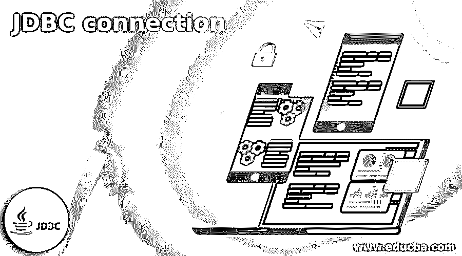

# JDBC 连接

> 原文：<https://www.educba.com/jdbc-connection/>

## JDBC 连接简介

Java Database Connectivity 是为 Java 设计的 API，它借助命令和查询将数据库关联起来，这些命令和查询可以处理从数据库获得的结果集。Java 持久层的第一个组件是 JDBC，它定义了访问数据库的客户端。它提供了几种方法来查询数据并将数据输入关系数据库。JDBC API 要求每个驱动程序与一个单独的数据库连接。本文讨论了连接数据库的步骤。

### JDBC 有什么联系？

JDBC 是一个软件应用程序，它允许 Java 中的应用程序与数据库通信。它们类似于 ODBC 驱动程序、OLE DB 驱动程序和 ADO.NET 驱动程序。简单地说，Java 数据库连接是一个专门为 Java 构建的 API，用于声明对客户端数据库的访问。它可以通过查询和命令来更新、删除、编辑和管理客户端关系数据库。即使要与单个数据库连接，API 也需要 JDBC 建立连接。

<small>Hadoop、数据科学、统计学&其他</small>

### 与 JDBC 连接的步骤

我们可以使用 JDBC 的 API 来管理保存在任何关系数据库中的表格数据。使用 JDBC，我们可以从数据库中获取、更新和删除数据。它类似于微软实现的开放式数据库连接。用户可以通过 Java 程序管理数据库，以执行各种活动，如连接到数据库、执行查询、对数据库的语句更新、连接接口、语句接口、驱动程序接口、准备好的语句接口、从数据库检索结果、结果集接口、可调用语句接口、行集接口、元数据接口和结果集接口。JDBC 中使用的著名类是 blob、clob、types 和 driver manager 类。

JDBC 调用并将结果集提供给 Java 应用程序。然后，数据库在 JDBC 驱动程序的帮助下保存从 Java 应用程序获得的数据。connection 对象管理与数据库的连接。

JDBC 中处理数据库连接和查询执行的主要步骤包括以下方法。

*   导入 JDBC 包
*   注册并加载 JDBC 驱动程序
*   设置到数据库的连接
*   创建一个语句对象来执行查询
*   处理结果集
*   关闭语句对象
*   关闭结果集
*   关闭已建立的连接

简单地说，到 JDBC 接口的连接分两步建立。

*   JDBC API 支持 JDBC 管理器和 Java 应用程序之间的交互。
*   JDBC 驱动程序支持 JDBC 管理器和数据库驱动程序之间的通信。

连接数据库的步骤如下，

*   找到或安装用户想要管理或访问的数据库。
*   让 JDBC 图书馆被包括在内。
*   检查用户是否需要位于正确类路径上的 JDBC 驱动程序。
*   要输入 SQL 命令，请使用已建立的连接。
*   活动完成后，关闭连接。

#### 打开到数据库的连接。

用户可以通过网络搜索来获得数据库和 JDBC 的驱动程序。例如，键入 MySQL JDBC 驱动程序将切换到 MySQL 的驱动程序。没有 JDBC 驱动程序的 Java 兼容数据库很难找到。下载并安装 SQLite，这是一个非常紧凑的数据库。但它并不打算用于生产。用户可以尝试很多东西，这将是一个伟大的学习平台。它使用一个文件作为功能数据库，无需安装守护程序或服务。该文件包含示例模式和基于文件的数据库，并保存数据以备将来使用。用户可以下载 SQLite 示例数据库来开始演示。

关系数据库是一个定义良好的存储库，由具有无限行和列的表组成。从 Java 到 SQL 的适配器层是由 JDBC 完成的，它为 Java 开发人员提供了一个连接数据库、提供查询和命令以及处理响应的公共接口。

编码应该在 IDE 中完成，以便将 JDBC 导入到 Java 应用程序中，但是如果编码直接内置在文本编辑器中会很好。打开与操作系统兼容的 JDK 安装。Java 平台是用工具通过编译一个简单的 Java 程序来开发的。可以通过调用文本编辑器 whatisJdbc.java 文件来粘贴代码。

`Import java.sql.connection;    // it represents the connection to the database
Import java.sql.drivermanager;   // the data source is implied for connection pooling and obtains the association with the database.
Import java.sql.sqlexception;    //manages the error between the database and Java application
Import java.sql.resultset;      // it modesl the sql statement and result set.
Import java.sql.statement;`

然后通过 getconnection()的方法调用 java.sql.drivermanager 类来打开 JDBC 连接。有三种方法可以打开与数据库的连接。

该变体将 URL 作为连接数据库的参数。然后用参数 getconnection()。获得的 URL 被连接到 URL 数据库，并检查 JDBC 驱动程序和数据库的文档以查看特定数据库的格式。网址可以在 H2Database 中查看。第二种方法是使用密码、用户和 URL 打开与数据库的连接。这里，getconnection()获取用户名、数据库 URL 和密码作为参数。获得的密码和用户名是数据库的用户名和密码。第三种方法是 getconnection()，它将属性和数据库 URL 作为参数。在这里，属性表示数据库的特性和策略。

#### 关闭数据库连接

它是通过调用连接来实现的。关闭()。活动完成后，必须关闭数据库连接，因为这会消耗应用程序和数据库服务器上的更多资源。

### 结论

SQL 和 JDBC 之间存在高级访问关系。尽管 NoSQL 在过去的几十年中得到了广泛的发展，但是关系数据库仍然保持不变，并且是使用最多的数据存储。

### 推荐文章

这是一个 JDBC 连接的指南。这里我们详细讨论用 Java 连接数据库的步骤。您也可以看看以下文章，了解更多信息–

1.  [甲骨文的 JDBC 驱动程序](https://www.educba.com/jdbc-driver-for-oracle/)
2.  [JDBC 司机](https://www.educba.com/jdbc-driver/)
3.  什么是 JDBC？
4.  [PostgreSQL JDBC 驱动程序](https://www.educba.com/postgresql-jdbc-driver/)

