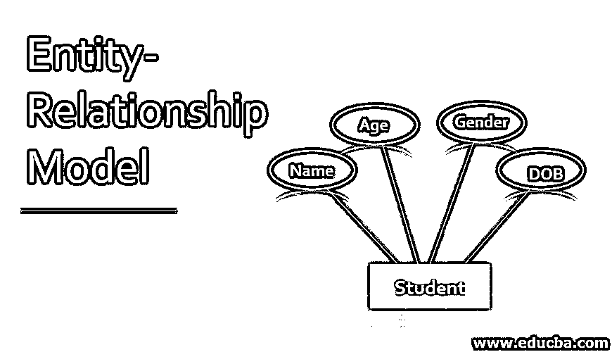
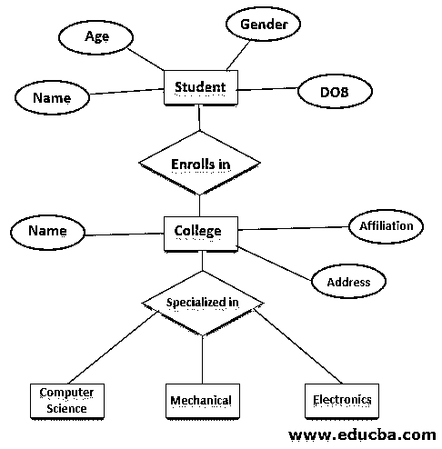

# 实体关系模型

> 原文：<https://www.educba.com/entity-relationship-model/>

## 实体关系模型简介

实体关系模型是数据库结构的图形表示，称为 ER 图。ER 图被认为是数据库的蓝图，它主要有两个组成部分，即关系集和实体集。ER 图用于表示实体集之间存在的关系。实体集被认为是一组包含属性的相似类型的实体。

根据数据库系统管理系统，实体被认为是表，属性是表的列。所以 ER 图显示了数据库中各表之间的关系。该实体被认为是实际存储在数据库中的真实对象。实体具有有助于唯一标识实体的属性。实体集可以被认为是相似类型的实体的集合。

<small>Hadoop、数据科学、统计学&其他</small>

### 我们为什么要用实体图？

*   实体图用于以图表形式表示数据库。
*   它有助于正确理解数据库。
*   数据库的所有必要细节都可以用 ER 图的形式表示。
*   实体表示数据库的所有表，属性是表的列，关系表示数据库的表之间的关联。

### 电流变模型图

以下是 ER 模型的示意图:

上图是大学生数据库的 ER 图。学生、学院、机械、电子和计算机科学是实体，招生和专业是关系。这些属性是姓名、年龄、性别、出生日期、隶属关系、地址。

### 实体关系模型的组件

ER 模型用作数据库的概念视图。ER 模型由现实世界的实体和它们之间存在的关联组成。ER 模型给出了用于任何应用程序的数据库的完整概念，非常容易理解。

以下部分包含有关 ER 图组件的信息:

#### 1.实体

实体被认为是真实世界的对象，它可以是任何容易识别的对象。例如，在雇员数据库中，雇员细节、位置、联系细节可以被认为是雇员数据库的实体。所有类型的实体都有一些属性，这些属性有助于给出实体的正确概念。实体集可以被认为是相似类型实体的集合。在实体集中，可能存在一些包含相似类型值的实体。例如，雇员集将包含所有雇员的信息。实体集不需要分离。

*   **弱实体:**弱实体被认为是不能通过其属性轻易选择的实体，并且需要与一些其他实体有某种关系。这种类型的实体称为弱实体。在 ER 图中，双矩形用于表示弱实体。例如，如果只有一个银行账户，那么它被认为是一个弱实体，因为不能识别该银行账户属于哪家银行。

#### 2.属性

实体用一些属性来表示，这些属性称为属性。所有的属性都有一定的价值。例如，雇员实体可以具有以下属性雇员姓名、雇员年龄、雇员联系细节。对于属性，可以认为是可以分配给属性的值域。例如，不能给雇员姓名分配某个数值。员工姓名应该始终是字母。员工年龄不能为负数，应该始终为正数。

**属性类型:**

*   **简单属性:**简单属性可以被认为是不能进一步分离的原子值。例如，雇员电话号码不能被进一步分离到一些其他属性。
*   **复合属性:**复合属性在组中包含多个属性。例如，雇员姓名属性可以被认为是一个复合属性，因为雇员姓名可以进一步分为名和姓。
*   **派生属性:**派生属性是物理上不存在于数据库中的属性类型，但是，派生的值来自物理上存在于数据库中的其他数据库。例如，雇员的平均工资是派生属性，因为它不直接存储在数据库中。该值可以从物理上存在于数据库中的其他属性中导出。
*   **单值属性:**单值属性包含单个值。例如，安全号码。
*   **多值属性:**多值属性是指包含不止一个值的属性。例如，员工可以有多个电子邮件 id 和电话号码。

#### 3.关系

关系是 er 图的另一种类型的组件，用于显示数据库实体之间的依赖关系。在 ER 图中，关系用菱形框表示。实体之间存在的所有关系都由 ER 图中显示的线连接。

下面给出了不同类型的关系:

*   **一对一:**在这种关系中，一个实体与另一个实体是一对一的关系。例如，一个人有一本护照，而这本护照被分配给一个人。

*   **多对一:**在这种关系中，当一个实体的多个实例链接到一个实体时。例如，许多学生可以在一所大学里读书。

*   **一对多:**一个实体链接到多个实体就是一对多关系。例如，一个客户下了多个订单。

*   **多对多:**当多个实体链接到多个实体时称为多对多关系。例如，学生可以有多个项目，项目被分配给多个学生。

### 结论

正如所看到的，ER 图被认为是数据库的蓝图，它包含了数据库的所有必要细节。实体被认为是数据库的表，属性被认为是表的列，而元组被认为是表的行。在实体之间存在某种关系，这构成了一个完整的关系数据库。

### 推荐文章

这是一个实体关系模型指南。这里我们讨论一下引言，为什么我们使用实体图和实体-关系模型的组件。您也可以浏览我们的其他相关文章，了解更多信息——

1.  [甲骨文版本](https://www.educba.com/oracle-versions/)
2.  [数据模型的类型](https://www.educba.com/types-of-data-model/)
3.  [层次数据库模型](https://www.educba.com/hierarchical-database-model/)
4.  [数据库管理系统中的数据模型](https://www.educba.com/data-models-in-dbms/)

