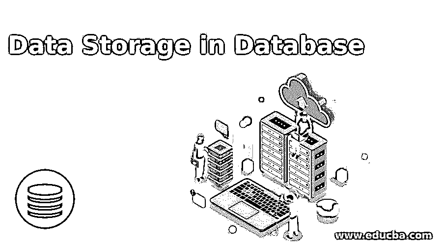

# 数据库中的数据存储

> 原文：<https://www.educba.com/data-storage-in-database/>

## 数据库中的数据存储介绍

数据存储系统可以解释为数据库管理系统在服务器内存中为数据库和相关操作分配的容量。还有一个称为“数据库配额”的术语，用于表示数据存储单元，它可以定义为从为整个数据库管理系统设置的总限制中分配给每个数据库系统的部分。在关系数据库类型中，数据存储通常以表、列、行及其对应关系的形式进行。换句话说，它通常是一个结构化的系统，为数据库的内容和操作分配所需的空间。

### 数据库中的数据存储类型

通常，数据库中的数据是以记录的形式存储的，而就设备而言，数据是放在电磁设备中的。数据库系统中用于数据存储的这些电磁设备的分类如下。

<small>Hadoop、数据科学、统计学&其他</small>

#### 1.主存储器

主存储器可以定义为一种数据存储系统，它允许服务器的中央处理器直接访问它，而不需要任何其他设备的帮助。一般来说，为了使主存储器无任何故障地运行，它必须具有持续和不间断的资源贡献，例如电源、电子硬件备份、支持设备的连续运行、用于调节系统温度的冷却剂等。这些类型的设备被认为在尺寸上相当小，并且本质上是易变的。就性能和速度而言，主存储器设备是最快的设备，并且该特征与设备的总容量成间接比例。

在数据库管理系统中，用于数据存储的一些常用的主要设备是 CPU 的主存储器、CPU 的寄存器，或者称为服务器的内部存储器和高速缓冲存储器，CPU 可以访问这些存储器以获得不间断的数据流。CPU 的所有这些存储单元将彼此对齐，以填补设备能力之间的差异。例如，每当 CPU 的主内存投入使用时，高速缓存也会被同时使用。这是因为 CPU 的运行速度比主存储器快得多，而高速缓冲存储器有助于补偿这两种设备的性能差异。

由于速度和性能的提高，这些类型的主存储设备的价格范围通常高于其他两种类型的存储存储器。

#### 2.辅助存贮器

顾名思义，辅助数据存储设备是可以被访问的设备，用于存储稍后各种操作或数据库操作所需的数据。因此，有时这些类型的存储系统也被称为备份单元。此类内存包括外部连接或插入的设备，与被视为 CPU 一部分的主内存不同。众所周知，这组设备的大小明显大于主存储单元，小于第三级设备。它也被认为是一个临时存储系统，因为它可以在用户需要时保存数据，并可以在用户完成时删除。在提供动作和速度时，这些辅助存储设备比主设备慢，也比第三设备快。设备的容量通常高于主存储系统，但随着技术世界的日益发展，它也在不断发展。

常用的二级存储系统是过去使用的磁盘和光盘，如 DVD 或 CD。近年来，为了给用户提供更多的便利来处理多个设备，技术上的建设性发展引入了现代设备。这些现代的辅助存储设备包括便携式和可重复使用的硬盘、可以通过外围设备的 USB 端口以即插即用的形式访问的闪存驱动器等。

RAID 或独立磁盘冗余阵列的概念是将基本的二级内存存储设备连接起来，以便通过链中的另一个设备来弥补一个设备的不足。它使用诸如用于结构化的阵列数据排列、镜像方法、纠错码、将单个磁盘隔离成多个磁盘等过程。才能让数据顺利通过。RAID 的级别可以称为 RAID 0、RAID 1、RAID 2 等等。这些级别是根据在存储的数据中观察到的冗余强度来计划和确定的。

#### 3.三级记忆

用于数据存储的三级存储器可以被定义为用于保存大量数据并且不需要一直连接到服务器或外围设备的设备类型。这种类型的设备从外部连接到服务器或放置数据库的相应设备。由于三级存储器可以提供比其他类型的设备存储器更多的空间，但也是所有其他设备形式中最慢的，所以成本低于一级和二级存储器。这种数据存储通常用于从服务器和数据库中制作副本，以尝试对数据进行备份。与辅助设备类似，第三设备也允许用户在需要时使用内存，并在不需要时删除内容。

### 结论

在数据库管理系统中，数据存储是一项基本功能，需要对各种参数进行深入分析和权衡，以便在三类内存类型中选择一种类型。数据存储系统应该足够灵活，能够与服务器、连接的节点一起运行，并允许数据库管理员/用户独立操作数据库。

### 推荐文章

这是一个数据库数据存储指南。这里我们讨论数据库中数据存储的介绍及其不同类型，如主存储器、辅助存储器等。您也可以浏览我们推荐的文章来了解更多信息-

1.  [八大免费数据分析工具](https://www.educba.com/free-data-analysis-tools/)
2.  [数据分析技术类型介绍](https://www.educba.com/types-of-data-analysis-techniques/)
3.  [数据分析与数据分析–主要差异](https://www.educba.com/data-analytics-vs-data-analysis/)
4.  [什么是数据集成？](https://www.educba.com/what-is-data-integration/)

