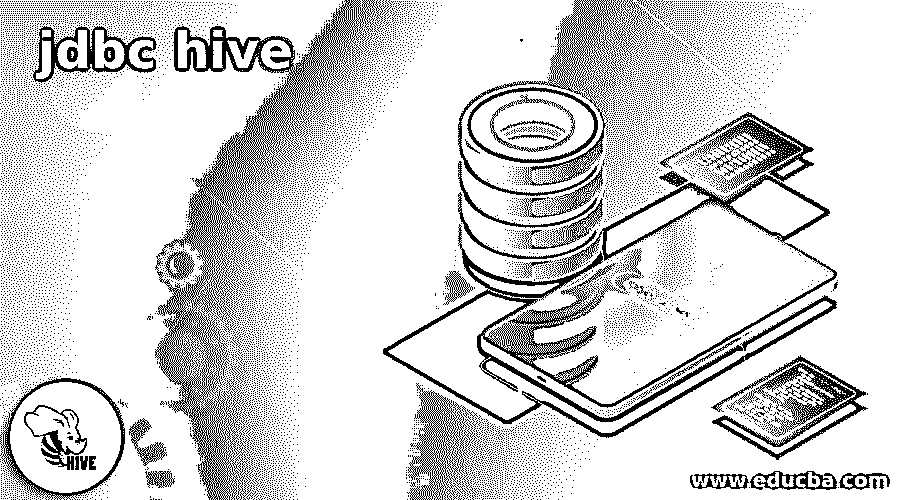

# jdbc 蜂巢

> 原文：<https://www.educba.com/jdbc-hive/>

## jdbc 配置单元简介

Hive JDBC 驱动程序允许用户通过 JDBC 支持经由商业智能应用管理 Hadoop 中的数据。驱动程序通过将来自应用程序的调用转换为 SQL 并将 SQL 查询传输到底层 Hive 引擎来执行此操作。大多数情况下，开发人员使用 Hive 中的驱动程序来开发桌面、移动和 web 应用程序，以便与 Hive 中的实时数据进行通信。Hive JDBC 中的驱动程序与 MySQL 驱动程序和 OLEDB 驱动程序具有相似的架构，即使在它们的结果集对象、连接和语句方面也没有变化。这篇文章简要介绍了蜂巢 JDBC。

### 什么是 JDBC 蜂巢？

JDBC 配置单元驱动程序是与 ODBC 驱动程序和节俭服务器一起出现在配置单元客户机中的组件之一。Hive 驱动程序用于关联 Java 应用程序和 Hive 之间的连接。ODBC 驱动程序使应用程序能够连接配置单元和 ODBC 协议。Hive 的功能包括管理多种数据格式文件、访问 SQL 数据、从 HBase 和 HDFS 访问文件、通过 Tez 执行查询、map-reduce、语言支持、在 LLAP 检索查询。Hive 提供了用于数据操作的驱动程序和命令行工具。

<small>Hadoop、数据科学、统计学&其他</small>

### 如何使用 JDBC 蜂巢？

蜂巢的工作很简单。在 Hive 客户端，应用程序和 Hive 驱动程序连接到 Hive 服务中的 Hive 服务器。然后，Hive 服务器连接到一个公共驱动程序，在该驱动程序中，可以从 Hadoop 集群和 Hive 元存储数据库访问所有类型的文件系统，该数据库位于 Hive 存储区域和计算中。

**连接 URL- JDBC 配置单元:**

该配置单元像另一个数据库一样支持使用 URL 字符串的连接。

`::hive1:/ip-address::port    to link other remote applications and Hive`

远程应用程序可以是 Java、Scala、Spark 和 Python

在以前的版本中，语法是 jdbc::hive://

安装是在 JAR 文件中完成的，这些文件是通过 JDBC 管理 Hive 所必需的。

下面的语法可以自动保存 JAR 文件

`hive-jdbc-<<version name>>.jar or hive-services-<<version name>>.jar`

配置了用于配置单元管理的服务器后，用户应该提供 JDBC 的驱动程序类名、数据库的 URL 和客户端的凭据。应该指定每个组件来建立到 SQL 数据库的连接。

通过 JDBC 访问配置单元的服务器配置文件，应该在下面的文件中进行更改，

`jdbc-site.xml
jdbc:hive1.://serverhive_hostname::serverhive_port//<databasename>
org.hive.jdbc.HiveJDBCDriver`

serverhive authentication 的值在 serverhive.authentication 中给出，其模拟在 hive.serverhive.enable.doas 属性中提供。

尽管 Hive 的服务是否使用 Kerberos 身份验证，但它会通知其他服务器属性的配置。这些性质在上述中定义。Hadoop 中的 xml 配置文件。用户可以通过编辑该文件来更改其属性。

使用用户身份选项查看谁正在从给定的服务器访问数据。

**HiveServer2**

要远程访问 Python、Scala 和 Java 或任何编程语言，请确保用户拥有 HiveServer2service

它位于目录$Hive_Home \ bin 中

`educba@name:~/hive /bin $  ./hiverserver2`

然后启动 hiveserver2。

将 Java 和 Scala 连接到 Hive，然后从 mvnrepository 库中执行 Hive QL。它依赖于 Gradel 或 Maven。万一，如果是 Maven，用户可以在 pom.xml 文件上选择一个 artefact。人工制品的版本和配置单元的版本必须相同，以避免错误。

`The new driver class org.hive.jdbc.HiveJDBCDriver`

这也适用于 Hiveserver2。

如果用户正在使用以前的版本，他可以选择继续工作

`org.hadoop.hive.Hivedriver`

连接字符串应该是 jdbc::hive//

### 来自 Java 的连接配置单元

从 Java 访问 Hive 的简单命令如下。它将互连的默认数据库和配置单元相关联。

要加载特定的配置单元使用，

`Class.forName()`

为了建立联系，

`Drivermanager.getconnection()`

若要获取 object 语句，请使用

`createstatement()`

要执行查询，请使用，

`stmt.executequery(“name of query”)`

要返回到对象连接，

`jdbc::hive: // 192.168.1.10000 / default.`

Scala 中的配置单元:

要从 Scala 访问 Hive，需要导入所有需要的包，比如 java.sql. exception，

`java.sql. connection,
java.sql, drivermanager;
java.sql resultset;
java.sql statement;
public class
{
Hive JDBC client extends Application
{
value driver name= “org.hadoop.hive.Hivedriver”
class. forname (“EDUCBA”);
value connection = drivermanager. getconnection(“jdbc::hive: // 192.168.1.10000 / default.;)
value stmt = createstatement();
value tablename = “Educba HiveDriver Table”
stmt.queryexecute (“Class1 + Educba”);
value res = stmt.query (“New table” + class 1 + (“key int. value string”);
// select * query name
value sql = “select * from “ + table name;”
res = stmt.query(sql);
while(result.next()
{
system.out.print(string.value)(result.get(1)) + ‘\t” + result.getstring(2)
}
standard hive query
val.sql = choose count(0) from + Educba;
result = stmt.query(sql);
while (result.next())
{
system.out.println ( result.get string(1));
}
}`

### JDBC 蜂箱示例

Hive 有像 WebHcat 和 Hcatalog 这样的主要组件。为了将数据存储到 Hadoop 并启用数据处理功能，Hcatalog 采用了 Pig 和 Map-reduce。WebHcat 可以使用 Map-reduce、Hive 作业和 Pig。它还可以用于管理使用 REST API 的元数据存储的操作，以及管理数据转换的所有数据类型。用户可以使用连接器从 Hive 获取数据。用户可以使用 JDBC 中的查询在 Hive 中提交定制的 SQL 查询，以便在连接器的帮助下获取结果。

在身份验证 NOSASL 中，所需的配置是 JDBC . property . authentic ation = no sasl

如果提供了用户名，那么他可以使用 jdbc.user。

配置中有许多额外的步骤，需要时可以通过使用 Kerberos 身份验证进行更改。要在 Hive 中设置安全集群，用户应该将包含 hive-site.xml 的目录添加到客户端类路径中。

### 结论

可以在其 XML 文件中更改配置。JDBC 配置单元用于不同的情况，可以根据需要实现。

### 推荐文章

这是 jdbc hive 的指南。在这里，我们讨论如何使用 JDBC 配置单元以及 Java 中的例子和连接配置单元。您也可以看看以下文章，了解更多信息–

1.  [蜂巢 JDBC 驾驶员](https://www.educba.com/hive-jdbc-driver/)
2.  [甲骨文的 JDBC 驱动程序](https://www.educba.com/jdbc-driver-for-oracle/)
3.  [JDBC 司机](https://www.educba.com/jdbc-driver/)
4.  什么是 JDBC？

